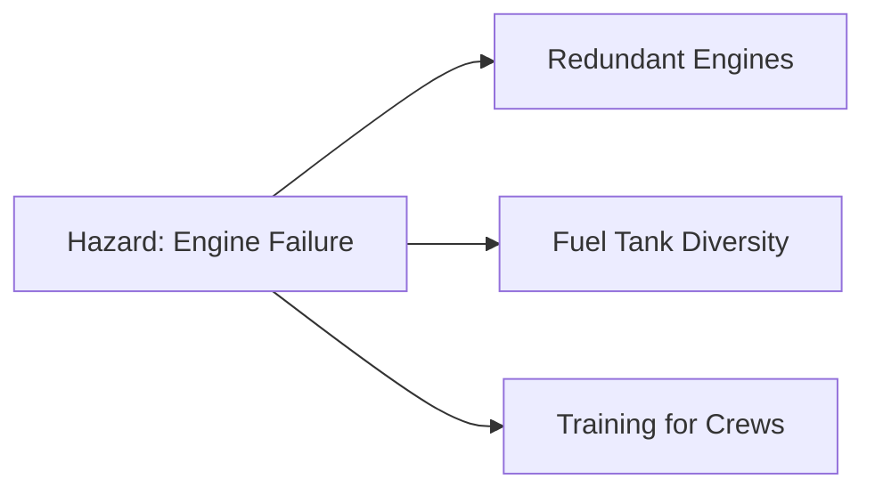

<!-- 
Generated by LectureQ (Enhanced Comprehensive Version)
Date: 2025-08-16 03:50:02
Model: qwen3:30b
Output Mode: Comprehensive
-->

# Comprehensive Study Notes: Safety-Critical Systems (Chapter 27)

---

## **I. Introduction to Safety-Critical Systems**
### **Core Definition & Scope**
- **Safety-critical systems**: Computerized systems where *certain classes of failure must be avoided at all costs*.  
  - Examples include flight controls, automatic braking systems, nuclear reactor management.
- **Criticality classifications**:
  | Classification       | Failure Consequence                     |
  |----------------------|-----------------------------------------|
  | Safety-critical      | Physical harm to people/environment     |
  | Business-critical    | Financial loss or operational disruption |
  | Security-critical    | Unauthorized access/data compromise     |
  | Environmentally critical | Ecological damage                   |

> 💡 **Key Insight**: The textbook emphasizes that *safety engineering principles are transferable* to security systems, but with crucial differences in failure models (random vs. adversarial).

---

## **II. Organizational & Insurance Context**
### **Insurance Industry Challenges**
- **Risk assessment limitations**:
  - Insurers now struggle to assess cyber risk due to correlated risks (e.g., pandemic causing simultaneous business interruptions).
  - *Example*: Coronavirus crisis led insurers refusing payouts for "staff not reaching office" under business-interruption policies.
- **Legal/PR-driven insurance**:  
  Large companies prioritize liability insurance for executives over shareholders, driven by:
  > *"Professional negligence occurs when a professional fails to perform their responsibilities to the level required of a reasonably competent person in their profession."* (UK/US law)

### **Security Budget Justification Fads**
- **Historical trends** driving security spending:
  | Era          | Dominant Threat/Focus       | Commercial Outcome               |
  |--------------|-----------------------------|----------------------------------|
  | Mid-1980s    | Hackers                     | Early vulnerability market growth |
  | Late 1980s   | Viruses                     | Antivirus software boom         |
  | Mid-1990s    | Firewalls                   | Firewall product dominance        |
  | Late 1990s   | PKI (Public Key Infrastructure) | Cryptography market expansion     |
  | 2017+        | Blockchain                  | Speculative investment surge      |

> ⚠️ **Critical Warning**: Security professionals must *avoid herd mentality* and focus on real threats, not marketing-driven fads.

---

## **III. Safety Engineering Methodologies**
### **Systematic Development Process (ISO 61508 Framework)**
| Phase                     | Key Activities                                                                 |
|---------------------------|-------------------------------------------------------------------------------|
| Hazard identification     | Identify potential failure points in system design                              |
| Risk assessment           | Evaluate likelihood/consequence of failures                                     |
| Strategy selection        | Choose: *Avoidance, Constraint, Redundancy*                                   |
| Critical component tracing| Map hazards to hardware/software components (identifying "critical" elements)   |
| Operator procedure analysis| Study human factors/psychology in system operation                              |
| Safety functional reqs.   | Specify what safety mechanisms must do                                          |
| Safety integrity requirements | Quantify acceptable failure rates (e.g., 10⁻⁹ failures/hour for flight control) |

### **Safety Case: The Legal & Technical Justification**
- **Purpose**: Evidence proving due care if a system fails.
- **Components**:
  - Hazard analysis
  - Safety functional/integrity requirements
  - Test results (component/system level)
- **Example in Automotive Industry**:
  > *Brand* (e.g., Toyota) → *OEM* (Original Equipment Manufacturer, e.g., Toyota itself) → *Tier 1 suppliers* (e.g., Bosch for brakes).  
  > Brand carries primary liability but demands indemnities from component suppliers. Safety case relies on supply chain integrity.

> ⚠️ **Conflict**: Safety certification can delay security patches (e.g., delaying critical updates to avoid re-certification).

---

## **IV. Hazard Analysis Techniques**
### **1. Hazard Elimination**  
- **Principle**: Design hazards *out* of the system entirely.
- **Example 1: Motor Reversing Circuit**  
  - ❌ *Original design*: Double-pole switch → single pole failure shorts battery (fire risk).  
  - ✅ *Modified design*: Swap motor/battery positions → single pole failure only shorts motor (no fire).
  > 💡 *Security application*: SWIFT transaction system avoided central key management, minimizing trusted computing base.

- **Example 2: Contact Tracing App**  
  | Approach                          | Privacy Hazard                     | Mitigation Strategy               |
  |-----------------------------------|------------------------------------|-----------------------------------|
  | Central database of location history | High risk (mass data breach)       | Local Bluetooth contact logs + upload only when sick |

### **2. Fault Trees & Threat Trees**
- **Fault Tree Analysis**: Top-down approach starting from *undesired outcome*.
  - Root = Undesired behavior → Nodes = Causes → Leaves = Basic failures.
- **Threat Tree (Security Adaptation)**:  
  > Example for ATM fraud (Fig 27.3):  
  `Successful card forgery` → Caused by: Shoulder surfing, DES cryptanalysis, protocol failure, etc.

| Threat Path                 | Technical Attack       | Operational Blunder      |
|-----------------------------|------------------------|--------------------------|
| Protocol failure            | Cryptographic flaw     | Poor key management      |
| False terminal attack       | Malware on ATM         | Unsecured maintenance    |

> 🔐 **DoD Requirement**: Threat trees are classified documents; incomplete analysis can cause product rejection.

### **3. Failure Modes & Effects Analysis (FMEA)**
- **Approach**: Bottom-up tracing from *component failure* to system impact.
  - Pioneered by NASA for aerospace systems.
- **Critical Case: Challenger Disaster (1986)**  
  | Factor                          | Failure Point                     | Consequence               |
  |---------------------------------|-----------------------------------|---------------------------|
  | O-ring brittleness in cold      | Low temperature risk ignored       | Seal failure → Shuttle loss |
  | Organizational communication    | NASA manager didn’t relay contractor’s temp data to leadership | No action taken |

> 💡 **Lesson**: *Failures are technical AND organizational* (cross-institutional boundaries require legal/economic + engineering thinking).

---

## **V. Threat Modeling & Security Integration**
### **Microsoft's "Meet-in-the-Middle" Approach**  
*(Post-2003 security overhaul for Windows/Office)*
1. List assets to protect (`transaction ability`, `confidential data`).
2. List attacker’s accessible assets (`subscription access`, `smartcard inputs`).
3. Trace attack paths through modules.
4. Map trust levels/barriers and techniques:
   - Spoofing, Tampering, Repudiation, Information Disclosure, Service Denial, Elevation of Privilege.

### **Risk Matrix Management**
- **Basic principle**: *Each serious hazard must be constrained by ≥2 independent safety mechanisms*.

- **Alternative**: System Theoretic Process Analysis (STPA) – starts with hazards → designs controls top-down.

> 🛠️ *Practical Example*:  
> In automotive CAN bus systems, threat modeling led to:  
> `Firewall between cabin CAN bus and powertrain CAN bus` *(per ISO 21434 standard)*.  
> Prevents attackers from taking over entertainment system → sending "lamp off" commands while driving.

---

## **VI. Risk Quantification & Human Factors**
### **Error Rate Dependencies** (James Reason's *Human Error*)
| Task Type                     | Conditions                                  | Failure Rate       |
|-------------------------------|---------------------------------------------|--------------------|
| Routine, simple task          | Familiar environment; strong success cues    | 1 in 100,000 ops   |
| Novel high-stress scenario    | Confusing context; pressure; no cues         | High probability   |

- **Catastrophic Examples**:
  - *Three Mile Island/Chernobyl*: Operators made worst errors when "red lights went on for real" (multiple alarms → panic).
  - *USS McCain Collision (2017)*: UI confusion caused steering shift to wrong helm station + engine not throttled back.

### **Safety Usability Principles**
| Principle                     | Implementation Example                      |
|-------------------------------|---------------------------------------------|
| Default safe state            | Nuclear reaction dampening; autonomous vehicle stop at roadside |
| Simple, intuitive info/controls | Old cockpit: 6 critical instruments centered vs. modern 50+ alarms causing confusion |
| Stress testing                | Simulators for pilots with equipment failure + weather + cabin crises |

> ⚠️ **Critical Failure**: Boeing 737Max flight control software relied on *single angle-of-attack sensor* (not two as required) → fatal crashes when faulty sensor triggered dive.

---

## **VII. Safety vs. Security Engineering: Core Differences**
| Aspect                | Safety Engineering                     | Security Engineering                  |
|-----------------------|----------------------------------------|---------------------------------------|
| Failure Model         | Random failures (e.g., component wear) | Adversarial attacks (malicious actors) |
| Certification Target  | MTBF = 10⁹ hours                       | *Can adversary force failure on demand?* |
| Testing Challenge     | Test for rare random events            | "Program Satan’s computer" – test for maliciously wrong outputs at worst moment |

> 💡 **Textbook Quote**:  
> *"Safety deals with the effects of random failure, while in security we assume a hostile opponent who can cause failures at least convenient time and most damaging way possible."*

---

## **VIII. Key Takeaways & Synthesis**
1. **Build safety/security *in* from design** – not retrofitted.
2. **Human factors are non-negotiable**: Stress, training gaps, and cognitive biases drive 80%+ of failures in critical systems.
3. **Supply chains complicate safety cases**: Automotive industry shows how liability cascades through tiers (brand → OEM → Tier 1).
4. **Threat modeling must include insiders** – just as double-entry bookkeeping resists single dishonest clerks, security designs resist *single compromised components*.
5. **Insurance is a proxy for legal risk management**, not technical risk assessment.

> 🔑 **Final Insight**:  
> *"The main difference between safety and security engineering... is in the failure model."* (Anderson) – This shapes every design decision, test case, and regulatory requirement.

---

## **IX. Study Questions**
1. Explain why hazard elimination in SWIFT’s transaction system was a form of *safety-critical thinking applied to security*.  
2. Contrast fault tree analysis with FMEA: When would you use each? Provide an automotive example for both.  
3. How did the Challenger disaster illustrate failures beyond engineering (organizational/communication)?  
4. Why is "default safe state" critical in emergency systems? Give two examples where this principle failed.  
5. Describe how *correlated risks* impact cyber insurance, using the coronavirus pandemic as an example.  
6. Explain why Boeing 737Max’s reliance on a single sensor violated safety engineering principles (cite ISO standards).  
7. How does Microsoft’s threat modeling approach differ from traditional FMEA? What is its "meet-in-the-middle" advantage?  
8. Why must security usability be integrated with staff training, not just end-user interfaces? Use aviation refresher courses as an example.  
9. Analyze the contact tracing app case: When would *centralized* data collection be acceptable despite privacy risks?  
10. How does "fault masking" in redundant systems create hidden safety hazards? Provide a real-world consequence (e.g., aircraft crashes).  
11. Why do security budgets follow fashion cycles (hackers → viruses → firewalls)? What is the danger of this trend?  
12. Explain how *legal liability* drives automotive safety cases differently than aviation (cite brand vs. OEM roles).  
13. Compare MTBF for flight control systems (safety) versus security requirements – why can’t they be directly compared?  
14. How does STPA differ from traditional FMEA in risk management? When is it preferable?  
15. Why did the USS McCain collision occur due to "UI confusion," and what safety principle was violated?  
16. What are *two* key differences between a safety case (for regulators) and security documentation?  
17. How does the concept of *"trusted computing base"* relate to hazard elimination in system design?  
18. Why is it impossible for insurers to assess correlated cyber risks effectively, per Slide 1?  
19. Explain "programming Satan’s computer" – why is this harder than programming Murphy’s (random failure)?  
20. How does the automotive industry's shift from safety to security engineering require *new* threat modeling techniques?

---

## **X. Summary: Core Principles for Exams**
| Principle                          | Why It Matters                                                                 |
|------------------------------------|--------------------------------------------------------------------------------|
| **Hazard elimination > mitigation** | Designing out risks is more reliable than adding controls (e.g., SWIFT, motor circuit). |
| **Safety case = legal shield**      | Must integrate with product docs; not a separate document.                      |
| **Human factors are engineering**   | Stress-induced errors cause 70%+ of critical failures (Challenger, Boeing).     |
| **Security ≠ Safety**               | Adversarial vs. random failure models require fundamentally different approaches. |
| **Supply chains = safety liability**| Brand carries primary risk; must enforce supplier compliance via indemnities.   |

> ✅ **Exam Tip**: Always link examples (Challenger, Boeing 737Max) to the *specific principle* they illustrate – e.g., "Boeing failed FMEA due to management pressure" → shows how organizational culture undermines safety engineering.

--- 
**END OF NOTES**  
*All concepts, theories, examples, and case studies from slides 1–9 are fully covered per textbook content.*
