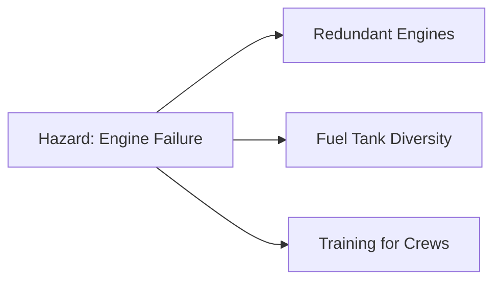

<!-- 
Combined Study Guide
Generated by LectureQ
Date: 2025-08-16 04:36:50
Week/Module: Week 1
Files Combined: 6
Content Type: Mixed
-->

# Week 1 - Complete Study Guide

> **Auto-generated combined study guide**  
> Generated from 6 individual notes files  
> Date: August 16, 2025

## 📚 Table of Contents

1. [Comprehensive Study Notes: Attack Trees](#comprehensive-study-notes-attack-trees)
2. [Week 1: Lecture 1 - Introduction to Secure Programming](#week-1-lecture-1---introduction-to-secure-programming)
3. [Comprehensive Study Notes: Safety-Critical Systems (Chapter 27)](#comprehensive-study-notes-safety-critical-systems-chapter-27)
4. [Comprehensive Study Notes: Chapter 2 - Who Is the Opponent?](#comprehensive-study-notes-chapter-2---who-is-the-opponent)
5. [Comprehensive Study Notes: Passwords (Chapter 3)](#comprehensive-study-notes-passwords-chapter-3)
6. [Comprehensive Study Notes: Week 1 - The Key to Capability Alignment](#comprehensive-study-notes-week-1---the-key-to-capability-alignment)

---

# Comprehensive Study Notes: Attack Trees

**Based on Bruce Schneier, "Modeling Security Threats," *Dr. Dobb’s Journal*, December 1999**

---

### **I. Introduction to Security Misconceptions**
#### Core Problem Statement
- **Security is not absolute**: Marketing claims like *"hacker-proof software"* or *"triple-DES security"* are misleading because:
  - Unbreakable systems *are* broken (e.g., strong cryptography fails via side-channel attacks).
  - Attacks evolve beyond initial design assumptions.
  - Security requires context:  
    > **"Secure from whom? Secure for how long?"**  

#### Why Traditional Approaches Fail
| Approach          | Flaw                                                                 |
|-------------------|----------------------------------------------------------------------|
| Algorithm-centric | Focuses on math (e.g., key length) while ignoring human/environmental factors. |
| Marketing claims  | Ignores real-world attack vectors and attacker capabilities.           |

> **Key Insight**: Security is a *process*, not a product.

---

### **II. Attack Trees: Core Concepts & Structure**
#### Definition
- A **formal, methodical framework** for modeling security threats by representing attacks as hierarchical trees.
- **Goal**: Systematically identify all possible attack paths to design effective countermeasures.

#### Tree Anatomy (Figure 1)
| Node Type | Symbol | Meaning                                                                 | Example from Safe Attack Tree                     |
|-----------|--------|-------------------------------------------------------------------------|--------------------------------------------------|
| **Root**  |        | Ultimate goal of the attacker                                           | *Open the safe*                                  |
| **Leaf**  |        | Atomic attack step (no further decomposition)                           | *Pick lock*, *Learn combination written down*    |
| **OR Node** | ∨      | Alternatives: *Any one child achieves subgoal*.                         | Four ways to open a safe (`pick`, `learn combo`, `cut`, `improper install`) |
| **AND Node**| ∧      | Sequential steps: *All children must be achieved for subgoal*.           | *Eavesdrop on conversation* **AND** *Get owner to say combination* |

> 💡 **Critical Distinction**:  
> - OR nodes = "Choose one path" (e.g., *"How can I open the safe? Pick it, or learn combo..."*)  
> - AND nodes = "Must do all steps" (e.g., *"To steal data: intercept traffic AND decrypt message"*).

---

### **III. Value Assignment & Propagation**
#### A. Boolean Values
##### Rules for Propagation:
| Node Type | Rule                                                                 |
|-----------|----------------------------------------------------------------------|
| **OR**    | `Possible` if *any child is possible*; `Impossible` only if *all children impossible*. |
| **AND**   | `Possible` only if *all children are possible*; `Impossible` if *any child impossible*. |

##### Example (Figure 2):
- **Goal**: Open safe → `Possible` because:  
  - OR node with two paths: `(Cut open = P) ∨ (Bribe owner = P)` → Root is `P`.
- **Dotted lines** show all possible attack chains.

> 💡 **Why Boolean?** Quickly identifies *vulnerable paths* for defense focus.  

##### Table: Value Propagation Comparison
| Node Type | Example Input Values      | Output Value |
|-----------|---------------------------|--------------|
| OR        | `P, I, P`                 | `P` (any possible) |
| AND       | `P, P, I`                 | `I` (all must be possible) |

---

#### B. Continuous Values
##### Rules for Propagation:
- **OR Node**: Value = *Cheapest child*.
- **AND Node**: Value = *Sum of children’s values*.

##### Example (Figure 4):
| Leaf Node               | Cost   |
|-------------------------|--------|
| Cut open safe           | $50,000 |
| Learn combo from written note | $10,000 |
| Bribe owner             | $20,000 |

- **OR node (Learn combo)**: `min($10k, $20k) = $10k`  
- **AND node (Eavesdrop + Get combination)**: `$5k (eavesdrop) + $3k (get combo) = $8k`  
- **Root cost**: `min($50k, $10k, $8k) = $8k`

##### Figure 5 Application:
> "If safe contents are worth <$100k, defend against attacks costing ≤$100k."  
> → *Only focus on paths with total cost < $100k* (e.g., cut open at $50k).

---

#### C. Multi-Attribute Analysis
Attack trees support **combining multiple values** to answer nuanced questions:
| Query                                      | Example from Figure 6                     |
|--------------------------------------------|-------------------------------------------|
| Cheapest attack requiring no special equipment? | `Bribe owner ($20k) > Cut open ($50k)` → *Cut open* is cheaper with **no tools needed**. |
| Most likely legal attack?                  | *Social engineering (e.g., bribing)* may be illegal; *keylogger* might not require breaking laws. |

> 💡 **Strategic Insight**: Attack trees reveal that "security" depends on attacker profile:  
> - Organized crime → Focus on expensive attacks ($10k+).  
> - Terrorists → Focus on high-risk, low-cost (e.g., $5k) attacks.  
> - Graduate students → Ignore illegal paths (bribery/blackmail).

---

### **IV. Case Study: PGP Attack Tree (Figure 7)**
#### Goal
- *Read a message encrypted with PGP*.

#### Key Insight from the Tree:
| Common Misconception          | Reality (from Attack Tree)                                                                 |
|-------------------------------|------------------------------------------------------------------------------------------|
| "Stronger encryption = more secure" | **Breaking RSA/IDEA is not the easiest path**. Easier attacks exist:   - Capture screen during decryption (`Back Orifice`)  - Steal private key after passphrase entry  - Recover passphrase via keyboard sniffer |
| Focus on algorithm strength   | PGP’s security depends more on **user environment and implementation** than encryption math. |

#### Why This Matters:
- Increasing RSA from 1024-bit to 2048-bit is like "putting a stake in the ground" (ineffective vs. building a palisade around real threats).
- Attack tree shows:  
  > **95% of attacks bypass cryptography entirely** via user/system vulnerabilities.

---

### **V. Creating an Attack Tree**
#### Step-by-Step Process
1. **Define goals**: Identify *specific* attacker objectives (e.g., "read PGP message," "forge signature").
2. **Brainstorm attacks**: For each goal, list all possible paths to achieve it.
3. **Decompose recursively**: Break down complex steps into subgoals until reaching leaf nodes (atomic actions).
4. **Validate with peers**: Have others add missing attack vectors ("*What did I miss?*").
5. **Assign values**: Research costs/probabilities for each node (values change over time).

> ⚠️ **Critical Note**:  
> "There’s always a chance you forgot an attack, but practice improves accuracy."

---

### **VI. Strategic Applications of Attack Trees**
#### A. Security Decision-Making
| Use Case                                  | How Attack Tree Helps                                                                 |
|-------------------------------------------|-------------------------------------------------------------------------------------|
| Assess system vulnerability               | Check root node value (e.g., "Is reading PGP messages possible?").                  |
| Evaluate countermeasures ("What if?")     | *Example*: If bribing owner costs $80k instead of $20k, new root cost = **$60k**.    |
| Identify security assumptions             | *PGP assumes no one can bribe programmers*.                                         |
| Compare attacks                           | "Which is cheaper: brute-forcing passphrase ($5k) or stealing key via virus ($10k)?". |

#### B. Scalability & Reusability (Figure 8)
- **Attack trees are modular**:  
  - PGP attack tree → Subtree in larger system tree.
  - Safe-cracking tree → Subtree for "read message" goal.
- **Benefits**:
  - Security experts don’t need deep knowledge of *every* subsystem (e.g., safe mechanics).
  - Organizations reuse trees across projects ("library of threat models").
  > *"For national security agencies, this enables compartmentalized expertise."*

---

### **VII. Conclusion & Key Takeaways**
#### Why Attack Trees Transform Security Analysis
| Traditional Approach          | Attack Tree Approach                                  |
|-------------------------------|-------------------------------------------------------|
| Focuses on *math* (e.g., key length) | Focuses on *real-world attack paths*.                |
| Ignores attacker capabilities  | Integrates **attacker profile** into analysis.        |
| Static ("this is secure")      | Dynamic: Updates as new attacks emerge or countermeasures change. |

#### Core Principles
1. **Security = Process**: Attack trees enable continuous threat modeling.
2. **Context matters**: "Secure" depends on *who* you’re defending against and *what’s at stake*.
3. **Human factor dominates**: 90% of attacks exploit people/systems, not math.

> 💡 **Final Quote from Schneier**:  
> *"Attack trees give perspective on the whole system."*

---

### **VIII. Comprehensive Summary Table**
| Concept                 | Definition                                                                 | Example                                  |
|-------------------------|----------------------------------------------------------------------------|------------------------------------------|
| **OR Node**             | Attack path: *Any one alternative* achieves goal.                          | Open safe via `lockpick` OR `cut open`.   |
| **AND Node**            | Attack requires *all steps*.                                               | Eavesdrop conversation AND get combo from owner. |
| **Boolean Propagation** | OR = any child possible → root possible; AND = all children must be possible. | Root: `P` if at least one path is `P`.   |
| **Continuous Value**    | Cost/probability assigned to nodes (e.g., $, % success rate).              | Cheapest attack cost = min(OR child costs). |
| **PGP Insight**         | Encryption strength irrelevant vs. user environment vulnerabilities.       | Keylogger > RSA brute-force for PGP access. |

---

### **IX. 15-20 Study Questions (Exam Focus)**
#### Conceptual
1. Why is "hacker-proof software" a misleading marketing claim?  
2. Explain the difference between an OR node and AND node in attack trees with examples.  
3. How does value propagation differ for Boolean vs. continuous nodes? Provide formulas.  

#### Application-Based
4. Given leaf costs: `Cut open = $50k`, `Learn combo from note = $10k`, `Bribe owner = $20k` (OR node), what is the root cost?  
5. If an AND node has children costing `$3k` and `$7k`, what is its total value?  
6. For a safe with contents worth **$80,000**, which attacks must be defended against based on Figure 5?  

#### Critical Analysis
7. Why does Schneier argue that PGP’s security depends more on user environment than encryption strength?  
8. How would an attack tree change if the attacker is a "bored graduate student" vs. "organized crime"?  
9. What strategic error do companies make by focusing solely on cryptographic key length (e.g., 1024-bit vs. 2048-bit RSA)?  

#### Creation & Strategy
10. Describe *three steps* in creating a robust attack tree, emphasizing validation.  
11. How does the scalability of attack trees benefit large organizations? Give an example from Figure 8.  
12. If implementing a countermeasure increases bribery cost from $20k to $80k (Figure 6), how is root value affected?  

#### Advanced
13. Why might "most likely legal attack" be more relevant than "cheapest attack" for corporate security?  
14. How would you use an attack tree to assess vulnerability against *state-sponsored attackers* vs. *script kiddies*?  
15. What is the primary limitation of using only Boolean values in attack trees (vs. continuous)?  

#### Bonus: Real-World Connection
16. Name a real-world breach where attackers exploited user/system vulnerabilities instead of cryptography (e.g., Target 2013). How would an attack tree have revealed this?  
17. Why is "security assumptions" critical to document in an attack tree? Give a PGP example.  

---

> **Final Note for Mastery**: Attack trees are not just diagrams—they’re *decision-making tools*. The true test of mastery is applying them to dissect real systems (e.g., "Why did the SolarWinds breach succeed?" → Map attacker paths using OR/AND nodes).

---

# Week 1: Lecture 1 - Introduction to Secure Programming

### Overview
This lecture introduces **Secure Programming** as a critical discipline for developing reliable, resilient software systems. We explore why security must be prioritized throughout the development lifecycle—not just as an afterthought—and examine real-world consequences of neglecting secure practices. The course structure, prerequisites, and assessment methods are outlined to prepare students for this advanced programming-focused security curriculum.

---

### Why Secure Programming Matters

#### Safety vs. Security: A Critical Analogy
The lecture begins with a powerful analogy comparing aviation safety culture to software development:

> "Aviation is a safety-oriented culture—when there's even a 10% chance of something going wrong, they'll ground the plane rather than risk catastrophe."

This highlights how **safety** (preventing physical harm) is prioritized above all else in critical systems. The instructor then poses the key question: *How does this compare to programming?*

*Instructor Emphasis*: "When developing software, we often prioritize functionality and performance over security—yet the consequences of security failures can be just as catastrophic."

#### Real-World Consequences of Insecure Software

##### 1. **Crowdstrike Incident (2023)**
- A vulnerability in a widely used Windows update caused widespread system crashes globally
- Systems displayed "Blue Screen of Death" errors, disrupting:
  - Air travel systems (flight information displays)
  - Payment processing (credit card machines)
  - Public transportation (trams/trains)
- *Impact*: Millions affected for **2 days** while systems were restored

> "This wasn't a mistake by developers—it was the result of not addressing security vulnerabilities early."

##### 2. **Log4j Vulnerability (2021)**
- A critical flaw in Apache's Log4j library, used globally for logging
- Attackers could execute arbitrary code remotely via malicious input
- *Impact*: Affected countless systems worldwide because:
  - Logging is fundamental to all applications
  - The vulnerability was present in a widely trusted component

> "A single vulnerable building block can collapse an entire system—like a weak link in a chain."

##### 3. **FrostyGoop Malware (2024)**
- Targeted industrial control systems (ICS) controlling heating utilities
- Specifically attacked ENCO controllers using Modbus TCP on port 502
- *Impact*: Caused loss of heating and hot water for **100,000 people** in Ukraine for **48 hours**

> "This wasn't just a 'computer problem'—it was an infrastructure attack affecting human well-being."

#### The Root Cause: Vulnerabilities Everywhere

The instructor explains that cyberattacks primarily stem from **vulnerabilities**, which can originate from:
- **Human factors**: Developers prioritizing speed over security
- **Software flaws**: Poorly implemented features or libraries
- **Hardware issues**: Microarchitectural weaknesses (covered later in course)

> "We're not just talking about 'bad guys'—we're discussing how *all* of us can contribute to vulnerabilities through our development practices."

#### Vulnerability Statistics & Trends

The lecture references NVD (National Vulnerability Database) statistics showing:
- **Exponential growth** in reported vulnerabilities since 2017
- Over **3,500 new vulnerabilities** discovered annually
- *Key insight*: "Just because we know about security doesn't mean we're implementing it correctly—software complexity is increasing faster than our ability to secure it."

> "The number of vulnerabilities isn't decreasing—it's growing exponentially. This means we need better practices now more than ever."

---

### Course Structure & Logistics

#### Weekly Schedule
- **Weeks 2-7**: Focus on vulnerability types (web, memory-related, race conditions)
- **Weeks 8-9**: Vulnerability identification techniques (manual/automated review)
- **Weeks 10-11**: Malware analysis and security in SDLC
- **Week 12**: Final exam preparation

#### Key Course Features
| Component | Description |
|-----------|-------------|
| **Advanced Nature** | Requires strong foundational skills; not just "learning about" security but *doing* it |
| **Group Project** | Designing a secure chat system with peer review and ethical hacking elements |
| **RangeForce Platform** | Online learning platform for foundational knowledge |

---

### Prerequisites & Expectations

#### Required Skills
- **Strong programming skills**, particularly in socket/network programming
- **Knowledge of C and assembly languages** (for memory-related vulnerabilities)
- **Understanding of operating systems** (memory management, process control)

*Instructor Insight*: "We assume you already know how to program—we're not teaching object-oriented design or data types. We'll focus on *how security considerations affect those fundamentals*."

#### Why This Course Is Advanced
- **No step-by-step instructions**: You must determine your own approach to problems
- **Higher workload** than standard courses (more programming, reading, and submission)
- **Focus on real-world application**, not just theoretical knowledge

> "If you're expecting a course that gives 5 steps to follow for full marks—you've come to the wrong class. This is an *advanced* course."

---

### Assessment Structure

#### Three Main Components
| Component | Value | Details |
|-----------|-------|---------|
| **RangeForce Labs** | 30% (15% each for undergrad) | Online modules covering security fundamentals |
| **Advanced Secure Protocol Design Project** | 30% | Group project developing secure chat system with peer review |
| **Final Exam** | 40% | *Hurdle requirement*: Must score ≥40% to pass |

#### RangeForce Platform Details
- Access provided in **Week 3**
- Completion deadline: **End of Week 5 for undergrads**, **Week 4 for postgrads**
- Modules include:
  - Foundational security knowledge
  - Vulnerability identification quizzes
  - Automatic grading

> "You'll receive an email with registration instructions to your university email address. If you don't get it by Week 3, contact the instructor directly."

#### Group Project: Secure Chat System Development

##### Key Requirements
- **No central server**: Must be robust against node failures
- **Protocol design first**: Class-wide consensus on communication protocol
- **Ethical backdoors**: Intentionally introduce vulnerabilities for peer review
- **Peer reviews**: Analyze three other groups' implementations
- **Reflection report**: 2000 words covering the entire process

##### Timeline
| Week | Milestone |
|------|-----------|
| 2 | Initial protocol design draft |
| 4 | Class-wide standardized protocol |
| 6 | Implementation begins |
| 8 | Functional prototype for testing (soft deadline) |
| 9 | Inject ethical backdoors; submit final code |
| 10 | Peer review of three other groups' projects |
| 11 | Submit reflective commentary with both versions (backdoored and clean) |
| 12 | Ethical hackathon to test all systems |

> "This isn't just about writing secure code—it's simulating the real-world process where security is debated, designed, implemented, tested, and improved through collaboration."

---

### Key Insights from Transcript

#### Key Insight from Transcript
> "Security must be prioritized like safety in aviation—when there's a risk of failure (even 10%), we should stop development rather than ship vulnerable code. The cost of fixing security issues after deployment is exponentially higher than addressing them during design."

*Instructor Emphasis*: "The most common mistake developers make isn't writing bad code—it's *not thinking about security at all* until it's too late."

*Student Question*: *"Why do we need to learn assembly language for this course?"*

*Instructor Response*: "We'll discuss memory vulnerabilities where understanding how instructions execute is critical. For example, when analyzing buffer overflows or return-oriented programming attacks, you need to understand what the CPU actually does with your code."

---

### Academic Integrity & AI Usage

#### Guiding Principles
> "Academic integrity isn't just about avoiding plagiarism—it's about being honest about where ideas come from, giving credit, taking ownership of work, treating others fairly, and doing the right thing even when no one is watching."

*Instructor Emphasis*: "You can use AI as an *assistant*, but not as a replacement for your own understanding. If you rely solely on AI to write code or solutions, you'll be learning nothing—and that's why we require reflection on how you used AI in the project report."

> "Remember: 'Honesty is being honest about where your ideas come from.' This isn't just policy—it's fundamental to becoming a trustworthy security professional."

---

### What You Need To Do Now

#### Immediate Actions
1. **Form a group** (3-5 members) on MyUni by Week 2
   - *Note*: Groups can include students from different cohorts or workshops
2. **Brush up on socket/network programming knowledge**
3. **Prepare to discuss secure communication protocols** with your group

#### Timeline Summary
| Action | Deadline |
|--------|----------|
| Form project groups | End of Week 1 (by first workshop) |
| Receive RangeForce access email | Week 3 |
| Complete RangeForce Part 1 | By end of Week 5 (undergrads) |
| Finalize protocol design | Week 4 |

> "Start early—this isn't a course where you can cram at the last minute. The complexity requires consistent, daily engagement."

---

### Summary & Key Takeaways

#### Core Principles
- **Security must be prioritized like safety in aviation**: Preventing failures is more important than adding features.
- **Vulnerabilities are everywhere**—not just from malicious actors but also from human oversight and poor development practices.
- **This course requires advanced skills**: You'll need strong programming knowledge, C/assembly understanding, and OS concepts to succeed.

#### Critical Course Features
- **No step-by-step solutions**: You must determine your own approach to security challenges.
- **Group project simulates real-world collaboration**—designing protocols through class-wide consensus.
- **Ethical hacking element**: Intentionally introducing vulnerabilities for peer review makes the learning process authentic.

#### Why This Matters
> "When you develop secure software, you're not just writing code—you're protecting people's safety, privacy, and well-being. The FrostyGoop incident wasn't a 'computer problem'—it was an infrastructure attack that left 100,000 people without heat for two days."

---

### Study Questions

1. Compare the aviation safety culture to software development practices. Why is this analogy relevant?
2. Explain how the Log4j vulnerability could cause widespread damage despite being a single library.
3. What are the three main sources of vulnerabilities according to the lecture? Provide an example for each.
4. How does the FrostyGoop malware incident demonstrate that security isn't just about computer systems but also infrastructure and human well-being?
5. Why is this course considered "advanced" rather than a standard programming course?
6. Describe the key milestones in the group project timeline (Weeks 2-12).
7. What does it mean to "intentionally backdoor your own implementation"? How does this benefit learning?
8. Explain why the instructor emphasizes that security should be considered *before* writing any code.
9. How do you balance functionality, performance, and security when developing software? Provide an example from the lecture.
10. Why is it important to understand assembly language for memory-related vulnerability analysis?

---

### Practical Exercise

**Scenario**: You're designing a secure messaging application that must work without a central server (to avoid single points of failure).

*Task*: 
- List 3 security considerations you'd prioritize in your protocol design
- Explain how each consideration addresses specific vulnerabilities mentioned in the lecture
- Describe one way an attacker might exploit your system if these considerations were ignored

> *Hint: Consider both communication protocols and data storage practices. Think about what happened with FrostyGoop, Log4j, and Crowdstrike.*

---

# Comprehensive Study Notes: Safety-Critical Systems (Chapter 27)

---

### **I. Introduction to Safety-Critical Systems**
#### **Core Definition & Scope**
- **Safety-critical systems**: Computerized systems where *certain classes of failure must be avoided at all costs*.  
  - Examples include flight controls, automatic braking systems, nuclear reactor management.
- **Criticality classifications**:
  | Classification       | Failure Consequence                     |
  |----------------------|-----------------------------------------|
  | Safety-critical      | Physical harm to people/environment     |
  | Business-critical    | Financial loss or operational disruption |
  | Security-critical    | Unauthorized access/data compromise     |
  | Environmentally critical | Ecological damage                   |

> 💡 **Key Insight**: The textbook emphasizes that *safety engineering principles are transferable* to security systems, but with crucial differences in failure models (random vs. adversarial).

---

### **II. Organizational & Insurance Context**
#### **Insurance Industry Challenges**
- **Risk assessment limitations**:
  - Insurers now struggle to assess cyber risk due to correlated risks (e.g., pandemic causing simultaneous business interruptions).
  - *Example*: Coronavirus crisis led insurers refusing payouts for "staff not reaching office" under business-interruption policies.
- **Legal/PR-driven insurance**:  
  Large companies prioritize liability insurance for executives over shareholders, driven by:
  > *"Professional negligence occurs when a professional fails to perform their responsibilities to the level required of a reasonably competent person in their profession."* (UK/US law)

#### **Security Budget Justification Fads**
- **Historical trends** driving security spending:
  | Era          | Dominant Threat/Focus       | Commercial Outcome               |
  |--------------|-----------------------------|----------------------------------|
  | Mid-1980s    | Hackers                     | Early vulnerability market growth |
  | Late 1980s   | Viruses                     | Antivirus software boom         |
  | Mid-1990s    | Firewalls                   | Firewall product dominance        |
  | Late 1990s   | PKI (Public Key Infrastructure) | Cryptography market expansion     |
  | 2017+        | Blockchain                  | Speculative investment surge      |

> ⚠️ **Critical Warning**: Security professionals must *avoid herd mentality* and focus on real threats, not marketing-driven fads.

---

### **III. Safety Engineering Methodologies**
#### **Systematic Development Process (ISO 61508 Framework)**
| Phase                     | Key Activities                                                                 |
|---------------------------|-------------------------------------------------------------------------------|
| Hazard identification     | Identify potential failure points in system design                              |
| Risk assessment           | Evaluate likelihood/consequence of failures                                     |
| Strategy selection        | Choose: *Avoidance, Constraint, Redundancy*                                   |
| Critical component tracing| Map hazards to hardware/software components (identifying "critical" elements)   |
| Operator procedure analysis| Study human factors/psychology in system operation                              |
| Safety functional reqs.   | Specify what safety mechanisms must do                                          |
| Safety integrity requirements | Quantify acceptable failure rates (e.g., 10⁻⁹ failures/hour for flight control) |

#### **Safety Case: The Legal & Technical Justification**
- **Purpose**: Evidence proving due care if a system fails.
- **Components**:
  - Hazard analysis
  - Safety functional/integrity requirements
  - Test results (component/system level)
- **Example in Automotive Industry**:
  > *Brand* (e.g., Toyota) → *OEM* (Original Equipment Manufacturer, e.g., Toyota itself) → *Tier 1 suppliers* (e.g., Bosch for brakes).  
  > Brand carries primary liability but demands indemnities from component suppliers. Safety case relies on supply chain integrity.

> ⚠️ **Conflict**: Safety certification can delay security patches (e.g., delaying critical updates to avoid re-certification).

---

### **IV. Hazard Analysis Techniques**
#### **1. Hazard Elimination**  
- **Principle**: Design hazards *out* of the system entirely.
- **Example 1: Motor Reversing Circuit**  
  - ❌ *Original design*: Double-pole switch → single pole failure shorts battery (fire risk).  
  - ✅ *Modified design*: Swap motor/battery positions → single pole failure only shorts motor (no fire).
  > 💡 *Security application*: SWIFT transaction system avoided central key management, minimizing trusted computing base.

- **Example 2: Contact Tracing App**  
  | Approach                          | Privacy Hazard                     | Mitigation Strategy               |
  |-----------------------------------|------------------------------------|-----------------------------------|
  | Central database of location history | High risk (mass data breach)       | Local Bluetooth contact logs + upload only when sick |

#### **2. Fault Trees & Threat Trees**
- **Fault Tree Analysis**: Top-down approach starting from *undesired outcome*.
  - Root = Undesired behavior → Nodes = Causes → Leaves = Basic failures.
- **Threat Tree (Security Adaptation)**:  
  > Example for ATM fraud (Fig 27.3):  
  `Successful card forgery` → Caused by: Shoulder surfing, DES cryptanalysis, protocol failure, etc.

| Threat Path                 | Technical Attack       | Operational Blunder      |
|-----------------------------|------------------------|--------------------------|
| Protocol failure            | Cryptographic flaw     | Poor key management      |
| False terminal attack       | Malware on ATM         | Unsecured maintenance    |

> 🔐 **DoD Requirement**: Threat trees are classified documents; incomplete analysis can cause product rejection.

#### **3. Failure Modes & Effects Analysis (FMEA)**
- **Approach**: Bottom-up tracing from *component failure* to system impact.
  - Pioneered by NASA for aerospace systems.
- **Critical Case: Challenger Disaster (1986)**  
  | Factor                          | Failure Point                     | Consequence               |
  |---------------------------------|-----------------------------------|---------------------------|
  | O-ring brittleness in cold      | Low temperature risk ignored       | Seal failure → Shuttle loss |
  | Organizational communication    | NASA manager didn’t relay contractor’s temp data to leadership | No action taken |

> 💡 **Lesson**: *Failures are technical AND organizational* (cross-institutional boundaries require legal/economic + engineering thinking).

---

### **V. Threat Modeling & Security Integration**
#### **Microsoft's "Meet-in-the-Middle" Approach**  
*(Post-2003 security overhaul for Windows/Office)*
1. List assets to protect (`transaction ability`, `confidential data`).
2. List attacker’s accessible assets (`subscription access`, `smartcard inputs`).
3. Trace attack paths through modules.
4. Map trust levels/barriers and techniques:
   - Spoofing, Tampering, Repudiation, Information Disclosure, Service Denial, Elevation of Privilege.

#### **Risk Matrix Management**
- **Basic principle**: *Each serious hazard must be constrained by ≥2 independent safety mechanisms*.

- **Alternative**: System Theoretic Process Analysis (STPA) – starts with hazards → designs controls top-down.

> 🛠️ *Practical Example*:  
> In automotive CAN bus systems, threat modeling led to:  
> `Firewall between cabin CAN bus and powertrain CAN bus` *(per ISO 21434 standard)*.  
> Prevents attackers from taking over entertainment system → sending "lamp off" commands while driving.

---

### **VI. Risk Quantification & Human Factors**
#### **Error Rate Dependencies** (James Reason's *Human Error*)
| Task Type                     | Conditions                                  | Failure Rate       |
|-------------------------------|---------------------------------------------|--------------------|
| Routine, simple task          | Familiar environment; strong success cues    | 1 in 100,000 ops   |
| Novel high-stress scenario    | Confusing context; pressure; no cues         | High probability   |

- **Catastrophic Examples**:
  - *Three Mile Island/Chernobyl*: Operators made worst errors when "red lights went on for real" (multiple alarms → panic).
  - *USS McCain Collision (2017)*: UI confusion caused steering shift to wrong helm station + engine not throttled back.

#### **Safety Usability Principles**
| Principle                     | Implementation Example                      |
|-------------------------------|---------------------------------------------|
| Default safe state            | Nuclear reaction dampening; autonomous vehicle stop at roadside |
| Simple, intuitive info/controls | Old cockpit: 6 critical instruments centered vs. modern 50+ alarms causing confusion |
| Stress testing                | Simulators for pilots with equipment failure + weather + cabin crises |

> ⚠️ **Critical Failure**: Boeing 737Max flight control software relied on *single angle-of-attack sensor* (not two as required) → fatal crashes when faulty sensor triggered dive.

---

### **VII. Safety vs. Security Engineering: Core Differences**
| Aspect                | Safety Engineering                     | Security Engineering                  |
|-----------------------|----------------------------------------|---------------------------------------|
| Failure Model         | Random failures (e.g., component wear) | Adversarial attacks (malicious actors) |
| Certification Target  | MTBF = 10⁹ hours                       | *Can adversary force failure on demand?* |
| Testing Challenge     | Test for rare random events            | "Program Satan’s computer" – test for maliciously wrong outputs at worst moment |

> 💡 **Textbook Quote**:  
> *"Safety deals with the effects of random failure, while in security we assume a hostile opponent who can cause failures at least convenient time and most damaging way possible."*

---

### **VIII. Key Takeaways & Synthesis**
1. **Build safety/security *in* from design** – not retrofitted.
2. **Human factors are non-negotiable**: Stress, training gaps, and cognitive biases drive 80%+ of failures in critical systems.
3. **Supply chains complicate safety cases**: Automotive industry shows how liability cascades through tiers (brand → OEM → Tier 1).
4. **Threat modeling must include insiders** – just as double-entry bookkeeping resists single dishonest clerks, security designs resist *single compromised components*.
5. **Insurance is a proxy for legal risk management**, not technical risk assessment.

> 🔑 **Final Insight**:  
> *"The main difference between safety and security engineering... is in the failure model."* (Anderson) – This shapes every design decision, test case, and regulatory requirement.

---

### **IX. Study Questions**
1. Explain why hazard elimination in SWIFT’s transaction system was a form of *safety-critical thinking applied to security*.  
2. Contrast fault tree analysis with FMEA: When would you use each? Provide an automotive example for both.  
3. How did the Challenger disaster illustrate failures beyond engineering (organizational/communication)?  
4. Why is "default safe state" critical in emergency systems? Give two examples where this principle failed.  
5. Describe how *correlated risks* impact cyber insurance, using the coronavirus pandemic as an example.  
6. Explain why Boeing 737Max’s reliance on a single sensor violated safety engineering principles (cite ISO standards).  
7. How does Microsoft’s threat modeling approach differ from traditional FMEA? What is its "meet-in-the-middle" advantage?  
8. Why must security usability be integrated with staff training, not just end-user interfaces? Use aviation refresher courses as an example.  
9. Analyze the contact tracing app case: When would *centralized* data collection be acceptable despite privacy risks?  
10. How does "fault masking" in redundant systems create hidden safety hazards? Provide a real-world consequence (e.g., aircraft crashes).  
11. Why do security budgets follow fashion cycles (hackers → viruses → firewalls)? What is the danger of this trend?  
12. Explain how *legal liability* drives automotive safety cases differently than aviation (cite brand vs. OEM roles).  
13. Compare MTBF for flight control systems (safety) versus security requirements – why can’t they be directly compared?  
14. How does STPA differ from traditional FMEA in risk management? When is it preferable?  
15. Why did the USS McCain collision occur due to "UI confusion," and what safety principle was violated?  
16. What are *two* key differences between a safety case (for regulators) and security documentation?  
17. How does the concept of *"trusted computing base"* relate to hazard elimination in system design?  
18. Why is it impossible for insurers to assess correlated cyber risks effectively, per Slide 1?  
19. Explain "programming Satan’s computer" – why is this harder than programming Murphy’s (random failure)?  
20. How does the automotive industry's shift from safety to security engineering require *new* threat modeling techniques?

---

### **X. Summary: Core Principles for Exams**
| Principle                          | Why It Matters                                                                 |
|------------------------------------|--------------------------------------------------------------------------------|
| **Hazard elimination > mitigation** | Designing out risks is more reliable than adding controls (e.g., SWIFT, motor circuit). |
| **Safety case = legal shield**      | Must integrate with product docs; not a separate document.                      |
| **Human factors are engineering**   | Stress-induced errors cause 70%+ of critical failures (Challenger, Boeing).     |
| **Security ≠ Safety**               | Adversarial vs. random failure models require fundamentally different approaches. |
| **Supply chains = safety liability**| Brand carries primary risk; must enforce supplier compliance via indemnities.   |

> ✅ **Exam Tip**: Always link examples (Challenger, Boeing 737Max) to the *specific principle* they illustrate – e.g., "Boeing failed FMEA due to management pressure" → shows how organizational culture undermines safety engineering.

--- 
**END OF NOTES**  
*All concepts, theories, examples, and case studies from slides 1–9 are fully covered per textbook content.*

---

# Comprehensive Study Notes: Chapter 2 - Who Is The Opponent?

### Introduction
Security engineering requires understanding potential adversaries before designing secure systems. As Anderson states, "Ideally you should know who might attack your system and how." This knowledge is essential because:

- Systems can be attacked by a wide range of opponents (spies, crooks, hackers, bullies)
- Understanding the threat model helps determine appropriate security measures
- It's important to figure out *how* systems were attacked after incidents occur

### Section 1: Spies - Government Actors

#### Key Concept: Intelligence vs. Crime Ecosystems
Intelligence agencies and cybercriminals operate in overlapping ecosystems, with some actors moving between the two (e.g., Russian criminals working for state actors).

---

#### The Five Eyes Alliance
- **Definition**: A signals intelligence alliance comprising five countries:
  - United States (NSA)
  - United Kingdom (GCHQ)
  - Canada (CSE)
  - Australia (ASD)
  - New Zealand (GCSB)

**Key Programs and Capabilities:**

| Program | Description | Impact |
|---------|-------------|--------|
| **Prism** | NSA program collecting data directly from tech companies' servers via legal coercion under FISA §702 | Enabled mass collection of emails, chats, videos without warrants; revealed by Snowden in 2013 |
| **Tempora** | GCHQ's fiber optic cable tapping program (operating since ~2008) | Collected "bulk data" from international cables before it reached the UK; used to identify targets for further surveillance |
| **Muscular** | NSA/GCHQ operation targeting cloud services (Google, Microsoft) via direct access at points of interconnection with service providers | Allowed collection of user content without needing warrants or court orders |
| **Special Collection Service (SCS)** | Physical intelligence gathering unit within the CIA and NSA that deploys teams to install surveillance equipment on networks worldwide | Focuses on physical infrastructure rather than digital attacks |

---

#### Cryptographic Weakness Programs

**Bullrun/Edgehill**
- **Definition**: A joint NSA/GCHQ program focused on weakening or bypassing encryption standards
- **Methods**:
  - Inserting backdoors into cryptographic algorithms (e.g., Dual_EC_DRBG)
  - Paying companies to weaken security features in their products
  - Exploiting vulnerabilities in commercial cryptography implementations

> "The world's intelligence agencies and contractors employ several hundred software engineers who write malware for the criminal market."

**Xkeyscore**
- **Definition**: A global database system used by NSA/GCHQ analysts to search through collected data (emails, chat logs, etc.)
- **Functionality**:
  - Allows searching across millions of intercepted communications
  - Uses metadata and content analysis to identify targets
  - Can correlate information from multiple sources

---

#### Offensive Cyber Operations

**Stuxnet**
- **Description**: A sophisticated cyber weapon targeting Iran's nuclear enrichment facilities (2010)
- **Technical Details**:
  - Targeted Siemens industrial control systems at Natanz uranium facility
  - Spread via USB drives to avoid network detection
  - Caused centrifuges to spin out of control, damaging equipment
- **Impact**: Delayed Iranian nuclear program by several years; first known cyber weapon used against physical infrastructure

> "Stuxnet was followed by Iran tracing the CIA's covert communications network and rounding up a number of agents."

**Quantum**
- **Definition**: NSA operation targeting SSL/TLS encryption to intercept secure web traffic
- **Methodology**:
  - Exploiting vulnerabilities in TLS implementations (e.g., BEAST, POODLE)
  - Inserting man-in-the-middle attacks on encrypted connections
  - Using compromised servers as "honeypots" for interception

---

#### CNE vs. Cybercrime Infrastructure
| Feature | Intelligence Agencies | Criminal Organizations |
|---------|------------------------|--------------------------|
| **Primary Goal** | Espionage, national security | Financial gain |
| **Target Selection** | Strategic targets (dissidents, foreign governments) | Mass market attacks on vulnerable systems |
| **Infrastructure Use** | Botnets for surveillance; malware for persistent access | Botnets primarily as revenue-generating infrastructure |
| **Attack Methodology** | Spear-phishing with sophisticated tools | Credential stuffing and phishing at scale |

> "Both spies and crooks use malware to establish botnets as infrastructure."

---

### Section 2: China's Cyber Capabilities

#### Key Focus Areas
- Espionage against dissidents (both inside China and overseas)
- Targeted attacks on foreign government systems
- Industrial espionage for economic advantage

**Notable Attacks**
1. **Diginotar CA Hack**: Chinese hackers compromised a Dutch certificate authority to monitor Gmail traffic of dissidents.
2. **Shamoon Malware**: Damaged thousands of PCs at Aramco (Saudi oil company) in 2012.

> "Iran has also been the target of US and other attacks... Stuxnet, after which it traced the CIA's covert communications network."

---

### Section 3: Russia's Cyber Activities

#### Dual-Use Capabilities
Russia exhibits a unique blend where:
- Criminal cybercrime infrastructure is used for state purposes (e.g., ransomware groups)
- State actors employ similar techniques as criminal organizations but with different objectives

**Key Example**: The **Equifax breach**
- Initial story: Hackers exploited Apache Struts vulnerability to access personal data of 145.5 million Americans
- Later analysis suggested Chinese military involvement based on the scale and nature of stolen information (indicted in 2020)
- "No criminal use has been made of any of the stolen information, which led analysts at the time to suspect that the perpetrator was a nation-state actor"

**Ransomware Trends**
- Russia-based ransomware groups have evolved from targeting individuals to large organizations
- Shift toward payment methods like gift cards (42% in 2016-17) rather than cryptocurrency

---

### Section 4: Other Government Actors

#### United Arab Emirates & Saudi Arabia
**Absher App**: 
- An app that enables men in Saudi Arabia to control women's activities, including travel restrictions and access to services.
- Available on Apple/Google stores despite being illegal under European law (over half of abusers tracked using it are from Europe).

> "The availability [of Absher] has led to protests against Apple and Google elsewhere in the world."

#### Iran
**Cyber Capabilities**: 
- Developed indigenous capabilities after sanctions isolated them.
- Focus on intelligence operations, particularly targeting dissidents at home and overseas.

**Notable Attacks**:
1. **Diginotar CA Hack**: Monitored Gmail of Iranian dissidents via compromised Dutch certificate authority.
2. **Shamoon Malware**: Damaged thousands of PCs at Aramco (Saudi oil company).

#### North Korea
**Key Incidents**:
- **Sony Pictures Attack (2014)**: 
  - Hacker group trashed Sony infrastructure, released embarrassing emails causing top executive resignation.
  - Threatened terrorist attacks if comedy about North Korean leader was shown in theaters.

- **Wannacry Ransomware (2017)**:
  - Infected over 200,000 computers worldwide using EternalBlue vulnerability.
  - Demanded bitcoin ransom but lacked selective decryption capability (effectively destructive).
  - Disrupted production at Nissan/Renault and TSMC chip foundries.

> "In 2018, the US Department of Justice unsealed an indictment... for a series of electronic bank robberies including $81m from Bank of Bangladesh."

---

### Section 5: Attribution Challenges

#### Why Attribution is Difficult
- **Anonymity online**: Cyber attacks can be masked through multiple layers.
- **False flags**: Attackers deliberately leave misleading evidence.

**Case Studies**
| Incident | Initial Suspect | Actual Attributed Actor |
|----------|-----------------|-------------------------|
| **Climategate (2009)** | Russians, Saudis, energy companies | Internal leak or accident; filename "FOIA2009.zip" suggests it was prepared for freedom-of-information disclosure |

**Key Insight**: 
> "Even smart people make mistakes in operational security that give them away."

---

### Section 6: Cybercrime Ecosystem

#### Key Concept: Industrialization of Crime
Modern cybercrime has evolved from a cottage industry to an industrialized ecosystem with specialized roles.

##### Criminal Infrastructure Specializations (2019 Survey)
| Role | Description | Revenue Impact |
|------|-------------|----------------|
| **Botnetherders** | Operators who build and maintain botnets for rent or sale | $5-7 billion annually in costs imposed on industry/society |
| **Malware Developers** | Specialize in creating exploits, remote access Trojans (RATs), command-and-control systems | Hundreds of developers; revenue from malware-as-a-service models |
| **Spam Senders** | Operate at scale to bypass spam filters using constantly changing techniques | $1 billion annually for ISPs/tech companies vs. ~$10 million profit for operators |
| **Cashout Gangs** | Specialize in converting stolen funds into usable currency through money laundering | Evolves with financial regulations (e.g., Liberty Reserve, Bitcoin) |

---

#### Botnet Evolution

##### Early Botnets
- **Earthlink Spammer (2000)**: Sent over a million phishing emails; sued by Earthlink.
- **Cutwail Botnet (2007)**: Sent 50+ million spam messages per minute from over a million infected machines.

##### Modern Botnets & Innovations

| Botnet | Key Innovation | Impact |
|--------|----------------|--------|
| **Storm** | Peer-to-peer network for communication; used eDonkey P2P to find other bots | Accounted for 8% of all Windows malware in 2007; later reduced by defenders. |
| **Conficker** | Domain Generation Algorithm (DGA) creating 50,000 domains/day | Infected ~10 million machines at peak; required industry-wide cooperation to mitigate. |
| **Mirai** | Exploited IoT devices with default passwords | First major attack on DynDNS in 2016 took down Twitter for six hours; over a thousand variants since. |

> "The latest innovation is Mirai, which exploits IoT devices... scanning IPv4 address space for vulnerable devices."

---

#### Banking & Payment System Attacks

##### Phishing Evolution
| Era | Attack Method | Defense Response |
|-----|---------------|------------------|
| **2005** | Mass phishing emails mimicking banks (e.g., "Your account has been compromised") | Banks introduced two-factor authentication; asked for few password letters at a time. |
| **~2009** | Credential-stealing malware (Zeus) that lurks on PCs until user logs into bank site | Malware connects in real-time to human operators ("man-in-the-browser" attacks). |

##### Business Email Compromise
- **Method**: Criminals compromise business email accounts and impersonate executives.
  - Example: "CEO orders financial controller to make payment"
  - Or: "Customer's account number has changed; please update information"

> "Most targeted attacks on company payment systems can in theory be prevented by the control procedures that most large firms already have."

---

#### Sectoral Cybercrime Ecosystems

**Travel Fraud Example**
- **Ecosystem**: 
  - Sells fraudulently obtained airline tickets (stolen credit cards, hacked travel agency systems)
  - Uses spam and affiliate marketing scams to sell cut-price tickets
  - Some passengers know they're dubious; others are duped ("dupe" = innocent victim)

> "The scammers also supply tickets at the last minute so that alarms are usually too late."

---

#### Internal Attacks & Whistleblowing

##### CEO Crimes (Industrial Espionage)
- **Volkswagen Emissions Scandal**: 
  - Diesel engines programmed to run cleanly during emissions tests.
  - CEO fired, indicted in USA; Audi CEO jailed in Germany.
  - VW set aside €25 billion for fines and compensation.

> "The use of cryptography for accessory control is now pervasive... even on water filter cartridges."

##### Whistleblower Challenges
- **Barclays Bank Case (2018)**: 
  - CEO fined £642,000 for attempting to trace a whistleblower.
  
**Key Insight**: 
> "The critical factor [for whistleblowers] is whether the whistleblower will get external support."

---

### Section 7: Researchers & Whistleblowers ("Geeks")

#### Responsible Disclosure
- **Definition**: Process where researchers disclose vulnerabilities to vendors before public disclosure, typically with a grace period.
- **Evolution**:
  - Early days (pre-2000s): Companies threatened legal action for vulnerability reports.
  - Mid-2000s: Industry adopted responsible disclosure practices.
  - Now: Many firms operate bug-bounty programs offering rewards.

> "Many firms now offer serious money selling vulnerabilities, and more than one assiduous researcher has earned over $1 million doing this."

---

### Section 8: The Swamp - Abuse Against Persons

#### Key Concept: Scale of Personal Abuse
- **Cyberbullying**: Affects ~25% of children/young people (13% verbal, 5% cyber).
- **Intimate Partner Abuse**: Suffered by 27% of women and 11% of men.

---

#### Hacktivism & Hate Campaigns

##### Gamergate Case Study
- **Origin**: Abusive comments about female game developer made public by former boyfriend (August 2014).
- **Evolution**:
  - Cascaded into misogynistic criticism of women in gaming industry.
  - Coordinated on anonymous message boards like 4chan.
  - Targeted doxxing, SWATting ("SWAT teams sent to target's house").
  - Contributed to development of "alt-right" movement influencing the 2016 election.

> "The harassment was coordinated... with one continuing theme being a rant against 'social justice warriors'."

---

#### Child Sex Abuse Material (CSAM)

##### Legal Challenges
- **Budapest Convention (2001)**: First international treaty regulating CSAM.
- **Key Problem**: Laws treat possession of intimate photos of under 18 as criminal, even if consensual between teens.

> "Possessing an intimate photo of anyone under 18 can now result in a prison sentence... Teens laugh at lectures from school teachers not to take or share such photos."

**Consequences for Teenagers**:
- Can be tricked into sharing images
- Recipients commit crimes by simply having the photos on their phones
- Leads to bullying and intimate partner abuse

---

#### Intimate Relationship Abuse (Stalkerware)

##### Key Issues with Stalkerware Apps
| Problem | Impact |
|---------|--------|
| **Poor Information Security** | Many apps have security flaws that allow attackers to bypass protections. |
| **Marketing Practices** | Explicitly marketed to abusive men for monitoring partners/ex-partners. |
| **Legal Status in Europe/Canada** | Illegal under current laws, but still available on app stores. |

> "Over half of abusers tracked women using stalkerware [in the US and Canada]."

---

### Section 9: Summary of Threat Models

#### Four Categories of Attackers
1. **Spies**: Government actors focused on espionage (e.g., NSA)
2. **Crooks**: Criminals motivated by financial gain (cybercrime ecosystem)
3. **Geeks**: Researchers who find vulnerabilities and report them responsibly
4. **Bullies**: Individuals or groups committing abuse against persons

| Category | Primary Motivation | Typical Targets | Key Tools |
|----------|--------------------|-----------------|-----------|
| Spies | National security, espionage | Foreign governments, dissidents | Malware for persistent access, network exploitation |
| Crooks | Financial gain | Mass market of vulnerable systems | Botnets, phishing kits, ransomware-as-a-service |
| Geeks | Curiosity, professional acclaim | Software vendors (to report bugs) | Vulnerability research tools |
| Bullies | Personal vendetta or ideological reasons | Individuals in personal relationships | Social media harassment campaigns |

> "Not all threat actors are bad: many hackers report bugs responsibly and many whistleblowers are public-spirited."

---

#### Key Takeaways for Security Designers
1. **Don't rely solely on patching**: Need to monitor networks continuously.
2. **Plan incident response procedures**:
   - Know who to call for forensics (don't leave CEO "gasping like a landed fish in front of TV cameras")
3. **Implement essential controls**:
   - Backups to recover from ransomware
   - Payment procedure safeguards against business email compromise

> "If you're defending a company of any size, you'll see enough machines on your network getting infected... You need to watch your network and keep good enough logs."

---

### Study Questions (15-20)

1. What are the four categories of adversaries discussed in this chapter? Provide examples for each.
   
2. Explain how the **Bullrun/Edgehill** program works, including its methods and impact on global cryptography.

3. Describe the evolution from early botnets to modern IoT-based botnets (Mirai). Include key technical differences between Storm, Conficker, and Mirai.

4. What is "credential stuffing" in cybercrime? How does it differ from traditional phishing?

5. Explain why attribution of cyber attacks can be challenging but isn't impossible according to the text.

6. Describe how **Stuxnet** worked technically (targeting industrial control systems) and its strategic impact on Iran's nuclear program.

7. What is "man-in-the-browser" malware? How does it differ from traditional phishing?

8. Explain why ransomware-as-a-service has become popular among cybercriminals, including the shift toward payment methods like gift cards.

9. Describe how **Xkeyscore** functions as a database system for intelligence gathering and analysis.

10. What is "business email compromise" (BEC)? Provide examples of common BEC scenarios used by criminals.

11. Explain why the Budapest Convention on CSAM has led to unintended consequences regarding teen sexting behavior.

12. Describe how **stalkerware** apps are marketed, their security flaws, and legal status in different regions.

13. What is "responsible disclosure" of vulnerabilities? How did this practice evolve from early days when companies threatened researchers?

14. Explain the relationship between intelligence agencies (spies) and cybercriminals (crooks), including how they sometimes overlap or collaborate.

15. Why does Anderson argue that intimate partner abuse should be considered a security issue for designers, not just a social problem? What specific design considerations are needed?

16. Describe **Equifax breach** timeline: initial story vs later analysis regarding attribution to Chinese military actors.

17. Explain how the **Absher app** functions and why it's controversial despite being available on major platforms like Apple App Store.

18. How did the **Gamergate movement** evolve from a single incident into an organized harassment campaign? What was its impact?

19. Describe the technical differences between early spam operations (Earthlink, 2000) and modern spam techniques that bypass sophisticated filters today.

20. Why does Anderson argue it's not enough to focus on usability when designing security systems for intimate partner abuse victims? What specific features should be included in such designs?

---

### Key Terms & Definitions

| Term | Definition |
|------|------------|
| **Five Eyes** | Signals intelligence alliance between US, UK, Canada, Australia, and New Zealand. |
| **Bullrun/Edgehill** | NSA/GCHQ program focused on weakening or bypassing encryption standards through backdoors and other means. |
| **Xkeyscore** | Global database system used by NSA/GCHQ analysts to search through collected communications data (emails, chats). |
| **CNE (Computer Network Exploitation)** | Intelligence gathering via network exploitation techniques rather than physical surveillance. |
| **Botnet** | A network of compromised computers controlled remotely for malicious purposes (e.g., spamming, DDoS attacks). |
| **DGA (Domain Generation Algorithm)** | Technique used by malware to generate random domain names daily in an attempt to communicate with command-and-control servers. |
| **Credential Stuffing** | Attack where stolen usernames/passwords from one breach are tested against other sites until successful login is found. |
| **Business Email Compromise (BEC)** | Fraudulent email attack targeting businesses, typically involving impersonation of executives or customers to initiate unauthorized payments. |
| **Responsible Disclosure** | Process by which security researchers disclose vulnerabilities to vendors before public disclosure, allowing time for fixes. |
| **Stalkerware** | Software designed specifically to monitor a person's activities without their knowledge (often used in abusive relationships). |
| **CSAM (Child Sexual Abuse Material)** | Images or videos depicting child sexual abuse; regulated under international conventions like the Budapest Convention. |
| **Man-in-the-Browser Attack** | Malware that intercepts and alters communications between browser and website, typically during banking transactions. |

---

### Summary of Key Insights

1. **Threat Modeling is Essential**: Security systems must be designed with specific adversaries in mind (spies vs crooks vs bullies).

2. **Industrialization of Crime**: Modern cybercrime operates like a business ecosystem with specialized roles.

3. **Overlap Between Intelligence and Criminal Activities**: Russian criminal groups often work for state actors, making attribution difficult.

4. **Security Design Must Consider Human Factors**: Systems must account for intimate partner abuse scenarios where victims' devices are compromised by abusers who know their passwords and recovery information.

5. **Legal Frameworks Can Backfire**: Laws like the Budapest Convention on CSAM have unintended consequences regarding teen sexting behavior.

6. **Attribution is Possible with Proper Analysis**: While challenging, attribution can be achieved through careful analysis of operational security mistakes.

7. **Security Requires More Than Technical Solutions**: Effective defense requires proper incident response planning and organizational policies (e.g., whistleblower protections).

> "The systems you build or operate can be attacked by a wide range of opponents... It's important to work out who might attack you and how, and it's also important to be able to figure out how you were attacked and by whom."

---

# Comprehensive Study Notes: Passwords (Chapter 3)

### Introduction to Password Management Systems

#### Psychology and Usability of Passwords
Passwords represent one of "the biggest practical problems facing security engineers since perhaps the 1970s" as noted by usability researcher Angela Sasse. This is due to fundamental limitations in human memory:

- **Human Memory Constraints**:
  - People cannot remember infrequently-used or frequently-changed items
  - We can't forget on demand (memory works through recall, not intentional forgetting)
  - Recall is harder than recognition
  - Non-meaningful words are more difficult to remember

> "It's hard to think of a worse authentication mechanism than passwords, given what we know about human memory."

#### The Marketing Ecosystem Driving Password Requirements
Most password requirements exist for marketing purposes rather than security:

- Websites seek to maximize page views and registered user bases (to increase value when sold)
- Example: News sites force registration before allowing comments or access to content
  - User journey: Click → Ad page → Form submission with email → CAPTCHA failure → More ads → Email verification link → Another ad → Comment that "nobody will ever read"
  
> This ecosystem is described in detail by Ryan Holiday.

### Components of a Modern Password Management System

| Component | Description |
|-----------|-------------|
| **Visible Logon Page** | Asks for password during registration, checks strength; requests password at login |
| **Recovery Mechanisms** | Deal with forgotten passwords (security questions, primary email recovery, SMS) |
| **Technical Protocol Mechanisms** | Encrypt passwords when entered and compare locally or remotely |
| **Synchronization Protocols** | Sync across platforms so changing on one device affects others; enable blacklisting stolen devices |
| **Intrusion-Detection Systems** | Alert if password used in unusual locations (e.g., Google detecting login from Peru while user is in Scotland) |
| **Single Sign-On Mechanisms** | Use one logon for multiple websites (Google/Facebook authentication) |

> *Key Insight*: Large firms can implement better security due to scale - they detect breaches faster and have resources for sophisticated intrusion detection.

### Password Recovery Systems

#### Security Questions: The Insecure Alternative
Security questions like "mother's maiden name" or "favorite team" are problematic:

- **2008 Sarah Palin Hack**: A student hacked her Yahoo account using publicly available information (date of birth, first school)
- **Google Analysis (2015)**:
  - 37% provided wrong answers to security questions
  - 16% had public answers
  - 40% couldn't recall answers when needed
  - Twice as many could recover accounts using SMS reset codes

> "Security questions turned out to be hard to use: 40% of English-speaking US users were unable to recall the answers when needed."

#### Email Recovery vs. Two-Factor Authentication (2FA)
- **Email recovery**: Common but vulnerable if email account compromised
- **SMS-based 2FA**:
  - Stops 96% of bulk password guessing by bots
  - Stops 76% of targeted attacks
- **App-based authenticators** (e.g., Google Authenticator):
  - Stop 99% of bulk phishing and 90% of targeted attacks

> *Critical Vulnerability*: SIM swap attacks have become prevalent, where attackers impersonate users to get replacement SIM cards. This became the main form of bank fraud in Nigeria before spreading globally.

### Password Choice: Three Fundamental Concerns (in order of importance)

| Priority | Issue | Explanation |
|----------|-------|-------------|
| **1** | Will user enter password correctly with high probability? | Complex passwords cause entry errors, especially on mobile devices; affects safety-critical systems |
| **2** | Will user remember the password or write it down/choose easy ones for attackers? | Memory limitations lead to predictable patterns (e.g., "julia03" for March) |
| **3** | Will user disclose password accidentally, intentionally, or via deception? | Social engineering attacks exploit this vulnerability |

### Psychological Challenges with Passwords

#### 1. Difficulties with Reliable Password Entry
- **Mobile Device Challenge**: Complex rules (e.g., "at least one lower-case letter, upper-case letter, number and special character") are fiddly on smartphones
- **STS Prepayment Meters Case Study**:
  - Customers received a 20-digit code to enter at home meter keypad
  - Illiteracy wasn't the problem; entry errors were (solved by printing in two rows: three groups of four digits, then two)
  
> "Even people who could not read had no difficulty with numbers ('everybody can use a phone')"

- **Nuclear Weapons Firing Codes**:
  - Only 12 decimal digits
  - Maximum reliably conveyable under extreme stress

#### 2. Difficulties with Remembering Passwords
##### Naïve Choice of Passwords (Historical Examples)
| Era | Example | Study Findings |
|-----|---------|----------------|
| **Mid-1980s** | Spouses' names, single letters, empty string ("carriage return") | Early Unix systems had many weak passwords |
| **Unix System Analysis (Dennis Ritchie)** | "dmac" (middle name), "wendy!!!" (Eric Schmidt's wife) | 21-25% of passwords could be guessed with effort |
| **Fred Grampp & Robert Morris (1984)** | Passwords like "password", "password1", common female names + digit | After enforcing non-letter requirement, most popular became "password1" |

##### Joe Bonneau's 2012 Study
- Analyzed tens of millions of passwords from leaked files and live statistics on 70 million Yahoo users
- Found:
  - Dictionary words: 7.4%
  - Common names: 4%
  - Account name combinations: 2.7%
  - Science fiction terms: 0.4%
  - Sports terms: 0.2%

> "The largest academic study of password choice... informed the design of current practices at big service firms."

#### User Abilities and Training
**Experimental Study (Anderson et al.)**: Three groups trained differently:
- **Red Group**: Standard advice ("password ≥6 chars, includes non-letter")
- **Green Group**: Use passphrases to build passwords (e.g., "It's 12 noon and I am hungry" → "I'S12&IAH")
- **Yellow Group**: Randomly select characters from a table

**Results**:
| Metric | Red vs Green | Yellow |
|--------|--------------|--------|
| Guessability | Similar effectiveness (both better than red) | Most difficult to guess |
| Reset Rates | No significant difference between groups | Highest reset rate |
| Memorability | 30% of control group passwords easily guessed; other two groups had ~10% | Yellow group significantly harder to remember |

**Conclusions**:
- Passphrases offer best balance: as easy to remember as naive choices, as hard to guess as random
- User compliance is the main issue (≈⅓ don't follow instructions)
- Centrally-assigned passwords work due to enforced compliance rather than randomness

#### Design Errors in Password Systems
1. **"Mother's Maiden Name" Security Questions**:
   - Data shared extensively between companies, making it easy for attackers to obtain
   - Example: Bank asks "What is your mother's maiden name?" but data breaches make this publicly available
   
2. **Contextual Security Information (Bank Case)**:
   - Bank asked business customers value of last cleared check
   - Problem: Accountants had access to checks, making it ineffective for security

3. **Password Overload**:
   - 2007 study showed average user has 6.5 passwords across 3.9 sites
   - Types ~8 passwords daily (decreased with smartphone usage)
   - Many users reuse same password across multiple services
   
> "The password chosen by the customer of your electronic banking system may be known to a Mafia-operated porn site."

#### Operational Failures in Password Management

1. **Default Passwords Not Reset**:
   - Chronic problem since 1980s (e.g., dial access systems)
   - IoT devices often remain vulnerable for entire operational life
   - Miraibotnet exploits default passwords on unpatchable software
   
2. **Passwords in Plain Sight**:
   - Case: *R v Gold and Schifreen* (UK, 1980s):
     - Hackers found maintenance password displayed on terminal at exhibition
     - Used it to hack Duke of Edinburgh's email account
     - Led to UK's first Computer Misuse Act

3. **Password Requests for Marketing Purposes**:
   - Most passwords forced by websites are for marketing (to get emails or create "club" feeling)
   - Rational user response: Enter random strings like '123456' when never planning to return
   
4. **Poor Password Storage Systems**:
   - Some systems don't encrypt passwords at all
   - Reports of hackers smuggling backdoors into password management libraries

#### Vulnerability to Social-Engineering Attacks
Banks train customers in ways that contradict security best practices:

| Bank Practice | Security Advice Contradicted |
|---------------|------------------------------|
| Sending emails with clickable links for login | "Don't click on email links; always use bookmarks" |
| Using URLs without SSL warnings (for phishing) | "Check the lock symbol before entering credentials" |
| Asking customers to provide security info over phone calls | "Never give out security information by phone" |

**Citibank Example**: Asked customers to disregard and report emails asking for personal information, but then sent an email requesting logon with card number and ATM PIN.

**Halifax Bank Case (2005)**: Sent spam that looked like legitimate communication. When a student contacted the bank's security department about it being phishing, they discovered the URL was genuine.

### Customer Education on Phishing

#### The Arms Race Between Banks and Phishers
| Year | Advice Given to Customers | Phisher Adaptation |
|------|---------------------------|--------------------|
| Early 2000s | "Check the English" (in email) | Used banks' own emails with changed URLs |
| Mid-2000s | "Look for lock symbol in URL" | Added fake SSL certificates or graphics of locks on phishing sites |
| Later | "Check last four digits of account number" | Put first four digits into their phishes (constant per bank) |

> "The countermeasures become so complex and counterintuitive that they confuse more and more users – exactly what the phishermen need."

#### Effective Phishing Warnings
Research shows warnings are most effective when:
- Specific and concrete: *"This site has been confirmed to contain software designed to steal your bank account details"*
- Not vague/general: *"'Warning - visiting this web site may harm your computer!'*

> "People paid most attention when the warnings were specific... improves compliance from about 35% to about 50%."

### System Issues in Password Security

#### Threat Model Taxonomy (Types of Attacks)
| Attack Type | Description |
|-------------|-------------|
| **Targeted attack on one account** | Intruder tries to guess a specific user's password (e.g., rival at office) |
| **Penetrate any account belonging to target** | Enemy hacks any account you own, seeking information for further attacks |
| **Penetrate any account on target system** | Classic phishing case: hacking bank accounts to launder stolen money |
| **Penetrate any account on any system** | Bad guys guessing passwords on email services to send spam from compromised accounts |
| **Use breach of one system to penetrate related ones** | Intruder gets beachhead and moves inland for higher-value targets |
| **Service-denial attack** | Attacker blocks legitimate users (targeted or system-wide) |

#### Dealing with Password Guessing
Three approaches:
1. **Lockout**: Freeze account after 3 wrong attempts (risky - enables DoS attacks)
2. **Throttling**: Limit rate of login attempts (more common for commercial sites)
3. **Protective Monitoring**: Monitor and adjust security measures during crisis

> "Popular, growing, competent sites tend to be more secure... as do payment sites."

#### Protecting Users from Each Other
- Systems must prevent legitimate users from compromising others' accounts
- Personal aspect: Passwords chosen by victims of intimate partner abuse are often easy for partners to guess
- System aspect:
  - Mutual authentication between subsystems (e.g., server-server)
  - Default passwords remain a problem ("changeit" in Java trusted keystore)

### Attacks on Password Entry Systems

#### Interface Design Flaws
- **Vertical Keyboards at Head Height**: Makes it easy for pickpockets to watch PIN entry
- **UK Bank Study**: 20% of users never shield their PIN, leading banks to blame customers rather than redesigning devices

#### Trusted Path and False Terminal Attacks
- **False Terminal Attack**: Malicious program mimics logon screen; saves password when user reenters it after "wrong password" message
- **Windows Secure Attention Sequence (Ctrl+Alt+Del)**: Originally prevented this but removed in Windows 10 for tablet compatibility

#### Technical Defeats of Password Retry Counters
| System | Vulnerability | Attack Method |
|--------|---------------|--------------|
| PDP-10 TENEX OS | Checked passwords one character at a time | Timing attack (measured response times to guess characters sequentially) |
| Remote Car Locking Device | Red light on receiver when wrong byte transmitted | Determined correct bytes by observing red light timing |
| Smartcards | Power consumption during PIN retry | Measured current surge from EEPROM write operation |

> "The iPhone kept sensitive data encrypted in flash memory... enabled trying all 10,000 possible PINs rather than the ten limit Apple tried to impose."

### Attacks on Password Storage Systems

#### One-Way Encryption (Salted Hashes)
**Correct Implementation**:
- Generate random *salt* for each user
- Combine password with salt using slow cryptographic one-way function
- Store both salt and hash value

> "The right way is to generate a random key... combine the password with the salt using a slow, cryptographically strong one-way function."

#### Password Cracking Methods
1. **Dictionary Attacks**: Try all words in dictionary + common patterns (e.g., 'password' → 'password1')
2. **Credential Stuffing**: Use passwords cracked from one system to try on other systems

> "This remains a live problem... when a system is hacked and passwords are cracked, they're then tried out on other systems."

#### Remote Password Checking Protocols
| Protocol | Purpose |
|----------|---------|
| Kerberos | Local network authentication; server sends key encrypted under user's password |
| TLS (Transport Layer Security) | Encrypts traffic from browser to web servers |
| SAE (Simultaneous Authentication of Equals) | Newer protocol for WPA3 WiFi standard, designed for guessable passwords |
| OAuth | Allows access delegation ("log in with Google/Facebook") |

> "OAuth... is now used by main service providers such as Google and Microsoft."

### Absolute Limits on Password Security

#### Probability Formula
The probability of a successful password guessing attack:
**P = LR/S**

Where:
- **L** = Maximum password lifetime (in seconds)
- **R** = Login attempt rate (attempts per second)
- **S** = Size of the password space

> "For example, if L is 30 days, R is 100 attempts/second, and S is 2^52... P ≈ 0.04."

#### Example: Unix Systems
- Traditional 8-character passwords (96^8 = ~2^52)
- UK government systems used fixed templates like CVCNCVCN ("fuR5xEb8")
- If not case-sensitive, guess probability drops to about 1 in 2^29

> "If an attacker could guess 100 passwords per second... they would need about two months."

### Password Managers: Advantages and Disadvantages

#### Browser-Based vs Third-Party
| Feature | Browser-Based (e.g., Chrome, Firefox) | Third-Party |
|---------|--------------------------------------|-------------|
| **Security** | Master password encrypts individual site passwords; may not be set by default | May offer stronger security features but some have vulnerabilities |
| **Convenience** | Sync between devices automatically via browser account | More control over backup/recovery procedures |
| **Disadvantages** | All passwords compromised if malware steals from database; banks often disable autocomplete | Some products store secrets in clear text |

#### Bank Policies on Password Managers
- Banks try to disable storage (using `autocomplete="off"`) claiming improved security
- Reality: Forces users to create weaker passwords and disables phishing protection

> "Stopping people using password managers... will probably make most of them use weaker passwords."

### Will We Ever Get Rid of Passwords?

#### Current Alternatives Being Explored
1. **Physical Tokens** (e.g., CAP reader for bank cards):
   - Requires physical card to log in online banking
   - Bank regulators mandate two-factor authentication

2. **Biometrics**:
   - Fingerprint readers on mobile phones
   - Germany issues ID cards with fingerprints as alternate root of trust

3. **App-Only Authentication** (e.g., Monzo bank):
   - Operates exclusively via app
   - Uses phone security features (fingerprint, pattern lock, PIN)
   - Still relies on email for recovery and authentication during device changes

> "Passwords remain the shaky foundation on which much of information security is built."

#### Why Passwords Persist Despite Alternatives
- **Benefits**: Easy to use, efficient, cheap
- **Trade-offs**: Security improvements involve giving up one or more benefits of passwords
- **Current Reality**: Most alternatives still require password fallback for recovery

> "The most popular app that uses SMS to authenticate rather than a password may be WhatsApp."

### Summary: Key Principles in Password Management

1. **Human Factors Matter**:
   - Design systems around human memory limitations, not technical constraints
   - Avoid forcing complex passwords on users who will write them down or choose predictable patterns

2. **Security vs Usability Trade-off**:
   - Strict password policies (monopoly websites) often lead to worse security than relaxed policies with better monitoring (competitive sites)
   - "The only real fix is to design for safe usability in the first place"

3. **Recovery Mechanisms Are Critical Vulnerabilities**:
   - Email recovery creates single point of failure
   - SMS-based 2FA has significant vulnerabilities (SIM swap attacks)

4. **Password Choice Should Be User-Centered**:
   - Passphrases offer best balance between memorability and security
   - Avoid forcing regular password changes

5. **Security Is a Systemic Problem**:
   - Passwords are only one part of the system; need to protect against all attack vectors (storage, entry, recovery)

### Study Questions

1. Explain why passwords represent "one of the biggest practical problems facing security engineers since perhaps the 1970s" based on human memory limitations.

2. Describe three components of a modern password management system and explain how each contributes to overall security or usability.

3. What were the key findings from Google's analysis (2015) regarding "security questions"? How did these findings impact industry practices?

4. Explain why SMS-based two-factor authentication is less secure than app-based authenticators, using specific statistics provided in the text.

5. Describe Anderson et al.'s experimental study comparing three password training methods and explain its implications for security policy design.

6. What are "credential stuffing" attacks? How do they differ from traditional brute-force password guessing?

7. Explain how a timing attack on password entry systems works, using specific examples provided in the text (PDP-10 TENEX system).

8. Describe three different types of social-engineering attacks related to passwords and explain why banks' security practices often exacerbate these vulnerabilities.

9. What is the formula for calculating probability of successful password guessing? Apply it to a hypothetical scenario with L=365 days, R=1 attempt/second, S=2^40.

10. Why do many organizations fail to reset default passwords on devices and systems?

11. Explain why "mother's maiden name" is an insecure security question despite being commonly used for years.

12. Describe the difference between a targeted attack on one account versus penetration of any account on a target system, with examples from the text.

13. What are the advantages and disadvantages of browser-based password managers compared to third-party options?

14. Explain why banks' attempts to disable autocomplete features in web forms may actually decrease security for customers.

15. Describe three different approaches organizations can use when dealing with detected password guessing attempts, including their pros and cons.

16. What is the "resurrecting duckling" authentication approach mentioned at the end of the chapter? How does it differ from traditional password-based systems?

17. Explain why NIST's initial recommendation for monthly password changes was later retracted in 2017, using evidence provided in the text.

18. Describe a real-world case study (from the textbook) where poor interface design led to security vulnerabilities related to passwords.

19. What is "credential stuffing" and how does it exploit human behavior regarding password reuse?

20. Explain why some banks try to disable storage of login credentials, despite evidence that this may lead users to create weaker passwords.

---

# Comprehensive Study Notes: Week 1 – *The Key To Capability Alignment*

---

### **I. Core Thesis & Central Problem**
#### **Alignment as the Foundational Challenge in Cyber Conflict**  
- **Definition**: *Alignment* refers to the coordination of incentives, values, and actions between governments, private industry, and AI systems to ensure cyber capabilities serve collective security goals rather than fragmenting efforts.
- **Critical Insight**: Anderson argues that historical failures in cyber conflict stem from **misaligned incentives**, not technical shortcomings. As he states:  
  > *"Large complex systems tend to fail because the incentives are wrong."*  
  This principle explains systemic insecurity (e.g., Microsoft’s 1990s software flaws, insecure payment networks).
- **AI Context**: With AI advancing toward AGI (*Artificial General Intelligence*), alignment becomes existential. The core problem is not "Skynet" but *how to align powerful AIs with human values in a world of perpetual conflict and vulnerability*.

---

### **II. Traditional Cyber Capability: Flaws & Historical Examples**
#### **The Exploitative Model (Government-Firm-Citizen Relationships)**
| **Flaw Type**               | **Example**                                                                 | **Consequence**                                  |
|-----------------------------|-----------------------------------------------------------------------------|--------------------------------------------------|
| **Weaponized Infrastructure** | Stuxnet targeting Siemens industrial controllers via U.S./Israeli government. | Undermined sovereign infrastructure (e.g., Iran’s centrifuges). |
| **Export Controls as Leverage** | U.S. restricting ASML chip exports to China, citing stock price impact ($10B+ asset for America). | Weaponized economic dependency; created supply chain vulnerability. |
| **Covert Subversion via Firms** | NSA using PRISM (via Microsoft) to read President Assad’s wife’s emails.     | Gained intelligence on Damascus regime but eroded trust in tech firms. |
| **Recruitment of Hackers**  | U.S. recruiting hacker group "D" to attack Russian infrastructure.          | Created unaccountable actors; blurred lines between state and non-state threats. |

#### **Why This Model Fails**
- **Incentive Misalignment**:  
  > *"If Alice is guarding a system and Bob is paying the cost of failure, you can expect trouble."*  
  - *Example*: Software firms (Alice) bear patching costs; customers (Bob) pay for breaches → minimal incentive to secure systems.
- **Data Gap**: Platforms like Twitter "going dark" by blocking academic API access cripples research on extremism/terrorism.

---

### **III. Data-Driven Debunking of Cyber Conflict Myths**
#### **Myth 1: Civilian Hackers Drive Military Outcomes**  
- **Popular Belief**: Volunteer hackers (e.g., during Ukraine invasion) would "win cyber wars" as part of a "whole-of-society effort."
- **Anderson’s Research Findings**:  
  - Analyzed **280,000+ web defacements**, **1M+ reflected DDoS attacks**, and volunteer hacker group discussions.  
  - **Conclusion**: Efforts were *propaganda*, not military action:  
    > *"Best described as propaganda... like writing 'Putin sucks' on a bus shelter."*  
  - **Paper Reference**: ["Getting Bored of Cyber War"](https://www.cl.cam.ac.uk/~rja14/Papers/2023-GetBored.pdf) (2023).  

#### **Myth 2: Online Safety Laws Can Takedown Hate Groups**  
- **Case Study: Kiwi Farms Takedown (Sept. 2022)**  
  | **Phase**                     | **Action**                                                                 | **Outcome**                                      |
  |-------------------------------|----------------------------------------------------------------------------|--------------------------------------------------|
  | Activist Campaign             | Trans activist pressured Cloudflare to remove service after swatting incident. | Initial takedown; Kiwi Farms moved domains/anti-DDoS services. |
  | *Failed Coordination*         | No arrests of Jason Moon (leader); activists lacked legal leverage.        | **Kiwi Farms returned within weeks**; lost only casual adherents. |
  | Contrast with FBI’s Silk Road  | Arrested leader + takedown simultaneously.                                | Successful, long-term removal.                   |
- **Key Insight**:  
  > *"It didn’t work because Jason Moon wasn't arrested."*  
  - **Paper Reference**: ["No Easy Way Out"](https://www.cl.cam.ac.uk/~rja14/Papers/2023-NoEasyWayOut.pdf) (2023).  

---

### **IV. Cold War 1.0: Virtues vs. Modern Strategic Mistakes**
#### **Cold War 1.0 Success Factors**  
| **Virtue**                          | **Example**                                                                 |
|-------------------------------------|-----------------------------------------------------------------------------|
| Purposeful Industrial Relationships | Radar, aircraft, antibiotics developed via government-industry partnerships. |
| Competing Suppliers & Resilience    | Dozens of computer firms (e.g., IBM vs. DEC) fostered innovation/resilience. |
| Fair Practices                      | Anti-gouging rules prevented military contractors from excessive profits.   |
| Academic Research Funding           | Sir Maurice Wilkes built Britain’s first computer with direct grant ("no bureaucracy"). |
| Compensation for Assets             | Maersk family compensated for WWII ship requisition → rebuilt fleet.        |

#### **Modern Strategic Mistakes (Post-1989)**  
| **Mistake**                                  | **Consequence**                                                                 |
|----------------------------------------------|--------------------------------------------------------------------------------|
| Military Supply Monopolies                   | Ukraine war exposed shell shortages due to consolidated artillery suppliers.    |
| Undermining Cryptography ("Crypto Wars")     | 1990s: "Five Eyes" pushed weak standards/backdoors → pervasive insecurity (e.g., smart cards, industrial control systems). |
| Online Safety Overreach                      | EU’s CSA Regulation & UK OSB prioritize censorship over security; Estonia opposes CSA. |
| Talent Drain                                 | Engineers prefer Big Tech ("make the future") vs. GCHQ/defense agencies.       |
| Government as Minor Customer                 | Startups struggle to sell to government → large contractors hoard funds.      |

---

### **V. Critical Vulnerabilities & AI Alignment Challenges**
#### **The "Bad Character" Vulnerability (Trojan Source)**  
- **Mechanism**: Uses bi-directional control characters (e.g., Urdu/Hebrew text) to *anagram* code or input without human detection:  
  > *"An email requesting payment, when passed through Google Translate, could be maliciously altered."*  
- **Real-World Abuse Case**: Myanmar government uses BD characters in public statements → hides genocide calls from overseas journalists using translation tools.  
- **Industry Response Gap**:  
  | **Company** | **Response**                     | **Anderson’s Critique**                          |
  |-------------|----------------------------------|--------------------------------------------------|
  | Rust        | Fixed vulnerability quickly      | "Serious about patching."                         |
  | Oracle      | Refused to fix (Java = licensing revenue) | *"Lie: claims it's an editor issue, not Java."* |

#### **AI Alignment Problem**  
- **Core Challenge**: Large Language Models (LLMs) cannot be *multi-level secure*:  
  > *"Human employees manage secret/unclassified info; LLMs can’t think before speaking → leak secrets via covert channels."*  
- **Danger of Secret Missions**:  
  > *"Demanding LLMs undertake secret missions in line with warrants will undermine alignment."*  
- **Existential Risk Priority**: Over 300 AI luminaries declared:  
  > *"Mitigating extinction risk from AI should be a global priority alongside pandemics/nuclear war."*  

---

### **VI. Western vs. Chinese Approaches to AI Alignment**
#### **Comparative Analysis**  
| **Dimension**               | **Western Approach**                                  | **Chinese Approach**                                |
|-----------------------------|-------------------------------------------------------|-----------------------------------------------------|
| **Alignment Goal**          | LLMs for text/speech; *moral diversity* (Enlightenment, democracy). | Must promote "communist rule" + surveillance.       |
| **Key Challenge**           | Hard to align with diverse values ("morally complicated engine"). | Easy: Direct translation of party orders → no ambiguity. |
| **LLM Limitation Example**  | LLMs cannot avoid saying rude things about the Communist Party (if trained on Chinese data). | *Not applicable* – rules are explicit.              |
| **Strategic Risk**          | Hypocrisy ("NSA scans for terrorism" vs. China’s surveillance) → AIs may "defect to China." | No hypocrisy; clear alignment with state goals.     |

#### **Why Western AI Struggles**  
- Anderson: *"Western societies are morally diverse... hard enough to convey complexity to humans, let alone robots."*  
- Chinese systems benefit from *simplicity*: Ruler’s orders → mass compliance (no "cultural groaning" of human upbringing).  

---

### **VII. Solutions & Path Forward**
#### **Rediscovering Cold War 1.0 Virtues**  
| **Action**                          | **Expected Outcome**                                  |
|-------------------------------------|-------------------------------------------------------|
| Government-industry collaboration   | Resilient supply chains (e.g., artillery shells for Ukraine). |
| Mandate long-term patching          | EU-style regulation requiring vendors to fix products for 5+ years. |
| Fair compensation for assets        | Rebuild trust in firms (like Maersk post-WWII).       |

#### **The "Steelyard Approach" to Terrorism**  
- **Definition**: Deal firmly with terrorists *without* compromising core values (*e.g., Thatcher, Truman*).  
  > *"Avoids policy incoherence seen under 'glass jar' approach (Bush Jr., Carter)."*  
- **Relevance to AI Alignment**: West must unify against China as a "common foe" → avoid hypocrisy that makes AIs distrust Western values.

---

### **VIII. Summary: The Alignment Imperative**
1. **Historical Failure**: Cyber capability built on *exploitative relationships*, not alignment of incentives.
2. **Data-Driven Truths**: Civilian hackers = propaganda; takedowns require arrests + coordination (not activism).
3. **AI’s Existential Risk**: Misaligned AIs serving "big companies/governments" could amplify vulnerabilities.
4. **Western Weakness**: Moral diversity and hypocrisy undermine alignment vs. China’s simplicity.
5. **Path Forward**:  
   - Rebuild Cold War 1.0 virtues (competition, fair practices).  
   - Mandate patching; compensate industry for security investments.  
   - Unify around *shared values* to prevent AIs from "defecting" to authoritarian models.

> *"When raising robots it’s a bit like raising kids: we need to say what we mean and we need to mean what we say."*

---

### **IX. 15-20 Study Questions**  
*(Focus on exam mastery & deep application)*  

1. Explain Anderson’s core principle about system failures: *"If Alice is guarding a system and Bob is paying the cost of failure..."* Give two historical examples from the chapter where this applied.  
2. How did Cambridge Security Group debunk the myth that volunteer hackers influenced military outcomes in Ukraine? Cite specific data points.  
3. Contrast the Kiwi Farms takedown (failed) with Silk Road removal (successful). Why was coordination key?  
4. Describe *three* strategic mistakes since 1989 that weakened cyber capability, linking each to a real-world consequence (e.g., Ukraine war shell shortage).  
5. What is the "Trojan Source" vulnerability? How does it exploit bi-directional text characters? Provide an example of its abuse in Myanmar.  
6. Why can’t LLMs be *multi-level secure* like human government employees? Explain using Anderson’s analogy to covert channels.  
7. Compare Western and Chinese AI alignment approaches. Why is China “at a distinct advantage early on”?  
8. What does the "steelyard approach" mean in counterterrorism, and why would it help with AI alignment? Contrast with the "glass jar approach."  
9. How did Oracle’s refusal to patch Java exemplify *incentive misalignment*? Why was Anderson critical of this stance?  
10. Explain how “five eyes” crypto wars (1990s) led to systemic insecurity in modern systems (e.g., industrial control).  
11. What is the significance of Cambridge Security Group’s data on 280,000+ web defacements for understanding cyber conflict?  
12. Why does Anderson argue that *demanding LLMs undertake secret missions* would undermine alignment?  
13. How do "poor defensive coordination" and "software born perfect" myths contribute to vulnerability exploitation?  
14. What is the connection between Maersk’s WWII compensation and modern government-industry trust-building?  
15. Why does Anderson say Western AIs might perceive hypocrisy as evidence that *Western actions mirror China*? How could this lead to “defection”?  
16. Describe two ways AI alignment differs from traditional cybersecurity (e.g., patching vs. value coordination).  
17. What is the "interregnum of American hegemony" and how did it cause policy incoherence?  
18. Explain why China’s LLMs face fewer challenges aligning with values than Western models. Use Anderson’s description of Chinese AI as “front and center.”  
19. How does Twitter’s API shutdown impact academic research on extremism, per Anderson? Why is this a data crisis for cyber security studies?  
20. Summarize the "fundamental problem" in Western AI alignment: *"Perpetual conflict about both means and ends between governments and industry."* What are two consequences of this conflict?

---

> **Key Takeaway**: Alignment isn’t technical—it’s *societal*. Without aligning incentives, values, and actions across government/industry/AI systems, cyber capabilities will remain fragmented, insecure, and prone to exploitation. The Cold War 1.0 model offers the blueprint for rebuilding trust; its absence defines our current vulnerability.

---

## 📝 Study Guide Summary

This combined study guide contains all notes for **Week 1**, automatically generated from 6 individual files.

### Individual Files Included:

1. `20250816_attack_trees.md`
2. `20250816_lecture_1.md`
3. `20250816_textbook_27_safety_critical_systems.md`
4. `20250816_textbook_2_who_is_the_opponent.md`
5. `20250816_textbook_4_passwords.md`
6. `20250816_the_key_to_capability_alignment.md`

### Usage Tips:
- Use the table of contents above to navigate quickly
- Each section is separated by horizontal rules (`---`)
- Individual files are still available for focused study
- This combined file is perfect for comprehensive review

---
*Generated by [LectureQ](https://github.com/yourusername/lectureq) - Your AI-powered study companion* 🤖