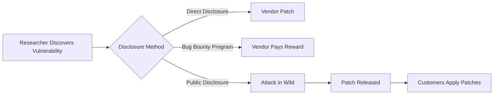

<!-- 
Generated by LectureQ (Enhanced Comprehensive Version)
Date: 2025-08-16 05:01:22
Model: qwen3:30b
Output Mode: Comprehensive
-->

# Chapter 27: Secure Systems Development - Comprehensive Study Notes

## 27.4 Prioritising Protection Goals

### Core Concept
**Risk-Reward Tradeoff**: Security decisions must balance risk mitigation against business value (profit/revenue). Overemphasis on security without considering business impact often leads to suboptimal outcomes.

---

### Key Principles and Concepts

#### **Business Risk vs Reward Analysis**
- **Example 1: Retail Fraud Management**
  - *Scenario*: A retailer with $10M turnover, $1M gross profit, and $150K theft losses.
    - Option A (Security Focus): "Stop theft to increase profits by 15%" → Profit increases from $1M to $1.15M
    - Option B (Business Growth Focus): Double turnover to $20M (even with tripling theft loss to $450K) → New profit = $1.55M (+85% increase)
  - *Key Insight*: Fraud management teams reporting to **Chief Marketing Officer** focus on sales opportunities ("only rejecting 3% of baskets instead of 4%" = +1% sales), while those reporting to **Chief Financial Officer** are seen as cost centers.

- **Example 2: Site Reliability Engineering**
  - *Principle*: Don't aim for "perfect" reliability (e.g., 99.99%) if users won't notice the difference.
  - *Strategy*: Deliberately set an **0.1% error budget** to:
    - Exercise resilience mechanisms through controlled failures
    - Allocate resources productively rather than chasing marginal gains

#### **Security Prioritization Debate**
- **"Tick-box approach"**: "Must have no open CVEs in any software"
  - *Critique*: Imposes high compliance cost, especially for firms that don't write all their own infrastructure (unlike Google)
  - *Reality Check*: Most organizations must prioritize vulnerabilities based on risk assessment

> 💡 **Key Insight from Textbook**: "Don't trust people who can only talk about 'tightening security.' Often it's too tight already, and what you really need to do is just focus it slightly differently."

---

### Case Studies & Real-World Examples

#### **Self-Service Checkout Evolution**
| Era | Approach | Business Outcome |
|-----|----------|------------------|
| 20 Years Ago (Pioneers) | Aggressive security challenges based on product weight | Reduced usability, higher customer frustration |
| Later Industry Standard | Gradual implementation with forgiving approach | Improved adoption and reduced losses through experience |
| Early 2020s (Post-COVID) | Scan-as-you-pick apps for grocery shopping | Increased sales efficiency; Amazon experimenting with fully self-service food stores |

- **Business Lesson**: "Profit is the reward for risk" - Self-service supermarkets were once considered too risky, but now dominate retail.

#### **Zoom Security Crisis**
- *Scenario*: Zoom grew from 20M to 200M users in March 2020
- *Consequence*: Forced into major security engineering effort (shifted from enterprise platform to public utility)
- *Key Insight*: "Entrepreneurs who succeed may have to improve security quickly."

---

### Safety vs Security Valuation Paradox

| Context | Value of Human Life |
|---------|---------------------|
| Road junction improvements | ~$50,000 per life saved |
| Train protection systems | >$500 million per life saved |
| Flu jabs/cancer screening | Hundreds to thousands per life saved |
| "War on terror" initiatives | Billions per life saved |

> 💡 **Psychological Insight**: Safety preferences change dramatically with perceived threat:
> - People may accept 1-in-10,000 risk from medical devices but become alarmed at 1-in-10,000,000 hacking risk.

---

## 27.5 Methodology

### Core Concept
**Software Engineering**: "The establishment and use of sound engineering principles in order to obtain economically software that is reliable and works efficiently on real machines."

> 💡 **Historical Context**: The term was proposed by Brian Randall (1968) during the "software crisis" when projects consistently failed.

---

### Software Development Models

#### Waterfall Model
- *Definition*: Sequential development process with no feedback from later stages to earlier ones.
  - Requirements → Specification → Implementation & Unit Testing → Integration & System Testing → Field Operations/Maintenance
- **Validation**: Building right system (requirements met)
- **Verification**: Building it right (against specification)

| Strengths | Weaknesses |
|-----------|------------|
| Early clarification of goals, architecture, interfaces | Requires detailed requirements upfront |
| Clear milestones for project managers | No feedback from testing to requirements |
| Cost transparency through separate billing stages | Not suitable when requirements are unknown |

- **V Model**: Variant used in safety-critical systems (Germany standard)
  - System flows down to implementation → climbs back up verification/validation
  - *Still a one-way process* where requirements drive the system

> 💡 **Historical Note**: The waterfall model was originally designed as "a means of getting engineering students started," not an accurate description of experienced designers' work.

---

#### Iterative Development (Agile)
- *Core Philosophy*: "Solve your worst problem. Repeat."
  - Early advocate: Harlan Mills ("build smallest system that works, try with real users")
  - Microsoft's approach contrasted with IBM's waterfall methodology
  - **Key Innovation**: Regression testing at regular intervals

| Waterfall | Agile |
|-----------|-------|
| Requires detailed requirements upfront | Requirements evolve through user feedback |
| Testing happens after development | Continuous integration and automated regression tests |
| "Big bang" deployment | Frequent small deployments |

- *Regression Test*: At regular intervals (typically daily), all code is compiled, tested against large input sets to ensure:
  - Previously working features still work
  - Old bugs haven't reappeared

> 💡 **Microsoft vs IBM**: Microsoft's approach enabled them to "take a $100bn business-software market from IBM" through better development methodology.

---

### Secure Development Lifecycle (SDL)

#### Microsoft SDL Components (2010 Simplified Implementation)
| Phase | Key Activities |
|-------|----------------|
| 1. Requirements | Risk assessment, quality gates ("bug bars"), regular reviews |
| 2. Design | Threat modeling, establish attack surface for detailed design |
| 3. Implementation | Approved tools, avoid unsafe functions, static analysis |
| 4. Verification | Dynamic analysis, fuzz testing, review of attack surface |
| 5. Release | Incident response plan, final security review |

#### Organizational Aspects
- **Security Subject-Matter Expert (SME)**: External to dev team for oversight
- **Security/Privacy Champion**: Within the development team itself

> 💡 **Maturity Model Insight**: Microsoft adapted Capability Maturity Model (CMM) from CMU, defining four levels of security maturity:
> - New teams underestimate project work and have high variance in time estimates
> - Mature teams better predict development times while reducing variance

---

### Gated Development for Security

- *Definition*: Pre-release version pushed through additional tests/reviews at regular intervals (e.g., Windows patches)
- **Why it's needed**: 
  - Security properties are emergent and diverse
  - Fewer security engineers compared to developers
  - Limited investment in specialized tools
  - Many vulnerabilities cross system abstraction levels

> 💡 **Historical Context**: Microsoft introduced "Patch Tuesday" (monthly updates) in 2003, shifting from ad-hoc patching. From 2003-2015 all customers received patches on the second Tuesday of each month.

---

### Software as a Service (SaaS)

#### Key Innovations
| Concept | Description |
|---------|-------------|
| Continuous Integration/Deployment | Migrate few users to new version for testing, then rest; controlled experiments with staging environments |
| Canary Deployment | Route 1% traffic to new version ("canary") before full rollout |
| A/B Testing | Measure user reactions to different features (e.g., Google browser warnings) |

#### Business Impact
- **Economics of Testing**: Ability to fix bugs quickly means less testing needed for target quality level
- **Data Utilization**: Monitor all aspects via dashboards; understand usability failures from security/safety/revenue perspectives

> 💡 **Key Insight**: "Large firms can optimise their products more quickly than smaller competitors... SaaS not only cuts costs in the short term, but increases lock-in in the long term."

---

### DevOps and DevSecOps

#### Evolution of Development Practices
| Era | Approach | Key Focus |
|-----|----------|-----------|
| 1960s-2000s | Waterfall (IBM) | Requirements-driven development |
| Early 2000s | Agile/DevOps (Microsoft, Google) | Continuous delivery and automation |
| Mid-2010s-Present | DevSecOps | Integrating security into continuous processes |

#### Microsoft vs. Google Ecosystems

| Aspect | Microsoft/Azure Approach | Google Approach |
|--------|--------------------------|----------------|
| **Security Integration** | "Shift left" - integrate early in development process | Security as part of infrastructure design philosophy |
| **Tools & Automation** | Extend SDL with metrics, threat modeling, crypto standards | Focus on automation for reliability and security |
| **Error Budgets** | 0.1% downtime budget to support experiments | Use error budgets for controlled outages ("chaos monkey") |

> 💡 **Google's Site Reliability Engineering (SRE)**: 
> - Set realistic availability targets (e.g., 99.9%) → use residual 0.1% for recovery, upgrades and experiments
> - "Chaos Monkey" takes down components to test resilience mechanisms

---

### Vulnerability Lifecycle Management

#### The Vulnerability Cycle Process

#### Stakeholder Interests
| Stakeholder | Interest |
|-------------|----------|
| Vendor | Minimize patching cost; avoid liability for customer devices needing patches (e.g., cars) |
| Customer | Avoid hassle of patching; may fail to apply updates |
| Researcher | Get reward (cash, fame); fix systems they rely on |
| Intelligence Agencies | Learn vulnerabilities quickly for zero-day exploits |
| Security Software Firms | Benefit from unpatched vulnerabilities in their products |

> 💡 **Critical Insight**: "The threat of eventual disclosure got vendors off their butts; the delay gave them time to test a proper fix."

---

### Coordinated Disclosure

- *Definition*: Process where multiple parties coordinate vulnerability reporting and patching
  - Critical for complex systems with many dependencies (e.g., Linux in embedded devices)

#### Case Study: Volkswagen vs. Academics
| Scenario | Outcome |
|----------|---------|
| Researchers discovered vulnerabilities in VW remote key entry system, responsibly disclosed to supplier |
| Supplier told VW only at last minute; VW sued researchers instead of fixing issue |
| **Result**: Court case against VW (lost), public attention on vulnerability |

> 💡 **Lesson Learned**: "Running bug bounty programs and monthly patching works better than threatening to sue people."

---

### Security Incident Response Plan

#### Four Essential Components
1. **Monitoring**
   - Build threat intelligence team; operate honeypots for IoT devices
   - Engage with ecosystem (bug bounties, CERTs, CVEs)

2. **Repair**
   - Prepare orchestrated response from intrusion detection through to dev teams
   - Alternative communication channels needed in emergencies

3. **Distribution**
   - Deploy patches rapidly: advance planning essential for consumer device patching
   - Balance between quick adoption (pioneers) and thorough testing (later adopters)

4. **Reassurance**
   - Educate CEO/board about need to respond quickly/honestly with compelling examples
   - Have press releases ready for incidents of varying severity

> 💡 **Critical Insight**: "Information security is a CEO issue" – breach can lead to loss of customers, stock price hit, or even CEO firing.

---

## 27.5.8 Organizational Mismanagement of Risk

### Key Failure Patterns
| Pattern | Description |
|---------|-------------|
| Requirement Fluctuation | Thin spread of domain knowledge → conflicting requirements → communication breakdown (e.g., London Ambulance Service disaster) |
| Y2K Success Story | Known requirement ("keep working through 2000") led to successful implementation despite scale |

#### Why Organizations Fail
- **Middle Managers**: Prefer checklist-based approaches over open learning processes
- **CISO Challenges**: 
  - "Good CISOs are almost as rare as hens' teeth"
  - Average tenure: ~2 years (high stress, constant saying no)
  - Requires people skills beyond technical expertise

> 💡 **Bezos' Law**: You can't run a dev project with more people than can be fed from two pizzas. Team of eight is about the limit.

---

### Risk Culture and Organizational Factors
- **Cultural Embedding**: Controls must fit organizational culture (e.g., dual-control safe locks in banks)
- **Moral Hazard**: Dumping risks on third parties removes incentives to take care (e.g., payment systems shifting fraud liability)

#### Example: Henry Ford's Product Liability Approach
> "If you were injured by one of his cars, you should sue the driver, not him" – took decades for courts/lawmakers to establish product liability.

---

## Comprehensive Summary

### Key Takeaways from Chapter 27.4 & 27.5

1. **Security Prioritization**: Balance risk mitigation with business value (profit/revenue), don't just "tighten security"
   
2. **Development Methodologies**:
   - Waterfall: Good for known requirements, safety-critical systems
   - Agile/DevOps: Better for evolving needs and rapid feedback

3. **Secure Development Lifecycle**: 
   - Microsoft's SDL integrates security throughout development process
   - "Shift left" means integrating security early in the cycle

4. **Vulnerability Management**:
   - Responsible disclosure is standard practice (not public disclosure)
   - Coordinated disclosure essential for complex systems with many dependencies

5. **Organizational Culture**: 
   - Security must be a CEO-level concern
   - CISO role requires people skills beyond technical expertise
   - Risk culture varies by industry and influences security decisions

6. **SaaS & DevSecOps**:
   - Continuous deployment enables rapid fixes but creates new challenges
   - "Chaos monkey" approach to test resilience mechanisms is now standard practice

---

## Study Questions (15-20)

1. Explain the business case for having fraud management teams report to marketing rather than finance.
   
2. What are the limitations of a pure "tick-box" security approach that aims for zero CVEs?

3. Describe how site reliability engineering uses an error budget, and why this is more effective than aiming for near-perfect availability.

4. Explain the difference between validation (building the right system) and verification (building it right).

5. What are three key strengths of the waterfall model? When might it be inappropriate to use?

6. How does regression testing support agile development practices, and why was this a critical innovation in software engineering during the 1990s-2000s?

7. Describe Microsoft's Secure Development Lifecycle (SDL) components and how they integrate security throughout the development process.

8. What is "gated development" for security? Why does it work better than continuous integration alone for security-critical systems?

9. Explain why vulnerability disclosure practices have evolved from anonymous bug reporting to coordinated disclosure, using Volkswagen as an example of what happens when companies don't follow best practices.

10. Describe the four components of a modern security incident response plan and explain how each contributes to effective breach management.

11. Why is information security considered "a CEO issue" according to this chapter?

12. What are three key differences between Microsoft's DevSecOps approach (Azure ecosystem) versus Google's approach, based on their engineering philosophies?

13. Explain the concept of technical debt and why it matters for secure systems development.

14. How does Bezos' law relate to organizational structure in software teams? Why is this relevant to security management?

15. Describe how safety valuation differs from security valuation (using examples like road junctions vs train protection).

16. What are the key challenges with implementing "zero-day" vulnerability disclosure programs, and why do some industries lag behind others in adopting best practices?

17. Explain what a "canary deployment" is and how it supports secure software delivery.

18. Why does Microsoft's approach to security differ from Google's? How has this evolved over time?

19. What are the key differences between traditional waterfall development and modern DevOps/DevSecOps approaches in terms of risk management?

20. Describe three organizational factors that contribute to poor security outcomes, based on examples provided in section 27.5.8.

---

## Key Terms & Definitions

| Term | Definition |
|------|------------|
| **Risk-Reward Tradeoff** | Balancing the cost/benefit of security measures against business value (profit/revenue) |
| **Error Budget** | Deliberately allocated downtime percentage to support resilience testing and controlled experiments |
| **CVE System** | Common Vulnerabilities and Exposures - system assigning numbers to reported vulnerabilities in publicly released software packages |
| **CVSS** | Common Vulnerability Scoring System - numerical representation of vulnerability severity |
| **Responsible Disclosure** | Process where researchers disclose vulnerabilities directly to vendors with a delay for patching before public disclosure |
| **Coordinated Disclosure** | Enhanced process where multiple parties coordinate vulnerability reporting and patching across dependencies |
| **DevSecOps** | Integration of security practices into DevOps processes, moving security left in the development cycle |
| **Technical Debt** | Development shortcuts that create future problems requiring "repayment" with interest (e.g., poor documentation, quick fixes) |
| **Regression Testing** | Automated testing to ensure previously working features still function after code changes |
| **Canary Deployment** | Gradual rollout of new software version by routing a small percentage of traffic through it first |

---

## Critical Concepts for Exam Preparation

1. **The Business Case for Security**: Understand how security decisions must align with business objectives (not just technical requirements).

2. **Development Methodology Evolution**: Be able to compare waterfall, spiral model, and agile/DevOps approaches in terms of their suitability for different contexts.

3. **Security Integration Points**: Know the five phases of Microsoft's SDL and where security should be integrated throughout development.

4. **Vulnerability Lifecycle Management**: Understand how vulnerabilities move from discovery through patching to exploitation (and why coordination matters).

5. **Organizational Risk Culture**: Be able to explain how organizational factors contribute to security failures beyond technical issues alone.

6. **SaaS Security Implications**: Recognize the unique challenges and opportunities presented by continuous deployment in SaaS environments for secure development practices.

7. **CEO-Level Responsibility**: Understand why information security is considered a top-level executive concern rather than just an IT issue.

8. **Safety vs Security Valuation Paradox**: Be able to explain why people value safety improvements differently based on context (e.g., road junctions vs train systems).
