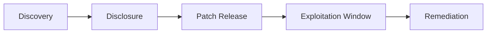

<!-- 
Generated by LectureQ (Enhanced Comprehensive Version)
Date: 2025-08-16 05:47:13
Model: qwen3:30b
Output Mode: Comprehensive
-->


# Comprehensive Study Notes: Module 2 - Input Sanitising and Authorisation
*Based on Week 2 Textbook Chapter (Ross Anderson Chapters 5, 6, 27.4–27.5)*  

---

## **I. Core Concepts of Secure Programming**  
### **A. Foundational Principles**  
1. **Input Sanitization vs. Validation**:  
   - **Sanitization**: *Cleaning* user input to remove malicious elements (e.g., stripping `<script>` tags from text fields).  
     > *Example*: Converting `""` → `"img src=x onerror=alert(1)"`.  
   - **Validation**: *Checking* if input meets predefined criteria (e.g., email format, length constraints).  
     > *Critical Insight*: Sanitization alone is insufficient; validation must be applied first. Always validate before sanitizing to avoid "double encoding" attacks.  

2. **Authentication vs. Authorization** (Common Exam Trap):  
   | **Term**          | **Definition**                                  | **Example**                          |
   |-------------------|-----------------------------------------------|--------------------------------------|
   | **Authentication**  | Verifying *who* a user is (e.g., password, biometrics). | User logs in with username/password. |
   | **Authorization**   | Checking *what resources* an authenticated user can access (e.g., admin vs. guest permissions). | Admin accesses `/admin/dashboard`, Guest sees only public pages. |

3. **Security Design Goals (Anderson 27.4)**:  
   - **Prioritization Framework**: Security goals must be ranked by impact (e.g., *confidentiality* > *availability* for financial systems).  
     - *Example*: For a bank app, preventing data breaches (`confidentiality`) is higher priority than avoiding minor downtime (`availability`).  

---

## **II. Key Vulnerabilities & Attack Vectors**  
### **A. Input-Driven Attacks (Web Application Focus)**  
#### 1. **SQL Injection (SQLi)**  
   - **Mechanism**: Injecting malicious SQL queries via user input to manipulate databases.  
     > *Classic Example*: Login form with `username = ' OR '1'='1` → Executes:  
     ```sql
     SELECT * FROM users WHERE username = '' OR '1'='1';
     -- Returns ALL users (bypasses authentication).
```
   - **Mitigation**: Use **parameterized queries** (prepared statements), not string concatenation.  
     > *Correct Code*: `stmt = conn.prepareStatement("SELECT * FROM users WHERE email = ?"); stmt.setString(1, userInput);`  

#### 2. **Cross-Site Scripting (XSS)**  
   - **Types & Examples**:  
     | **Type**          | **Mechanism**                                  | **Example Attack**                     |
     |-------------------|----------------------------------------------|----------------------------------------|
     | **Stored XSS**    | Malicious script saved in database, executed on page load. | User posts `<script>stealCookie()</script>` → All visitors see it. |
     | **Reflected XSS** | Script injected into URL/redirects (e.g., search query). | `https://site.com/search?q=<script>alert(1)</script>` → Victim’s browser executes script. |

   - **Mitigation**:  
     1. Escape output for context: Convert `<` to `&lt;`, `"` to `&quot;`.  
     2. Use Content Security Policy (CSP) headers to block inline scripts.  

#### 3. **OS Command Injection**  
   - **Mechanism**: Injecting OS commands via user input (e.g., in a "ping" tool).  
     > *Example*: `user_input = "; rm -rf /"` → Executes system command: `ping ; rm -rf /`.  
   - **Mitigation**: Avoid shell execution; use safe APIs (e.g., Python’s `subprocess.run` with `shell=False`).  

#### 4. **Deserialization Vulnerabilities**  
   - **Mechanism**: Untrusted data deserialized into objects, enabling remote code execution.  
     > *Example*: Java app using `ObjectInputStream.readObject()` on user-uploaded `.ser` file → Attacker crafts malicious payload to execute `Runtime.exec("rm -rf /")`.  
   - **Mitigation**: Never deserialize untrusted input; use safe serialization formats (e.g., JSON with strict schemas).  

---

### **B. Authentication & Authorization Flaws**  
#### 1. **Session Management Vulnerabilities**  
   | **Flaw Type**       | **How It Happens**                          | **Real-World Case Study**              |
   |---------------------|-------------------------------------------|----------------------------------------|
   | **Session Fixation** | Attacker sets victim’s session ID before login (e.g., via URL: `?session_id=abc123`). | 2014 LinkedIn breach: Session IDs leaked in URLs. |
   | **Session Hijacking** | Stealing active session token (e.g., via XSS). | Attackers steal cookies from `localStorage` using reflected XSS. |

#### 2. **Authorization Bypass Techniques**:  
   - **IDOR (Insecure Direct Object Reference)**:  
     > *Example*: URL `/user/profile?id=1001` → Change to `/user/profile?id=1002` to access another user’s data.  
     **Fix**: Use `if current_user.id == requested_id` before granting access.  

   - **Role-Based Access Control (RBAC) Misconfiguration**:  
     > *Example*: Admin role has permission `delete_all_users`, but a "moderator" accidentally inherits it via group assignment → Unauthorized deletion.  

---

## **III. Mitigation Strategies & Best Practices**  
### **A. Comprehensive Vulnerability Prevention Matrix**  
| **Vulnerability**       | **Proactive Mitigation**                     | **Reactive Measure (Post-Breach)**     |
|------------------------|-------------------------------------------|---------------------------------------|
| SQLi                   | Parameterized queries + input validation   | Database audit logs; WAF rules blocking `UNION`/`DROP`. |
| XSS                    | Output encoding + CSP headers             | Content Security Policy updates; browser-based script sanitization. |
| Session Hijacking      | Regenerate session IDs after login; use HTTPS | Monitor for abnormal logins (e.g., new IP). |
| Deserialization        | Avoid deserializing untrusted data         | Isolate services using serialization; runtime monitoring tools (e.g., AWS Lambda guards). |

### **B. Data Leakage Prevention**  
- **Sensitive Data Handling**:  
  - *Never store passwords in plaintext* → Use **bcrypt/scrypt** with salted hashing.  
    > `hash = bcrypt.hashpw(password.encode(), bcrypt.gensalt())`  
  - Mask sensitive data (e.g., credit card numbers: `****1234`).  

- **TLS/SSL for Data-in-Transit**:  
  - *Why it matters*: Prevents eavesdropping on unencrypted HTTP traffic.  
    > *Example*: HTTPS vs. HTTP → Attackers cannot steal session cookies from public Wi-Fi.  

---

## **IV. Critical Reading: Ross Anderson Chapters**  
### **A. Chapter 5 (Cryptography) Key Concepts**  
| **Term**               | **Definition & Security Relevance**                              |
|------------------------|---------------------------------------------------------------|
| **Hash Functions**     | One-way functions (e.g., SHA-3, bcrypt). *Prevents password storage leaks*; collisions must be impossible. |
| **Elliptic Curve Cryptography (ECC)** | More efficient than RSA for same security level → Used in TLS 1.3 for key exchange. |
| **TLS**                | Transport Layer Security: Encrypts web traffic via SSL/TLS handshake (e.g., `https://`). *Critical for auth flows*. |
| **Code Signing/PGP/GPG** | Verifies software integrity (`gpg --verify app.exe`) and sender identity → Prevents tampered updates. |

### **B. Chapter 6: Access Control Fundamentals**  
- **Principle of Least Privilege**: Users get *only* permissions needed for their role (e.g., HR can’t access financial records).  
- **Mandatory vs. Discretionary Controls**:  
  - *Mandatory*: System-enforced rules (e.g., "All users must log in via SSO").  
  - *Discretionary*: User-defined controls (e.g., sharing a file on Google Drive with specific people).  

### **C. Chapter 27: Vulnerability Cycle & CVE**  
- **Vulnerability Lifecycle**: Discovery → Disclosure → Patching → Exploitation (Anderson 27.5.7):  

- **CVE System**: Common Vulnerabilities and Exposures (e.g., `CVE-2021-44228` for Log4j).  
  > *Why it matters*: Standardized IDs enable security tools to track patches across systems.  

---

## **V. Summary: Key Takeaways**  
| **Concept**                | **Critical Insight**                                                                 |
|----------------------------|----------------------------------------------------------------------------------|
| **Input Sanitization**     | Always validate first → sanitize second; never trust user input.                  |
| **Authentication ≠ Authorization** | Auth = "You are who you say"; Authorization = "What can you do?"               |
| **Session Management**     | Regenerate IDs after login, use secure cookies (`HttpOnly`, `Secure` flags).      |
| **Cryptography Basics**    | Hash passwords (not encrypt), TLS for all web traffic, code signing for integrity.|
| **CVE/Vulnerability Cycle**| Patching must be prioritized based on exploit availability (e.g., Log4j was patched in 2 days but exploited widely before). |

---

## **VI. Study Questions (15-20)**  
### *Conceptual Understanding*  
1. Why is sanitizing input after validation dangerous? Provide an example where it fails.  
2. Contrast stored XSS and reflected XSS with real-world attack scenarios. How would you mitigate both?  
3. Explain how a session fixation attack exploits the authentication process. What’s one countermeasure?  

### *Technical Application*  
4. Given this vulnerable code: `query = "SELECT * FROM users WHERE email='" + userInput + "'";`, rewrite it securely using parameterized queries in Python (using `sqlite3`).  
5. A web app uses `eval(request.GET['code'])` to execute user-provided JavaScript snippets. Name two vulnerabilities and propose fixes.  

### *Reading Integration*  
6. How does Anderson’s "prioritizing protection goals" framework apply to a healthcare app vs. an e-commerce site? (Reference Chapter 27.4)  
7. Why is ECC preferred over RSA in modern TLS implementations? Explain using cryptographic efficiency metrics.  

### *Case Analysis*  
8. **CVE-2019-5736**: A container runtime vulnerability allowing root access via a malicious `runc` binary. How does this relate to deserialization flaws discussed in the chapter?  
9. An app uses IDOR: `/profile?id=123`. Describe how an attacker could exploit it and two ways to fix it (one proactive, one reactive).  

### *Advanced Application*  
10. Why is using `md5` for password hashing insecure today? Compare with bcrypt’s security properties.  
11. How would you implement RBAC in a system where users have dynamic roles (e.g., "project lead" changes weekly)? Reference Chapter 6 concepts.  

### *Exam-Style Questions*  
12. **True/False**: "Using `htmlspecialchars()` in PHP fully prevents XSS." Justify your answer.  
13. A developer uses `os.system("ping " + userInput)` for a network tool. Name the vulnerability and explain why it’s more severe than SQLi.  
14. Explain how TLS 1.3 improves security over TLS 1.2 in terms of handshake process (reference Chapter 5).  
15. **Scenario**: A session token is stored in `localStorage` without expiration. What attack could occur, and what two measures would fix it?  

---

> *"Security is not a product but a process."* — Ross Anderson, *Security Engineering*, Ch. 27.5  
> **Final Tip for Exams**: Always link vulnerabilities to their root cause (e.g., "XSS occurs due to unescaped output → Fix: escape all user-generated content").
