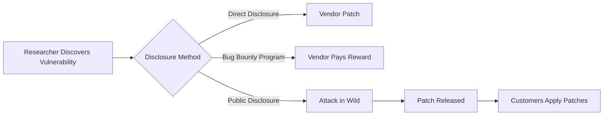
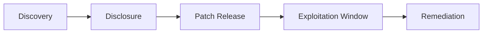

<!-- 
Combined Study Guide
Generated by LectureQ
Date: 2025-08-16 05:47:15
Week/Module: Week 2
Files Combined: 6
Content Type: Mixed
-->

# Week 2 - Complete Study Guide

> **Auto-generated combined study guide**  
> Generated from 6 individual notes files  
> Date: August 16, 2025

## 📚 Table of Contents

1. [Week 2: Lecture 2 - Secure Programming: Threat Modeling and Input Sanitization](#week-2-lecture-2---secure-programming-threat-modeling-and-input-sanitization)
2. [Chapter 27: Secure Systems Development - Comprehensive Study Notes](#chapter-27-secure-systems-development---comprehensive-study-notes)
3. [Comprehensive Cryptography Study Guide](#comprehensive-cryptography-study-guide)
4. [Comprehensive Study Notes: Chapter 6 - Access Control](#comprehensive-study-notes-chapter-6---access-control)
5. [Comprehensive Study Notes: Secure Programming Tutorial 1](#comprehensive-study-notes-secure-programming-tutorial-1)
6. [Comprehensive Study Notes: Module 2 - Input Sanitising and Authorisation](#comprehensive-study-notes-module-2---input-sanitising-and-authorisation)


---

# Week 2: Lecture 2 - Secure Programming: Threat Modeling and Input Sanitization

### Overview
This lecture introduces two critical security concepts for secure software development:
1. **Threat modeling** as a proactive approach to identify potential security threats early in the design phase
2. **Input sanitization and authentication**, focusing on preventing common web application vulnerabilities like injection attacks

The lecture covers foundational cybersecurity terminology, threat modeling methodologies (particularly STRIDE), attack trees, MITRE ATT&CK framework, Kerckhoff's Principle, OWASP Top 10 vulnerabilities, and practical examples of security flaws in web applications.

---

### Cybersecurity Fundamentals: Key Terminology

Before diving into threat modeling, it's essential to understand these core cybersecurity concepts:

#### The CIA Triad
The foundation for all security considerations:
- **Confidentiality**: Ensuring data is accessible only to authorized users
- **Integrity**: Guaranteeing data remains unaltered by unauthorized parties
- **Availability**: Maintaining system functionality when needed

> *Instructor Insight*: "These three principles form the bedrock of security. If you don't understand these, you'll struggle with everything else in this course."

#### Core Security Terminology
| Term | Definition | Example |
|------|------------|---------|
| **Threat** | Potential cause of harm that could exploit a vulnerability | Hacker attempting unauthorized access |
| **Vulnerability** | Weakness or flaw that can be exploited by a threat | Web app not validating input, allowing SQL injection |
| **Exploit** | Action/tool/code taking advantage of a vulnerability to cause harm | Attacker injects `' OR '1'='1' --` into login form |
| **Impact** | Damage resulting from successful exploitation | Breach of sensitive customer data, reputational loss |
| **Risk** | Likelihood that threat will exploit vulnerability considering impact | Probability SQL injection flaw will be exploited |

*Instructor Emphasis*: "Risk = Threat × Vulnerability × Impact. This is the fundamental equation for security risk assessment."

---

### Threat Modeling: A Proactive Security Approach

#### Why Threat Model?
- **Identify threats early** in software development (before implementation)
- **Prevent costly fixes later**: Insecure design costs up to 100x more to fix than if addressed during design phase
- **Align security with business objectives**

> *Instructor Insight*: "Threat modeling is like planning your home defense before you build it. You wouldn't wait until intruders are in your house to decide how to secure it."

#### Threat Modeling Process (Step-by-Step)
1. **Identify assets** - What needs protection? (Data, systems, business processes)
2. **Define security requirements** based on CIA triad
3. **Create data flow diagrams** showing system components and interactions
4. **Apply threat modeling methodology** (e.g., STRIDE) to identify threats
5. **Evaluate risks** and prioritize mitigation strategies

*Instructor Emphasis*: "The key is to do this *before* writing a single line of code, not after."

---

### STRIDE Methodology: A Practical Threat Modeling Approach

STRIDE was developed by Microsoft in 1999 as a mnemonic for identifying security threats. It categorizes threats into six types:

#### STRIDE Elements & Security Properties
| STRIDE Element | Security Property | Description |
|----------------|-------------------|-------------|
| **Spoofing Identity** | Authentication | Verifying user identity (or accepting anonymous users) |
| **Tampering** | Integrity | Ensuring data/system resources changed only appropriately by authorized people |
| **Repudiation** | Nonrepudiation | Preventing users from denying actions they performed |
| **Information Disclosure** | Confidentiality | Restricting access to intended recipients only |
| **Denial of Service (DoS)** | Availability | Maintaining system readiness when needed |
| **Elevation of Privileges** | Authorization | Ensuring explicit permissions for resource access |

> *Instructor Insight*: "Authentication is about verifying who you are. Authorization is about what you're allowed to do after verification."

#### Data Flow Diagrams: The Foundation of STRIDE
Data flow diagrams (DFDs) visually represent how data moves through a system:

**Key Components & Rules:**
- **Entities**: External actors interacting with the system (e.g., users, external services)
- **Processes**: Actions or functions within the system
- **Data Stores**: Databases or storage locations
- **Data Flows**: Directional arrows showing data movement

**DFD Construction Rules:**
1. Every entity-entity, entity-data store, and data store-data store must connect via a process
2. Processes must have at least one input and output
3. Use domain-specific names for all components (e.g., "Library System" instead of just "System")

#### Building Data Flow Diagrams: Step-by-Step

**Step 1: Context Diagram (Level 0)**
- Identify all external entities interacting with the system
- Show only one process (the entire system)
*Example*: For a library system, entities would include users, librarians, and the website.

**Step 2: System Process Breakdown (Level 1)**
- Split complex processes into sub-processes
- Identify data stores
- Check conditions for each flow
*Example*: The "Library Website" process might break down into:
- User interface handling requests
- Login process
- Database query handler

**Step 3: Further Decomposition (Optional, Level 2+)**
- Continue breaking down processes until you have manageable components

> *Instructor Insight*: "Think of it like peeling an onion. You start with the big picture and gradually reveal more detailed layers as needed."

---

### Practical Threat Modeling Exercise: Library System
Let's apply STRIDE to a library system:

**Scenario**: A normal user can remove books from the database.

- **STRIDE Element**: Elevation of Privileges (or Tampering)
- **Explanation**: The system allows users who shouldn't have this capability (normal users) to perform actions that should only be available to librarians.
- **Why it matters**: This is a classic example where authentication works correctly (users log in), but authorization fails (no check on user type before allowing book removal).

> *Instructor Insight*: "Authentication verifies who you are. Authorization determines what you can do after verification."

**Student Question**: "How does this relate to STRIDE elements?"

*Instructor Response*: "This is a clear case of Elevation of Privileges because normal users shouldn't be able to perform librarian-level actions, and Tampering because they're altering data without proper authorization."

---

### Attack Trees: Modeling Attacks from the Attacker's Perspective

#### Key Concepts
Attack trees model threats as decision trees from an attacker's perspective:
- **Capabilities**: What can the attacker do? (e.g., technical skills)
- **Motivation**: Why would they attack? (e.g., financial gain, revenge)
- **Vulnerabilities**: Weaknesses in the system that can be exploited

#### Example: Breaking into a Safe
```
Open Safe
├── Find written combination (possible, low cost)
│   └── Look on table/fridge (low effort)
└── Cut open safe (possible, high cost)
    ├── Requires special equipment (expensive)
    └── Needs physical strength (high effort)
```
*Instructor Emphasis*: "Attack trees help you think like an attacker to identify all possible paths they might take."

---

### MITRE ATT&CK Framework

#### What It Is
A globally accessible knowledge base of adversary tactics and techniques based on real-world cyber attacks.

#### Key Components:
- **Tactics**: High-level objectives (e.g., Initial Access, Execution)
- **Techniques**: Specific methods to achieve those tactics (e.g., Phishing for Initial Access)

> *Instructor Insight*: "MITRE ATT&CK is like a comprehensive playbook of how attackers operate. It helps security teams understand and defend against real-world threats."

*Practical Application*: This framework will be explored further in RangeForce modules.

---

### Kerckhoff's Principle: The Foundation of Secure Design

#### Core Concept
> **"Cryptosystems should remain secure even when the attacker knows all internal details of the system. The key should be the only thing that must be kept secret."**

*Instructor Emphasis*: "Never rely on security through obscurity. Assume attackers know everything about your system except the secret keys."

#### Why It Matters
- **Common Mistake**: Hardcoding secrets in source code (e.g., passwords, API keys)
- **Correct Approach**: Keep only the key secret; design systems assuming all other details are known

> *Instructor Insight*: "If you're hiding how your system works to prevent attacks, you've already failed. Attackers will find out anyway."

---

### OWASP Top 10: The Most Critical Web Application Vulnerabilities

#### Important Notes
- **Top 10 = Risks**, not impacts or vulnerabilities
- Updated every few years (2021 is the 7th update)
- Focuses on common security failures, not specific technical flaws

#### OWASP Top 10 Breakdown

##### A01: Broken Access Control
- **Description**: Failure to enforce proper access policies after authentication
- **Examples**:
  - Normal users can delete other users' data
  - Users can perform admin actions without authorization
- **Why it matters**: Directly relates to STRIDE's "Elevation of Privileges" element

##### A02: Cryptographic Failures
- **Description**: Inadequate protection for sensitive data in transit or at rest
- **Examples**:
  - Storing passwords as plaintext
  - Using weak encryption algorithms
  - Missing TLS configuration
- *Instructor Emphasis*: "This isn't just about fancy cryptography—it's about properly protecting data."

##### A03: Injection
- **Description**: Untrusted data sent directly to an interpreter without validation
- **Examples**:
  - SQL injection (exploiting database queries)
  - Command injection (executing arbitrary OS commands)
  - Cross-site scripting (XSS)

> *Instructor Insight*: "Injection flaws occur when you trust user input. Always assume users are attackers."

##### A04: Insecure Design
- **Description**: Security weaknesses in design, not just implementation
- **Key Point**: Costs up to 100x more to fix after development than during design phase
- **Why it matters**: Shift security left—integrate threat modeling early

> *Instructor Insight*: "If you don't model threats before writing code, you're building a house on sand."

##### A05: Security Misconfiguration
- **Description**: Unnecessary features enabled or insecure default configurations
- **Examples**:
  - Default credentials (e.g., admin/admin)
  - Error messages revealing stack traces
  - Unused ports/services

##### A06: Vulnerable and Outdated Components
- **Description**: Using libraries with known vulnerabilities
- **Key Point**: Root cause of largest, most costly breaches
- *Instructor Emphasis*: "This is why the US Executive Order 14028 (Sept. 2022) requires software supply chain transparency."

##### A07: Identification and Authentication Failures
- **Description**: Weak authentication mechanisms or session management
- **Examples**:
  - Allowing common passwords ("Password1", "admin/admin")
  - Missing multi-factor authentication (MFA)
  - Insecure session tokens

> *Instructor Insight*: "If your password is 'password', you've already failed security."

##### A08: Software and Data Integrity Failures
- **Description**: Failure to protect integrity of software or data
- **Examples**:
  - Unverified code updates
  - Missing build verification (SBOM)
  - Unsigned CI/CD pipelines

##### A09: Security Logging and Monitoring Failures
- **Description**: Inadequate logging, detection, or monitoring
- **Why it matters**: Critical for reducing breach window and meeting legal requirements

> *Instructor Insight*: "If you can't detect a breach, how will you respond to it?"

##### A10: Server-Side Request Forgery (SSRF)
- **Description**: Web application fetching remote resources without validating user-supplied URLs
- **Why it matters**: Added as #1 in community survey due to high exploit potential

> *Instructor Insight*: "This is why you should never trust a URL from an unverified source."

---

### Input Sanitization & Authentication: Practical Vulnerabilities

#### Web Application Architecture Overview
```
Client (Browser) → Server (Web App) → Database
          |               |
        GET/POST Requests   Queries
```
**Request Types**:
- **GET**: For requesting resources (e.g., `?id=5`)
- **POST**: For form submissions and sensitive data

---

### Injection Attacks: The Core Problem

#### Definition
> "Injection flaws occur when an application sends untrusted data to an interpreter."

*Instructor Emphasis*: "This is the most common web vulnerability. If you don't validate input, you're inviting attackers in."

#### Example: Command Injection (Ping Vulnerability)

**Vulnerable Code**:
```php
$t = $_REQUEST['ip'];
$o = shell_exec('ping -C 3 ' . $t);
echo $o;
```
**Attack Vector**: `127.0.0.1; ls`  
*(Semicolon separates commands, so it executes both ping and list files)*

**Resulting Command**:
```bash
ping -C 3 127.0.0.1; ls
```
**Exploit Impact**: Attacker can execute arbitrary system commands.

> *Instructor Insight*: "This is why you should never trust user input directly in command execution."

#### SQL Injection: The Most Famous Example

##### Vulnerable Code:
```php
$id = $_GET['id'];
$getid = "SELECT first_name, last_name FROM users WHERE user_id = $id";
$result = mysql_query($getid) or die(mysql_error());
```
**Attack Vector**: `1 OR 1=1;#`  
*(The semicolon ends the query, and # comments out the rest)*

**Resulting Query**:
```sql
SELECT first_name, last_name FROM users WHERE user_id = 1 OR 1=1;
```
**Impact**: Returns all user data (not just one user).

##### Why Quotes Don't Fully Fix It:
```php
$getid = "SELECT ... WHERE user_id = '$id'";
```
Attack Vector: `1' OR '1'='1';#`  
*(Quotes are escaped, but comment syntax bypasses the check)*

**Resulting Query**:
```sql
SELECT ... FROM users WHERE user_id = '1' OR '1'='1';#
```
> *Instructor Insight*: "This is why prepared statements (separating query from data) are essential."

---

### Cross-Site Scripting (XSS)

#### Types of XSS
| Type | Description | Example |
|------|-------------|---------|
| **Non-Persistent/Reflected** | Malicious code embedded directly in URL, reflected immediately to user | `https://example.com/search?q=<script>alert('xss')</script>` |
| **Persistent/Stored** | Malicious script stored on server (e.g., in database), executed for all users viewing the content | User posts comment with `<script>...</script>` |

*Instructor Emphasis*: "XSS is dangerous because it executes code in *your user's browser*, not your server."

---

### Cross-Site Request Forgery (CSRF)

#### How It Works
1. User logs into bank.com (sets session cookie)
2. Attacker tricks user to click malicious link: `bank.com/transfer?amount=10000&dest=evilcorp`
3. Browser sends request with valid session cookie
4. Bank processes transfer without user's knowledge

#### Why It Matters
- Requires **user interaction** (clicking a link)
- Requires **active session** on target site
- Different from XSS: CSRF exploits *existing authenticated sessions*, not browser vulnerabilities

> *Instructor Insight*: "CSRF is like someone tricking you into signing a document while you're already logged in to your bank."

---

### Assessment Information (Critical for Students)

#### Final Exam Details
- **Format**: Closed book, 40% hurdle requirement
- **Allowed Items**:
  - One A4 double-sided page of handwritten/printed notes
  - Four-function calculator without alphanumeric memory
- **Question Types**:
  - Multiple choice
  - Fill-in-the-blank (usually ≤3 words)
  - Essay questions requiring vulnerability identification and mitigation

*Instructor Emphasis*: "The sample exam is just a template—don't memorize it. Focus on understanding concepts."

---

#### RangeForce Assessment Details
| Component | Undergrad (3307) | Postgrad (7307) |
|-----------|------------------|-----------------|
| **Part 1** | 15 points | 10 points |
| **Part 2** | 15 points | 10 points |
| **Challenges** | N/A | 10 points |

*Key Requirements*:
- Complete at least 70 out of 79 modules in Parts 1 & 2
- For postgrads: Complete at least 5 out of 9 Challenges modules

> *Instructor Insight*: "Start immediately—RangeForce access expires after 6 weeks. Don't wait until the last minute."

---

### Group Project Information (Critical for Students)

- **Deadline**: Form groups by end of this week
- **Group Size**: Maximum 5 students per group
- **Project Focus**: Design a secure communication protocol

*Instructor Emphasis*: "This is your chance to apply security principles. Don't wait—form teams now."

---

### Ethical Considerations (Critical Reminder)

> **"Do not use these tools and methods against real targets! It might be illegal to test your own network in some countries."**

*Instructor Emphasis*: "Always follow ethical guidelines: Use virtual machines or sandbox environments only. Never attack systems without explicit permission."

---

### Summary & Key Takeaways

#### Core Security Principles
1. **Kerckhoff's Principle**: Assume attackers know everything except secret keys.
2. **Threat Modeling Early**: Identify threats before coding (STRIDE methodology).
3. **Input Validation is Non-Negotiable**: Never trust user input directly.

#### Critical Vulnerabilities to Avoid
| OWASP Category | Key Risk | Prevention |
|----------------|----------|------------|
| A01: Broken Access Control | Users performing unauthorized actions | Implement proper authorization checks |
| A02: Cryptographic Failures | Sensitive data exposed | Encrypt in transit and at rest |
| A03: Injection | Unvalidated input executed as code | Use parameterized queries/prepared statements |
| A04: Insecure Design | Security ignored until late stage | Integrate threat modeling early |

#### Practical Application
- **For any user input**: Validate, sanitize, and escape before use.
- **For authentication**: Enforce strong passwords and MFA.
- **For data storage**: Encrypt sensitive information.

---

### Study Questions

1. Explain Kerckhoff's Principle in your own words and why it matters for secure design.
2. Describe the difference between authentication and authorization with an example from the library system.
3. How would you apply STRIDE to a banking application? Provide one threat per STRIDE element.
4. What is the fundamental reason SQL injection occurs, and how can it be prevented?
5. Why does OWASP consider "Insecure Design" as a critical category (A04)?
6. Explain why command injection in the ping example would fail if proper input validation was implemented.
7. How do XSS and CSRF differ in their attack mechanisms? Provide an example of each.
8. What is the significance of MITRE ATT&CK for security professionals?
9. Why does Kerckhoff's Principle make hard-coded secrets (e.g., passwords in code) a critical vulnerability?
10. Describe how you would build a data flow diagram for a simple e-commerce website.

---

### Practical Exercises

#### Exercise 1: STRIDE Analysis
Take an online shopping application and identify:
- One threat related to Spoofing Identity
- One threat related to Tampering
- One threat related to Information Disclosure

#### Exercise 2: SQL Injection Prevention
Rewrite this vulnerable PHP code using prepared statements:

```php
$id = $_GET['id'];
$query = "SELECT * FROM products WHERE id = $id";
$result = mysql_query($query);
```
#### Exercise 3: XSS Defense
How would you prevent reflected XSS in a search feature?
- Current implementation: `<input type="text" name="search">`
- Vulnerable code: `echo "You searched for: " . $_GET['search'];`


---

# Chapter 27: Secure Systems Development - Comprehensive Study Notes


### 27.4 Prioritising Protection Goals

#### Core Concept
**Risk-Reward Tradeoff**: Security decisions must balance risk mitigation against business value (profit/revenue). Overemphasis on security without considering business impact often leads to suboptimal outcomes.

---

#### Key Principles and Concepts

##### **Business Risk vs Reward Analysis**
- **Example 1: Retail Fraud Management**
  - *Scenario*: A retailer with $10M turnover, $1M gross profit, and $150K theft losses.
    - Option A (Security Focus): "Stop theft to increase profits by 15%" → Profit increases from $1M to $1.15M
    - Option B (Business Growth Focus): Double turnover to $20M (even with tripling theft loss to $450K) → New profit = $1.55M (+85% increase)
  - *Key Insight*: Fraud management teams reporting to **Chief Marketing Officer** focus on sales opportunities ("only rejecting 3% of baskets instead of 4%" = +1% sales), while those reporting to **Chief Financial Officer** are seen as cost centers.

- **Example 2: Site Reliability Engineering**
  - *Principle*: Don't aim for "perfect" reliability (e.g., 99.99%) if users won't notice the difference.
  - *Strategy*: Deliberately set an **0.1% error budget** to:
    - Exercise resilience mechanisms through controlled failures
    - Allocate resources productively rather than chasing marginal gains

##### **Security Prioritization Debate**
- **"Tick-box approach"**: "Must have no open CVEs in any software"
  - *Critique*: Imposes high compliance cost, especially for firms that don't write all their own infrastructure (unlike Google)
  - *Reality Check*: Most organizations must prioritize vulnerabilities based on risk assessment

> 💡 **Key Insight from Textbook**: "Don't trust people who can only talk about 'tightening security.' Often it's too tight already, and what you really need to do is just focus it slightly differently."

---

#### Case Studies & Real-World Examples

##### **Self-Service Checkout Evolution**
| Era | Approach | Business Outcome |
|-----|----------|------------------|
| 20 Years Ago (Pioneers) | Aggressive security challenges based on product weight | Reduced usability, higher customer frustration |
| Later Industry Standard | Gradual implementation with forgiving approach | Improved adoption and reduced losses through experience |
| Early 2020s (Post-COVID) | Scan-as-you-pick apps for grocery shopping | Increased sales efficiency; Amazon experimenting with fully self-service food stores |

- **Business Lesson**: "Profit is the reward for risk" - Self-service supermarkets were once considered too risky, but now dominate retail.

##### **Zoom Security Crisis**
- *Scenario*: Zoom grew from 20M to 200M users in March 2020
- *Consequence*: Forced into major security engineering effort (shifted from enterprise platform to public utility)
- *Key Insight*: "Entrepreneurs who succeed may have to improve security quickly."

---

#### Safety vs Security Valuation Paradox

| Context | Value of Human Life |
|---------|---------------------|
| Road junction improvements | ~$50,000 per life saved |
| Train protection systems | >$500 million per life saved |
| Flu jabs/cancer screening | Hundreds to thousands per life saved |
| "War on terror" initiatives | Billions per life saved |

> 💡 **Psychological Insight**: Safety preferences change dramatically with perceived threat:
> - People may accept 1-in-10,000 risk from medical devices but become alarmed at 1-in-10,000,000 hacking risk.

---

### 27.5 Methodology

#### Core Concept
**Software Engineering**: "The establishment and use of sound engineering principles in order to obtain economically software that is reliable and works efficiently on real machines."

> 💡 **Historical Context**: The term was proposed by Brian Randall (1968) during the "software crisis" when projects consistently failed.

---

#### Software Development Models

##### Waterfall Model
- *Definition*: Sequential development process with no feedback from later stages to earlier ones.
  - Requirements → Specification → Implementation & Unit Testing → Integration & System Testing → Field Operations/Maintenance
- **Validation**: Building right system (requirements met)
- **Verification**: Building it right (against specification)

| Strengths | Weaknesses |
|-----------|------------|
| Early clarification of goals, architecture, interfaces | Requires detailed requirements upfront |
| Clear milestones for project managers | No feedback from testing to requirements |
| Cost transparency through separate billing stages | Not suitable when requirements are unknown |

- **V Model**: Variant used in safety-critical systems (Germany standard)
  - System flows down to implementation → climbs back up verification/validation
  - *Still a one-way process* where requirements drive the system

> 💡 **Historical Note**: The waterfall model was originally designed as "a means of getting engineering students started," not an accurate description of experienced designers' work.

---

##### Iterative Development (Agile)
- *Core Philosophy*: "Solve your worst problem. Repeat."
  - Early advocate: Harlan Mills ("build smallest system that works, try with real users")
  - Microsoft's approach contrasted with IBM's waterfall methodology
  - **Key Innovation**: Regression testing at regular intervals

| Waterfall | Agile |
|-----------|-------|
| Requires detailed requirements upfront | Requirements evolve through user feedback |
| Testing happens after development | Continuous integration and automated regression tests |
| "Big bang" deployment | Frequent small deployments |

- *Regression Test*: At regular intervals (typically daily), all code is compiled, tested against large input sets to ensure:
  - Previously working features still work
  - Old bugs haven't reappeared

> 💡 **Microsoft vs IBM**: Microsoft's approach enabled them to "take a $100bn business-software market from IBM" through better development methodology.

---

#### Secure Development Lifecycle (SDL)

##### Microsoft SDL Components (2010 Simplified Implementation)
| Phase | Key Activities |
|-------|----------------|
| 1. Requirements | Risk assessment, quality gates ("bug bars"), regular reviews |
| 2. Design | Threat modeling, establish attack surface for detailed design |
| 3. Implementation | Approved tools, avoid unsafe functions, static analysis |
| 4. Verification | Dynamic analysis, fuzz testing, review of attack surface |
| 5. Release | Incident response plan, final security review |

##### Organizational Aspects
- **Security Subject-Matter Expert (SME)**: External to dev team for oversight
- **Security/Privacy Champion**: Within the development team itself

> 💡 **Maturity Model Insight**: Microsoft adapted Capability Maturity Model (CMM) from CMU, defining four levels of security maturity:
> - New teams underestimate project work and have high variance in time estimates
> - Mature teams better predict development times while reducing variance

---

#### Gated Development for Security

- *Definition*: Pre-release version pushed through additional tests/reviews at regular intervals (e.g., Windows patches)
- **Why it's needed**: 
  - Security properties are emergent and diverse
  - Fewer security engineers compared to developers
  - Limited investment in specialized tools
  - Many vulnerabilities cross system abstraction levels

> 💡 **Historical Context**: Microsoft introduced "Patch Tuesday" (monthly updates) in 2003, shifting from ad-hoc patching. From 2003-2015 all customers received patches on the second Tuesday of each month.

---

#### Software as a Service (SaaS)

##### Key Innovations
| Concept | Description |
|---------|-------------|
| Continuous Integration/Deployment | Migrate few users to new version for testing, then rest; controlled experiments with staging environments |
| Canary Deployment | Route 1% traffic to new version ("canary") before full rollout |
| A/B Testing | Measure user reactions to different features (e.g., Google browser warnings) |

##### Business Impact
- **Economics of Testing**: Ability to fix bugs quickly means less testing needed for target quality level
- **Data Utilization**: Monitor all aspects via dashboards; understand usability failures from security/safety/revenue perspectives

> 💡 **Key Insight**: "Large firms can optimise their products more quickly than smaller competitors... SaaS not only cuts costs in the short term, but increases lock-in in the long term."

---

#### DevOps and DevSecOps

##### Evolution of Development Practices
| Era | Approach | Key Focus |
|-----|----------|-----------|
| 1960s-2000s | Waterfall (IBM) | Requirements-driven development |
| Early 2000s | Agile/DevOps (Microsoft, Google) | Continuous delivery and automation |
| Mid-2010s-Present | DevSecOps | Integrating security into continuous processes |

##### Microsoft vs. Google Ecosystems

| Aspect | Microsoft/Azure Approach | Google Approach |
|--------|--------------------------|----------------|
| **Security Integration** | "Shift left" - integrate early in development process | Security as part of infrastructure design philosophy |
| **Tools & Automation** | Extend SDL with metrics, threat modeling, crypto standards | Focus on automation for reliability and security |
| **Error Budgets** | 0.1% downtime budget to support experiments | Use error budgets for controlled outages ("chaos monkey") |

> 💡 **Google's Site Reliability Engineering (SRE)**: 
> - Set realistic availability targets (e.g., 99.9%) → use residual 0.1% for recovery, upgrades and experiments
> - "Chaos Monkey" takes down components to test resilience mechanisms

---

#### Vulnerability Lifecycle Management

##### The Vulnerability Cycle Process

##### Stakeholder Interests
| Stakeholder | Interest |
|-------------|----------|
| Vendor | Minimize patching cost; avoid liability for customer devices needing patches (e.g., cars) |
| Customer | Avoid hassle of patching; may fail to apply updates |
| Researcher | Get reward (cash, fame); fix systems they rely on |
| Intelligence Agencies | Learn vulnerabilities quickly for zero-day exploits |
| Security Software Firms | Benefit from unpatched vulnerabilities in their products |

> 💡 **Critical Insight**: "The threat of eventual disclosure got vendors off their butts; the delay gave them time to test a proper fix."

---

#### Coordinated Disclosure

- *Definition*: Process where multiple parties coordinate vulnerability reporting and patching
  - Critical for complex systems with many dependencies (e.g., Linux in embedded devices)

##### Case Study: Volkswagen vs. Academics
| Scenario | Outcome |
|----------|---------|
| Researchers discovered vulnerabilities in VW remote key entry system, responsibly disclosed to supplier |
| Supplier told VW only at last minute; VW sued researchers instead of fixing issue |
| **Result**: Court case against VW (lost), public attention on vulnerability |

> 💡 **Lesson Learned**: "Running bug bounty programs and monthly patching works better than threatening to sue people."

---

#### Security Incident Response Plan

##### Four Essential Components
1. **Monitoring**
   - Build threat intelligence team; operate honeypots for IoT devices
   - Engage with ecosystem (bug bounties, CERTs, CVEs)

2. **Repair**
   - Prepare orchestrated response from intrusion detection through to dev teams
   - Alternative communication channels needed in emergencies

3. **Distribution**
   - Deploy patches rapidly: advance planning essential for consumer device patching
   - Balance between quick adoption (pioneers) and thorough testing (later adopters)

4. **Reassurance**
   - Educate CEO/board about need to respond quickly/honestly with compelling examples
   - Have press releases ready for incidents of varying severity

> 💡 **Critical Insight**: "Information security is a CEO issue" – breach can lead to loss of customers, stock price hit, or even CEO firing.

---

### 27.5.8 Organizational Mismanagement of Risk

#### Key Failure Patterns
| Pattern | Description |
|---------|-------------|
| Requirement Fluctuation | Thin spread of domain knowledge → conflicting requirements → communication breakdown (e.g., London Ambulance Service disaster) |
| Y2K Success Story | Known requirement ("keep working through 2000") led to successful implementation despite scale |

##### Why Organizations Fail
- **Middle Managers**: Prefer checklist-based approaches over open learning processes
- **CISO Challenges**: 
  - "Good CISOs are almost as rare as hens' teeth"
  - Average tenure: ~2 years (high stress, constant saying no)
  - Requires people skills beyond technical expertise

> 💡 **Bezos' Law**: You can't run a dev project with more people than can be fed from two pizzas. Team of eight is about the limit.

---

#### Risk Culture and Organizational Factors
- **Cultural Embedding**: Controls must fit organizational culture (e.g., dual-control safe locks in banks)
- **Moral Hazard**: Dumping risks on third parties removes incentives to take care (e.g., payment systems shifting fraud liability)

##### Example: Henry Ford's Product Liability Approach
> "If you were injured by one of his cars, you should sue the driver, not him" – took decades for courts/lawmakers to establish product liability.

---

### Comprehensive Summary

#### Key Takeaways from Chapter 27.4 & 27.5

1. **Security Prioritization**: Balance risk mitigation with business value (profit/revenue), don't just "tighten security"
   
2. **Development Methodologies**:
   - Waterfall: Good for known requirements, safety-critical systems
   - Agile/DevOps: Better for evolving needs and rapid feedback

3. **Secure Development Lifecycle**: 
   - Microsoft's SDL integrates security throughout development process
   - "Shift left" means integrating security early in the cycle

4. **Vulnerability Management**:
   - Responsible disclosure is standard practice (not public disclosure)
   - Coordinated disclosure essential for complex systems with many dependencies

5. **Organizational Culture**: 
   - Security must be a CEO-level concern
   - CISO role requires people skills beyond technical expertise
   - Risk culture varies by industry and influences security decisions

6. **SaaS & DevSecOps**:
   - Continuous deployment enables rapid fixes but creates new challenges
   - "Chaos monkey" approach to test resilience mechanisms is now standard practice

---

### Study Questions (15-20)

1. Explain the business case for having fraud management teams report to marketing rather than finance.
   
2. What are the limitations of a pure "tick-box" security approach that aims for zero CVEs?

3. Describe how site reliability engineering uses an error budget, and why this is more effective than aiming for near-perfect availability.

4. Explain the difference between validation (building the right system) and verification (building it right).

5. What are three key strengths of the waterfall model? When might it be inappropriate to use?

6. How does regression testing support agile development practices, and why was this a critical innovation in software engineering during the 1990s-2000s?

7. Describe Microsoft's Secure Development Lifecycle (SDL) components and how they integrate security throughout the development process.

8. What is "gated development" for security? Why does it work better than continuous integration alone for security-critical systems?

9. Explain why vulnerability disclosure practices have evolved from anonymous bug reporting to coordinated disclosure, using Volkswagen as an example of what happens when companies don't follow best practices.

10. Describe the four components of a modern security incident response plan and explain how each contributes to effective breach management.

11. Why is information security considered "a CEO issue" according to this chapter?

12. What are three key differences between Microsoft's DevSecOps approach (Azure ecosystem) versus Google's approach, based on their engineering philosophies?

13. Explain the concept of technical debt and why it matters for secure systems development.

14. How does Bezos' law relate to organizational structure in software teams? Why is this relevant to security management?

15. Describe how safety valuation differs from security valuation (using examples like road junctions vs train protection).

16. What are the key challenges with implementing "zero-day" vulnerability disclosure programs, and why do some industries lag behind others in adopting best practices?

17. Explain what a "canary deployment" is and how it supports secure software delivery.

18. Why does Microsoft's approach to security differ from Google's? How has this evolved over time?

19. What are the key differences between traditional waterfall development and modern DevOps/DevSecOps approaches in terms of risk management?

20. Describe three organizational factors that contribute to poor security outcomes, based on examples provided in section 27.5.8.

---

### Key Terms & Definitions

| Term | Definition |
|------|------------|
| **Risk-Reward Tradeoff** | Balancing the cost/benefit of security measures against business value (profit/revenue) |
| **Error Budget** | Deliberately allocated downtime percentage to support resilience testing and controlled experiments |
| **CVE System** | Common Vulnerabilities and Exposures - system assigning numbers to reported vulnerabilities in publicly released software packages |
| **CVSS** | Common Vulnerability Scoring System - numerical representation of vulnerability severity |
| **Responsible Disclosure** | Process where researchers disclose vulnerabilities directly to vendors with a delay for patching before public disclosure |
| **Coordinated Disclosure** | Enhanced process where multiple parties coordinate vulnerability reporting and patching across dependencies |
| **DevSecOps** | Integration of security practices into DevOps processes, moving security left in the development cycle |
| **Technical Debt** | Development shortcuts that create future problems requiring "repayment" with interest (e.g., poor documentation, quick fixes) |
| **Regression Testing** | Automated testing to ensure previously working features still function after code changes |
| **Canary Deployment** | Gradual rollout of new software version by routing a small percentage of traffic through it first |

---

### Critical Concepts for Exam Preparation

1. **The Business Case for Security**: Understand how security decisions must align with business objectives (not just technical requirements).

2. **Development Methodology Evolution**: Be able to compare waterfall, spiral model, and agile/DevOps approaches in terms of their suitability for different contexts.

3. **Security Integration Points**: Know the five phases of Microsoft's SDL and where security should be integrated throughout development.

4. **Vulnerability Lifecycle Management**: Understand how vulnerabilities move from discovery through patching to exploitation (and why coordination matters).

5. **Organizational Risk Culture**: Be able to explain how organizational factors contribute to security failures beyond technical issues alone.

6. **SaaS Security Implications**: Recognize the unique challenges and opportunities presented by continuous deployment in SaaS environments for secure development practices.

7. **CEO-Level Responsibility**: Understand why information security is considered a top-level executive concern rather than just an IT issue.

8. **Safety vs Security Valuation Paradox**: Be able to explain why people value safety improvements differently based on context (e.g., road junctions vs train systems).


---

# Comprehensive Cryptography Study Guide


### 1. Symmetric Cryptography Fundamentals

#### 1.1 Block Ciphers
Block ciphers are cryptographic algorithms that operate on fixed-size blocks of data (typically 64 or 128 bits) using a secret key.

**Key Concepts:**
- **AES (Advanced Encryption Standard)** - The current standard for symmetric encryption, replacing DES.
- **Substitution and Permutation Networks** - AES is constructed through careful combination of substitutions (S-boxes) and permutations to achieve confusion and diffusion properties.
- **Modes of Operation** - How block ciphers are used in practice:
  * ECB (Electronic Codebook): Encrypts each block independently. **Insecure for most applications due to pattern preservation**
  * CBC (Cipher Block Chaining): Each plaintext block is XORed with the previous ciphertext before encryption, creating dependency between blocks.
  * CTR (Counter Mode): Turns a block cipher into a stream cipher by encrypting successive counter values.

> "Never use ECB mode unless you really understand what you're doing."

#### 1.2 Stream Ciphers
Stream ciphers generate a keystream that is combined with the plaintext to produce ciphertext, typically using XOR operations.

**Construction from Block Ciphers:**
- Can be constructed by putting block ciphers in specific modes of operation (like CTR mode)
- Have different error propagation properties compared to block cipher modes

#### 1.3 Hash Functions
Hash functions take an input message and return a fixed-size output called a hash digest.

**Key Properties:**
- **One-way**: Given h = H(x), it should be computationally infeasible to find x.
- **Collision-resistant**: It should be hard to find two different inputs that produce the same hash (x ≠ y but H(x) = H(y)).
- **Preimage resistance**: Hard to reverse a given hash value back to its input.

**Common Hash Functions:**
| Algorithm | Output Size | Status |
|-----------|-------------|--------|
| MD5       | 128 bits    | Broken for collision attacks (no longer secure) |
| SHA-1     | 160 bits    | Vulnerable, no longer recommended |
| SHA-2     | Various sizes (SHA-256, SHA-384, etc.) | Current standard |
| SHA-3/Keccak | Various sizes | NIST-standardized alternative to SHA-2 |

**Example of Hash Collision:**
> In February 2017, scientists from Amsterdam and Google published a collision for SHA-1 (the first practical attack), proving the point that it was insecure. This led to widespread migration away from SHA-1.

#### 1.4 HMAC - Keyed Hashing
HMAC is an algorithm for message authentication using hash functions with keys:
```
HMAC_k(M) = h(k ⊕ B, h(k ⊕ A, M))
```
Where:
- `A` and `B` are constants (0x36 and 0x5C repeated)
- `h` is the underlying hash function
- `k` is the secret key

**Purpose:** Provides message authentication using a shared secret key.

> "If a hash function is on the weak side, this construction can make exploitable collisions harder to find."

#### 1.5 Merkle Trees for Large Data Structures
Merkle trees are used to efficiently verify large data structures by hashing multiple inputs into a single root hash:
```
Root = H(H(left_child) || H(right_child))
```
**Structure:**
- Leaves contain hashes of individual data blocks
- Each non-leaf node contains the hash of its child nodes' hashes

**Applications:**
1. **Code Signing**: Allows verification without waiting for all files to be checked.
2. **Blockchain Applications**: A blockchain is essentially a Merkle tree.

> "Merkle saw that you could generate a series of private keys by encrypting a counter with a master secret key, and then use a tree to hash the resulting public keys."

### 2. Asymmetric Cryptography

#### 2.1 RSA (Rivest-Shamir-Adleman)
RSA is based on the difficulty of factoring large integers.

**Mathematical Foundation:**
- **Euler's Theorem**: For integer n with gcd(a,n)=1, a^φ(n) ≡ 1 mod n
- φ(n) = number of positive integers less than n that are coprime to n

For RSA:
- N = p × q (product of two large primes)
- φ(N) = (p-1)(q-1)
- Public exponent e: gcd(e, φ(N)) = 1
- Private key d: de ≡ 1 mod φ(N)

**Encryption & Decryption:**
```
C ≡ M^e mod N   [Encryption]
M ≡ C^d mod N    [Decryption]
```
> "Neither RSA encryption nor signature is safe to use on its own. The reason is that, as encryption is an algebraic process, it preserves certain algebraic properties."

#### 2.2 OAEP (Optimal Asymmetric Encryption Padding)
OAEP adds randomness and redundancy to prevent attacks:
```
C1 = M ⊕ h(N)
C2 = N ⊕ h(C1)
Result: C = RSA_encrypt(C1 || C2)
```
**Purpose:** Prevents chosen-ciphertext attacks, low-exponent attacks, and homomorphism-based attacks.

> "This was eventually proven to be secure. There are a number of public-key cryptography standards; PKCS #1 describes OAEP."

#### 2.3 Diffie-Hellman Key Exchange
A protocol for establishing shared secrets over an insecure channel:
```
Alice: Choose random x_A, compute y_A = g^x_A mod p
Bob:   Choose random x_B, compute y_B = g^x_B mod p

Shared secret:
  Alice computes K = (g^x_B)^x_A mod p = g^(x_A*x_B) mod p
  Bob computes K = (g^x_A)^x_B mod p = g^(x_A*x_B) mod p
```
**Forward Security:**
- If transient keys are used, an attacker who compromises past private keys cannot decrypt future communications.
- "Even if an opponent had inspected both their machines before this protocol was started... the opponent could still not eavesdrop on their traffic."

#### 2.4 Digital Signature Algorithm (DSA)
A variant of ElGamal signatures that uses discrete logarithms:

**Key Parameters:**
- Prime p (typically 2048 bits for security level equivalent to RSA-2048)
- Prime q (256 bits, dividing p-1)
- Generator g of order q modulo p
- Private signing key x
- Public verification key y = g^x mod p

**Signature Process:**
```
r ≡ (g^k mod p) mod q   [Random k]
s ≡ (h(M) - xr)/k mod q  [Hash h(M)]
Sig_x(M) = (r, s)
```
#### 2.5 Elliptic Curve Cryptography (ECC)

**Mathematical Foundation:**
- Uses discrete logarithms on elliptic curves
- An elliptic curve is defined by y² = x³ + ax + b

**Advantages over Traditional Systems:**
1. **Performance**: Requires less computation and shorter keys for equivalent security.
2. **Efficiency in constrained environments**: Used in EMV payment cards, Bitcoin.

> "Elliptic curve cryptography uses discrete logarithms on an elliptic curve – a curve given by an equation like y² = x³ + ax + b."

**Security Comparison:**
| Security Level | RSA Key Size (bits) | ECC Key Size (bits) |
|----------------|--------------------|---------------------|
| 80 bits        | ~1024              | ~160                |
| 112 bits       | ~2048              | ~224                |
| 128 bits       | ~3072              | ~256                |

> "Elliptic curve systems appear to achieve this bound; a 256-bit elliptic scheme could be about as hard to break as a 128-bit block cipher with a 128-bit key."

#### 2.6 Identity-Based Cryptography
A system where public keys are derived from identities (e.g., email addresses):
```
Public Key = ID (e.g., "alice@example.com")
Private Key = f(ID, master_secret)
```
**How it Works:**
- User chooses identity.
- Central authority issues private key corresponding to that identity using its own secret key.

> "Identity-based primitives have been used in a few specialist systems: in Zcash for the payment privacy mechanisms..."

### 3. Cryptographic Protocols

#### 3.1 TLS (Transport Layer Security)

**TLS Handshake Process (Simplified):**
```
C → S: ClientHello {name, nonce}
S → C: ServerHello {name, nonce, certificate with public key}
C → S: Encrypted pre-master-secret + Finished message
S → C: Finished message + Data encrypted under master secret
```
**Key Components:**
- **Pre-Master Secret**: Random value exchanged using RSA or Diffie-Hellman.
- **Master Secret**: Derived from pre-master secret and nonces (K1 = h(K0, NC, NS)).
- **Session Keys**: Generated by hashing the master secret with new nonces.

**TLS Versions:**
| Version | Year | Key Features |
|---------|------|--------------|
| SSL 3.0 | 1996 | Initial version; vulnerable to attacks |
| TLS 1.0 | 1999 | Renamed from SSL 3.0 |
| TLS 1.1 | 2006 | Protection against CBC padding errors |
| TLS 1.2 | 2008 | Support for SHA-256 and authenticated encryption |
| TLS 1.3 | 2019 | Mandatory forward secrecy via Diffie-Hellman |

> "TLS 1.3 dropped backwards compatibility to end support for many old ciphers, and made it mandatory to establish end-to-end forward secrecy by means of a Diffie-Hellman key exchange at the start of each session."

#### 3.2 QUIC Protocol
A UDP-based protocol designed as an alternative to TLS:

**Key Features:**
- Faster session establishment (reduces latency)
- Allows sessions to persist across network changes
- Uses cookies holding client's last IP address

> "Google claims it reduces search latency 8% and YouTube buffer time 18%. Independent evaluation suggests that the benefit is mostly on the desktop rather than mobile."

#### 3.3 Code Signing
Used for software provenance verification:

**Implementation Challenges:**
- **Key Management**: Developers may keep keys in hardware security modules (expensive, prone to failure).
- **Chain of Trust**: May involve commercial CAs or custom implementations.
- **Verification Mechanisms**: Often involves trusted hardware like TPMs.

> "Code signing isn't quite as easy as it looks, particularly when the user is the enemy."

#### 3.4 PGP/GPG
Pretty Good Privacy: Open-source encryption for email:

**Key Features:**
- Manual key management (no central CA).
- Supports both encryption and digital signatures.
- Used by sysadmins, CERTs, malware researchers.

> "Only four of twelve subjects were able to correctly send encrypted email to the other subjects, and every subject made at least one significant error."

### 4. Key Management & Security Concepts

#### 4.1 Forward and Backward Security
**Forward Security:**
- If a key is compromised in session i+1, past sessions (i) remain secure.
- Achieved by updating keys using hash functions or message exchanges.
```
K_{i+1} = h(K_i, M_i)
```
> "If an attacker now compromises one of their systems and steals the key, then as soon as they exchange a message which he can't observe or guess, security will be recovered."

**Backward Security:**
- If a key is compromised in session i+1, future sessions (i+2) remain secure.
- Achieved by using hash functions to break chains of compromise.

> "The chain of compromise is broken by the hash function's one-wayness."

#### 4.2 Certificate Authorities
**Certificate Structure:**
```
C_A = Sig_KS(TS, L, A, K_A, V_A)
```
Where:
- TS = certificate start time/date
- L = validity period length
- A = user name
- K_A = public encryption key
- V_A = public signature verification key

**Challenges:**
1. **Naming**: Difficult to establish meaningful identities.
2. **Authorization vs Authentication**: Systems often need more than just a name (e.g., security clearance).
3. **Revocation**: Often "flaky" or doesn't work.

> "The revocation of bad certificates is usually flaky, if it works at all."

#### 4.3 Threshold Cryptography
A mechanism to split signing/decryption keys among multiple principals:

**Basic Concept:**
- Split key d = d₁ + d₂ + ... + dₙ.
- For k < n, use Lagrange interpolation formula.

> "Threshold signatures were first used in systems where a number of servers process transactions independently and vote independently on the outcome."

#### 4.4 Blind Signatures
A technique to sign messages without knowing their content:

**RSA Example:**
1. User takes random R, forms ReM mod n.
2. Signer computes (ReM)d = R·Md mod n.
3. User divides by R to get Md.

> "The first was in digital cash; you might want to be able to issue anonymous payment tokens to customers..."

### 5. Implementation Issues & Attacks

#### 5.1 Side-Channel Attacks
Attacks that exploit information leaked through physical implementation rather than mathematical weaknesses:

**Common Types:**
| Attack Type | Information Leaked |
|-------------|-------------------|
| Timing Analysis | Time taken for cryptographic operations |
| Power Analysis | Power consumption during computation |

> "Many of the practical attacks on cryptographic implementations... have exploited side channels such as timing and power analysis."

#### 5.2 Poor Random Number Generation
**Critical Vulnerabilities:**
- RSA keys with common factors (1 in 172 IoT certs share a factor)
- Predictable seeds for discrete logs

> "Poor random number generators have led to many other failures... The proportion of RSA certs one can find out there on the Internet that share a common factor with other RSA keys has actually risen between 2012 and 2020; 1 in 172 IoT certs are trivially vulnerable."

#### 5.3 Common Implementation Flaws
**Examples:**
- **Bleichenbacher Attack**: On SSL v3.0 by sending crafted ciphertexts to observe error messages.
- **Padding Oracle Attacks**: Exploiting padding validation errors.

> "One spectacular example was when Daniel Bleichenbacher found a way to break the RSA implementation in SSL v 3.0..."

#### 5.4 Quantum Computing Threat
**Shor's Algorithm:**
- Can factor integers and compute discrete logarithms efficiently on quantum computers.
- Would break all current public-key cryptography.

> "Peter Shor has shown that if a sufficiently large quantum computer could be built, then both factoring and discrete logarithm computations will become easy."

#### 5.5 Post-Quantum Cryptography
**Current Status:**
- NIST is standardizing post-quantum algorithms.
- Initial submissions reduced from 65 to 15 through two rounds of review.

> "If elliptic logs become easy, bitcoins will be trivial to forge..."

### 6. Security Strength Comparison

#### 6.1 Symmetric vs Asymmetric Key Sizes
| Security Level | Symmetric Key Size (bits) | RSA/ECC Key Size (bits) |
|----------------|----------------------------|--------------------------|
| 80 bits        | ~80                        | RSA: ~1024, ECC: ~160    |
| 112 bits       | ~112                       | RSA: ~2048, ECC: ~224    |
| 128 bits       | ~128                       | RSA: ~3072, ECC: ~256    |

> "In order to provide the same level of protection as a symmetric block cipher, asymmetric cryptographic primitives generally require at least twice the block length."

#### 6.2 Attack Types and Mitigations
| Threat Type                | Example                     | Mitigation Strategy               |
|----------------------------|-----------------------------|-----------------------------------|
| Collision Attacks          | SHA-1 collisions            | Migrate to SHA-2/SHA-3             |
| Side-Channel Analysis      | Timing attacks on RSA       | Constant-time implementations     |
| Poor Random Number Gen.    | Common factors in RSA keys  | Use cryptographically secure RNGs   |
| Weak Key Exchange          | Export-controlled weak keys | Avoid export restrictions         |

### Summary of Critical Concepts

#### **Core Principles**
1. **Don't roll your own crypto** - Designing and implementing cryptographic systems is extremely error-prone.
2. **Use established standards** - AES, SHA-3, TLS 1.3 are well-vetted protocols.
3. **Never use ECB mode for encryption** - It preserves patterns in the plaintext.

#### **Security Properties**
| Property | Description |
|----------|-------------|
| Semantic Security | An attacker cannot learn any information about a message from its ciphertext (even with chosen-ciphertext access) |
| Forward Secrecy | Compromising current keys doesn't compromise past communications |
| Backward Secrecy | Compromising current keys doesn't compromise future communications |

#### **Key Cryptographic Systems**
- **Symmetric**: AES, ChaCha20
- **Asymmetric**: RSA (factoring), ECC (discrete logs on curves)
- **Hash Functions**: SHA-3, BLAKE2

### Study Questions

1. Explain why ECB mode is insecure for most applications and provide an example of how it could leak information.
   
2. Describe the mathematical foundation behind RSA encryption and decryption.

3. What are the key differences between TLS 1.2 and TLS 1.3 in terms of security features?

4. How does a Merkle tree work, and what is its primary application in cryptography?

5. Explain how forward security works with an example using Diffie-Hellman key exchange.

6. Why do asymmetric cryptographic systems require longer keys than symmetric ones for equivalent security levels? Provide specific examples from the text.

7. Describe three common implementation flaws that have led to real-world attacks on cryptographic protocols, and explain how each can be mitigated.

8. What is a blind signature, and what was its original application in digital cash?

9. Explain why SHA-1 has been deprecated for most security applications despite being widely used for many years.

10. Describe the role of HMAC in message authentication compared to simple hash-based MACs.

11. How does elliptic curve cryptography achieve better performance than traditional RSA at equivalent security levels? Provide specific key size comparisons.

12. What is a threshold signature scheme, and how would it be used in practice?

13. Explain why the NSA's interest in discrete logarithm problems for 1024-bit primes matters to real-world cryptographic systems today.

14. Describe two different types of side-channel attacks on cryptographic implementations and explain their fundamental principles.

15. Why is random number generation considered a critical component of secure cryptography, and what are some common failures?

16. Explain the concept of "post-quantum" cryptography and why it's important for future-proofing systems.

17. What was the significance of Daniel Bleichenbacher's attack on SSL v3.0, and how did it influence subsequent cryptographic protocol design?

18. How does OAEP (Optimal Asymmetric Encryption Padding) improve upon raw RSA encryption in terms of security properties?

19. Explain why certificate revocation is often considered "flaky" or ineffective in practice.

20. Describe the difference between a digital signature and an HMAC, including their respective use cases and security guarantees.


---

# Comprehensive Study Notes: Chapter 6 - Access Control


### Introduction to Access Control

#### Core Concept
Access control is **the central pillar of computer security**, functioning to regulate which principals (persons, processes, machines) have access to which resources in a system. It controls:
- Which files users can read
- Which programs they can execute
- How data is shared between principals

> "Anything your computer can do for you it can potentially do for someone else." - A.L. Ox  
> "Security systems have an nasty habit of backfiring and there's no doubt they would cause enormous problems." - Rick Maybury

#### Historical Context
Access control became the center of gravity in security from the 1970s onward, as computers evolved beyond single-user mainframes to multi-process environments. Early computing had physical security only (punched cards), but with time-sharing systems came the need for **protection mechanisms** preventing one program from interfering with another.

#### Access Control Levels
Access control operates at multiple levels in a system:

| Level | Description | Example |
|-------|-------------|---------|
| Hardware | Processor and memory management controls | Memory protection, segmentation |
| Operating System | Controls access to files, ports, resources | File permissions on Linux/Windows |
| Middleware | Enforces security between applications | Web browsers, database systems |
| Application | Domain-specific policies for specific tasks | Bank call center restrictions |

> "As we work up from the hardware through the operating system and middleware to the application layer, the controls become progressively more complex and less reliable."

### Operating System Access Controls

#### Core Mechanisms
##### 1. Access Control Matrix Model
A fundamental model representing access permissions as a matrix:

- **Columns**: Resources (files)
- **Rows**: Principals (users)

Permissions are represented by:
- `r` = read permission
- `w` = write permission
- `x` = execute permission
- `-` = no access

**Example Matrix (Figure 6.1):**
```
Operating Accounts Accounting Audit
System Program Data Trail
Sam       rwx   rwx    rw     -
Alice      x     x     rw     -
Bob        rx    r      r     r
```
*Interpretation:*
- Sam has full access to all resources except the audit trail (which he can only read)
- Alice needs to execute programs but not tamper with them; she must use approved interfaces
- Bob, as an auditor, can read everything

**Limitations:** 
This model doesn't scale well for large systems. A bank with 50,000 staff and 300 applications would require a matrix of **15 million entries**, creating performance overheads and administrative complexity.

##### 2. Access Control Matrix Variants
Two main approaches to managing the access control matrix:

| Approach | Description | Pros | Cons |
|----------|-------------|------|------|
| Column-based (ACL) | Store permissions per resource ("column") | Natural for user-managed security; common in Unix systems | Inefficient at runtime; hard to find all files a user can access |
| Row-based (Capabilities) | Store permissions per principal ("row") | Efficient for runtime checks; easy delegation | Hard to change file status; difficult to track who has access |

**Example of Capability (Figure 6.4):**
```
User      Operating System Program Accounts Data Audit Trail
Bob       rx          r        r     r
```
*Interpretation:* Bob's capabilities show he can read all resources.

#### Groups and Roles

##### Key Concepts:
- **Group**: A list of principals (users)
- **Role**: A fixed set of access permissions that one or more principals may assume for a period of time

**Classic Role Example:** "Officer of the watch on a ship" - exactly one person holds this role at any given time with formal procedures for handover.

##### Implementation Challenges:
1. **Group vs Role Distinction**: 
   - *Groups* express organizational rank (e.g., manager)
   - *Roles* include specific permissions in context (e.g., "acting manager of Cambridge branch")

2. **Real-World Example**:
   > In banking: The manager of the Cambridge branch might have privileges expressed by membership of group `manager` and assumption of role `acting_manager_Cambridge_branch`. 
   > *Policy*: "Transfers over $10m must be approved by two staff, one with rank at least manager and one with rank at least assistant accountant."

3. **Security Implications**:
   - If the branch manager is sick, an assistant accountant acting as manager might need a second signature from regional head office.

#### ACLs (Access Control Lists)

##### Implementation in Unix
Traditional Unix systems use `rwx` attributes for owner/group/world:

- First character: `-` = file, `d` = directory
- Next three characters (`rwx`): Owner permissions
- Middle three characters (`rwx`): Group permissions
- Last three characters (`rwx`): World (others) permissions

**Example ACL:**  
`drwxrwxrwx Alice Accounts` - Directory with all permissions for owner, group, and world.

**Real Example from Text:**
```
-rw-r----- Alice Accounts
```
*Interpretation:* 
- File type = regular file (`-`)
- Owner (Alice) can read/write (`rw`)
- Group members (Accounts) can only read (`r`)
- World has no access (`-`)

##### Limitations of Unix ACLs:
1. **Root Privilege Issue**: Root user (`uid=0`) bypasses all security checks
   - *Problem*: System administrator could modify audit trails, making it hard to defend against false accusations or cover up intrusions.
   - *Solution*: Traditional approach was sending logs to a printer in locked room; modern solution is separate logging server.

2. **SUID (Set-User-ID) Mechanism**:
   - Allows programs to run with owner's privileges rather than invoking user's
   - Example: Create `account-package` user owning file 2, mark as SUID, place in directory accessible by Alice
   
3. **Security Problems with SUID**:
   > "Programmers are often lazy or facing tight deadlines; so they just make the application suid root, so it can do anything."
   
   This practice leads to security holes because responsibility for access control moves from OS environment to applications.

4. **State Management Issues**: 
   - ACLs don't handle mutable state well (e.g., transactions requiring manager + accountant approval)
   - Hard to revoke access when employees are fired

5. **Single-User Limitation**:
   - Unix ACL only names one user
   - *Solution*: Older systems used groups; newer systems implement POSIX extended ACLs with multiple named users/groups.

#### DAC (Discretionary Access Control) vs MAC (Mandatory Access Control)

##### Discretionary Access Control (DAC)
- **Definition**: Security policy is controlled by the owner of resources or system administrator
- **Model**: "You start your computer in supervisor mode and then, as the administrator, you can make less-privileged accounts available"
- **Example**: Traditional Unix systems where root user has complete control

##### Mandatory Access Control (MAC)
- **Definition**: Security policy is enforced by a central authority regardless of owner's actions
- **Origin**: Military research program in 1970s to protect classified information ("Top Secret" files can't be accessed by "Secret" clearance users)
- **Key Difference**: In MAC, the sysadmin isn't the boss; ultimate control rests with remote government authority setting security policy

##### Evolution of MAC:
| Era | Development |
|-----|-------------|
| 1970s | US military research for multilevel secure (MLS) systems |
| 1980s | Safety engineers develop safety integrity levels, similar to MLS concepts |
| 1990s | Creative industries lobby for DRM as form of MAC ("preventing sharing with non-subscribers") |
| Early 2000s | Microsoft and Intel incorporate MAC into products via Trusted Computing Group |

##### Modern Implementations:
- **Windows Vista (2006)**: Introduced trusted boot using TPM chips to prevent persistent malware
- **TPM (Trusted Platform Module)**: Smartcard chip on motherboard supporting trusted boot, hard disk encryption

> "The real supervisor on the system is no longer you, the machine owner – it's the operating-system vendor."

#### OS-Specific Implementations of Access Control

##### 1. Unix Security Model
- **Root User**: Has unrestricted access; can do anything (access any file, become any user)
- **Security Issues**:
  - Difficulty implementing audit trails that root cannot modify
  - SUID programs often misused as `suid root` for convenience rather than necessity

##### 2. macOS Security Model
- Based on FreeBSD Unix with Mach kernel
- Default: Root account disabled; administrators in "wheel" group (can `su` to root)
- **Mandatory Access Control**: Since version 10.5 (Leopard), uses TrustedBSD variant for MAC protection of core system components

##### 3. iOS Security Model
- Based on Unix with Mach kernel and FreeBSD modifications
- **Key Features**:
  - Apps have *permissions* as capabilities (request access to services like camera, SMS)
  - Trust-on-first-use model: User consents when app first requests service
  - Closed ecosystem: iPhone only runs apps signed by Apple

> "The security of mobile devices is a rather complex issue involving not just access controls and tamper resistance but the whole ecosystem."

**Security Architecture Details (iOS):**
- **Secure Enclave**: Dedicated processor for sensitive operations (fingerprint, payments)
- **Key Management**: Unique 256-bit AES key burned into fusible links on system-on-chip
- **Passcode Handling**: Ten tries to enter passcode; keys derived from master key only after successful entry

##### 4. Android Security Model
- Based on Linux with apps running under different user IDs
- **Key Features**:
  - Apps have *permissions* as capabilities (request access to device services)
  - Signed packages (.apk files) using self-signed certificates as developer names
  - Permissions must be approved by users for "dangerous" permissions

> "Android is the world's most widely used operating system, with 2.5 billion active Android devices in May 2019."

**Evolution of Permission Model:**
- **Early Versions**: Required all permissions on installation or app wouldn't run
- **Problem**: Users clicked through everything (e.g., flashlight apps demanded address book access)
- **Android 6+**: Moved to Apple-style trust-on-first-use model

> "Since Android 5, SELinux has been used to harden the OS with MAC."

##### 5. Windows Security Model
**Evolution:**
1. **Early Versions (Pre-Windows NT)**: No access control - all software ran as root
2. **Windows NT**: First version with proper security model; inspired by Unix but extended:
   - Additional attributes beyond read/write/execute (`takeownership`, `changepermissions`, `delete`)
   - Multiple values for permissions (`AccessDenied`, `AccessAllowed`, `SystemAudit`)

3. **Active Directory** (Core of Windows Security):
   - Hierarchical namespace organizing users, groups, machines
   - Manages remote authentication via Kerberos or TLS

4. **Key Features in Modern Windows:**
   - **User Account Control (UAC)**: Replaced default admin privilege with user defaults; requires elevation prompts for privileged tasks
   - **Dynamic Access Control**: Controls access by context (work PC vs home PC, phone)
   - **Principals & Security Identifiers (SIDs)**: Represent users/computers/processes in security contexts

> "Windows evolved to provide a richer and more flexible set of access control tools than any system previously sold in mass markets."

**Why Windows is Complex:** 
Driven by corporate customers needing to manage tens of thousands of staff across hundreds of sites with internal controls limiting damage from dishonest staff or infected machines.

### Middleware Access Controls

#### Database Security
Database security mechanisms are often more complex than OS-level controls:

| Feature | Description |
|---------|-------------|
| **Access Control Model** | Mix of ACLs and capabilities (privileges for both users and objects) |
| **Stateful Policies** | Prevent user from learning too much about customers; deal with statistical inference rather than simple yes/no rules |
| **Common Failure Mode** | Developers bypassing OS controls by using database accounts instead of operating system accounts |

> "In many installations, the database is accessible directly from outside; even where shielded by web service front-end, loopholes often let SQL code be inserted."

**Real-World Example:**
- **Slammer Worm (2003)**: Propagated via stack-overflow exploit against Microsoft SQL Server 2000
- Created massive traffic as compromised machines sent attack packets to random IP addresses

#### Browser Security
Browsers are critical middleware platforms for access control:

**Core Protection Mechanism:** 
- **Same-Origin Policy**: JavaScript/active content can only communicate with the original domain it came from (enforced via sandboxing)

> "The browser is the place on your laptop where you run code written by people you don't want to trust and who will occasionally be malicious."

##### Common Browser Security Failures:
1. **Cross-Site Request Forgery (CSRF)**: 
   - Malicious website includes links/form buttons that execute actions when user clicks
   - Example URL: `https://mybank.com/transfer.cgi?amount=10000USD&recipient=thief`
   - *Countermeasures*: Short-lived sessions, anti-CSRF tokens (invisible MAC of session cookie), checking Referer header

2. **Cross-Origin Resource Sharing (CORS) Misconfigurations**:
   - Example: Amazon Alexa had misconfigured CORS policy allowing subdomain compromise to replace skills with malicious ones
   - *Result*: Anyone compromising another Amazon subdomain could replace target Alexa skills

### Sandboxing and Virtualization

#### Sandboxing
- **Definition**: Restricted environment where code has no access to local hard disk (or limited temporary access) and can only communicate with host it came from.
- **Origin**: Introduced by Sun with Java programming language in late 1990s.

**How It Works:**
- Code executed by interpreter (Java Virtual Machine - JVM)
- Limited memory access rights
- Enforced via same-origin policy

> "This is enforced by having the code executed by an interpreter – the Java Virtual Machine (JVM) – with only limited access rights."

#### Virtualization
**Definition**: Technology enabling a single machine to emulate multiple independent machines.

##### Evolution:
1. **Early 1960s**: IBM VM/370 partitioned mainframes into virtual machines for legacy app support.
2. **2003**: VMware ESX Server and Xen enabled cloud computing revolution by handling resource usage well.
3. **Modern Cloud Computing**: Powers data centers where users rent VMs for $10-$50/month.

**Security Implications:**
- **Hypervisor Security Claim**: VMM code can be smaller than OS, making it easier to review/secure
- **Reality Check**: "Whether there are actually fewer vulnerabilities is of course an empirical question."

##### Client-Side Virtualization:
- Allows running guest OS on host (e.g., Windows on macOS)
- Enables security separation: e.g., employee has two copies of Windows - one locked-down for office, another for home

**Real Example:** 
- **Samsung Knox**: Creates VM on mobile phone that employer can lock down and manage remotely while user enjoys normal Android.

##### Containerization (2010s):
- **Definition**: Lightweight alternative to virtualization; isolated guest process sharing kernel with other containers
- **Key Difference from VMs**:
  - VM: Complete OS insulated by hypervisor
  - Containers: Isolated processes sharing a kernel

> "Containers have been the hot new topic in late 2010s... they evolved as lightweight alternative to virtualization."

##### Security Issues with Containers:
- **Real Example (2019)**: Biometric identification service left entire database unprotected; researchers found millions of people's photos, fingerprints, passwords on unsecured Elasticsearch.
- **Hardware Limitations**: Meltdown and Spectre side-channel attacks undermine container/VM security.

### Hardware Protection

#### Memory Management & Segmentation
**Classic Mechanism:** Segment addressing - memory addressed by two registers:
1. Segment register pointing to segment of memory
2. Address register pointing within that segment

> "The implementation has become more complex as processors themselves have."

##### Historical Processor Evolution:
- **IBM Mainframes**: Early systems had 2-state CPU (authorized vs non-authorized)
- **Multics (MIT, 1960s)**: Introduced rings of protection with varying privilege levels
  - Ring 0: Complete access to disk/supervisor state
  - Ring 2: Supervisor processes
  - User code at less privileged levels

#### Intel Processors & Security Features

##### Key Developments:
| Year | Feature | Purpose |
|------|---------|---------|
| 1982 | Explicit parameter checking instructions (verify read/write/length) | Prevent stack overflows, but avoided by developers to prevent architecture dependencies |
| 2006 | Hardware support for virtualization (Intel VT-x) | Enable cloud computing; run unmodified OSes faster and more robustly |
| 2015 | Software Guard Extensions (SGX) | Create encrypted memory enclaves for trusted code execution |

**SGX Details:**
- **Memory Encryption Engine**: Encrypts enclave data
- **New Instructions & Memory Checks**: Prevent non-enclave processes from accessing enclave memory
- **Security Perimeter**: CPU itself; software is encrypted in main memory (costing time/space)
- **Current Vulnerabilities**: 
  - Return-oriented programming (ROP) attacks within enclaves
  - "Stealthy return-oriented programming" attacks on host apps

> "SGX has been promoted for DRM and securing cloud VMs, particularly those containing crypto keys or sensitive personal information; this is under threat from Spectre and similar attacks."

#### Arm Processors & Security Features

##### Key Developments:
- **Arm Architecture**: Most common processor in phones/tablets/IoT devices
- **TrustZone (2004)**: "Two worlds" model for security
  - Open world: Normal OS/applications
  - Closed enclave: For sensitive operations (cryptography, critical I/O)
  
> "Phones were the 'killer app' for enclaves as operators wanted to lock subsidised phones and regulators wanted baseband software tamper-resistant."

**TrustZone Features:**
- Secure mode orthogonal to user/supervisor modes
- Hosts single trusted execution environment (TEE) with separate stacks, simplified OS
- Runs only signed code by OEM

> "Arm's latest offering is CHERI which adds fine-grained capability support to Arm CPUs... could prevent most zero-day exploits of recent years."

### What Goes Wrong: Security Vulnerabilities & Attacks

#### Attack Types and Evolution

##### 1. Memory Overwriting (Stack Smashing)
- **Classic Exploit**: Morris worm in 1988
- **Mechanism**:
  - Program accepts input without size checking
  - Long argument overwrites stack, executing attacker's code
  - Landing pad: NOP instructions to catch processor execution

> "Attacks involving violations of memory safety accounted for well over half the exploits against operating systems in late 1990s and early 2000s."

**Example (Figure 6.5):**
```
Malicious argument → Overlong input buffer → Landing pad (NOP) → Malicious code
```
##### 2. Other Technical Attacks

| Attack Type | Description | Example |
|-------------|-------------|---------|
| **Use After Free** | Memory freed but still used, leading to malicious function invocation | Common in browser exploits; most common remote execution vulnerability today |
| **SQL Injection** | User input not sanitized before passing to database | Careless web developer passes user input containing SQL code directly to backend DB |
| **Race Conditions (TOCTTOU)** | Transaction carried out in stages with access rights verified at first stage, sensitive action done later; attacker alters state between steps | Early Unix `mkdir` vulnerability: Replace directory with link to password file during two-step process |

##### 3. Advanced Attack Techniques
- **Return-Oriented Programming (ROP)**:
  - Uses existing code ("gadgets") ending in return instructions
  - Assembles Turing-complete machine from these gadgets
  - Defeats Data Execution Prevention by using legitimate code

> "Many modern systems try to prevent type safety attacks... but an attacker can look for gadgets..."

- **Block-Oriented Programming (BOP)**:
  - Generates ROP chains automatically from crashes discovered via program fuzzing
  - Defeats current control-flow integrity controls

##### 4. Side Channel Attacks (2018)
| Attack | Target Processor | Mechanism |
|--------|------------------|-----------|
| **Meltdown** | Intel processors | Exploits out-of-order execution; leaks memory via cache timing differences |
| **Spectre** | Intel, AMD, Arm | Exploits speculative execution (predicting future instructions) |

> "The basic idea is that large modern CPUs' pipelines are so long and complex they look ahead... The path not taken can still load information into a cache..."

##### 5. User Interface Failures
- **Classic Example**: Windows confirmation dialogues trained users to click boxes away, combined with requiring administrator privileges for software installation.
  
> "Until 2006 a user needed to be the administrator to install anything... hundreds of millions had admin privileges they shouldn't have."

**Resulting Impact:**
- Malware ecosystem established in PC world
- Android ecosystem now developing similar issues as businesses pressure people to install apps rather than use websites

#### Remedies for Security Vulnerabilities

##### 1. Technical Defenses:
| Defense | Year Introduced | Mechanism |
|---------|-----------------|-----------|
| **Stack Canaries** | ~2003 | Random number inserted next to return address on stack; if overwritten, canary changes |
| **Data Execution Prevention (DEP)** | 2003 (Windows XP) | Marks memory as data or code; prevents execution of data segments |
| **Address Space Layout Randomization (ASLR)** | ~2003 | Makes memory layout different in each system instance to prevent target address prediction |
| **Control Flow Integrity** | 2005 | Analyzes possible control-flow graph at compile time, enforces it at runtime |

##### 2. Better Tools:
- **Static Analysis Programs**: (e.g., Coverity) find potential software bugs early
- **Secure Programming Languages**: Rust replacing C/C++ for systems code

> "Rust emerged from Mozilla research in 2010 and has been used to redevelop Firefox; it's been voted the favorite language in Stack Overflow annual survey from 2016–2019."

##### 3. Better Training:
- Microsoft security initiative (2002): All programmers trained in secure coding
- Book: "Writing Secure Code" still worth reading

##### 4. DevSecOps Approach:
- Agile development methodology extended to rapid patch deployment and incident response
- Focuses effort on most urgent problems through continuous integration/continuous delivery pipelines

#### Environmental Creep (Security Model Failure)

**Definition**: Security mechanisms that worked in initial environment fail when environmental changes occur.

**Unix Case Study:**
1. **Original Design**: "Single user Multics" - security for containing mistakes
2. **Evolution to Networked Systems**: 
   - Berkeley versions assumed extension from single machine to network of machines on one LAN under one management
   - Internet mechanisms (telnet, ftp) originally written for mainframes on secure networks with no transfer of authorization

> "The arrival of billions of phones... has left security engineers running ever faster to catch up."

**Key Environmental Changes:**
- From single machine → networked systems → internet
- From trusted users in lab setting → millions of untrusted apps from selfish/malicious authors
- From simple bugs → malicious code

### Summary and Key Takeaways

#### Core Principles of Access Control
1. **Layering**: Security operates at multiple levels (hardware, OS, middleware, application)
2. **Trade-offs**: Higher-level mechanisms are more expressive but often less reliable
3. **Evolution**: Systems evolve beyond original security assumptions ("environmental creep")
4. **Complexity vs Usability**: More complex systems tend to have more vulnerabilities

#### Security Model Evolution Timeline:
| Era | System Type | Primary Security Approach |
|-----|-------------|---------------------------|
| 1960s-70s | Mainframes, early time-sharing | Physical security; basic access control for contained environments |
| 1980s | Workstations, LANs | DAC (Discretionary Access Control) - owner-controlled permissions |
| Late 1980s-Early 2000s | Networked systems, Internet | MAC (Mandatory Access Control) research; early DRM attempts |
| Mid-2000s-Present | Mobile devices, cloud computing | Hybrid models with strong hardware security features |

#### Key Security Failures by System Type:
1. **Unix**: SUID root programs bypassing proper access control
2. **Windows**: Default admin privileges for all users; poor user interface design leading to malware installation
3. **Mobile (iOS/Android)**: Overly permissive app permissions, lack of sandboxing in early implementations

#### Modern Security Challenges:
- **Hardware Limitations**: Side-channel attacks undermining enclaves and containers
- **Ecosystem Complexity**: Mobile ecosystems require security beyond just access control mechanisms
- **Usability Issues**: Poor usability leads to insecure defaults (e.g., "allow all" permissions)

### Study Questions

1. Explain the difference between DAC and MAC, providing historical context for each.
2. Describe how a traditional Unix ACL works with an example of its limitations in modern environments.
3. What are capabilities? How do they differ from ACLs in terms of security checking efficiency?
4. Why did Windows Vista introduce User Account Control (UAC)? Explain the problem it was solving and what new vulnerabilities might have emerged as a result.
5. Describe how TrustZone works on Arm processors, including its two-world model and key components like TEE.
6. What is Meltdown/Spectre? How do they undermine traditional security models based on hardware isolation?
7. Compare and contrast the permission systems in iOS versus Android, highlighting similarities and differences.
8. Explain why stack smashing was such a prevalent attack vector historically, including how it worked with an example from the text (Morris worm).
9. What is "environmental creep" as described by Anderson? Provide specific examples of environmental changes that undermined security models over time.
10. How does SELinux differ from traditional Unix access control mechanisms?
11. Explain why Windows evolved to have such a complex access control system, and what business drivers led to this complexity.
12. Describe the concept of "least privilege" as it relates to secure software design, and provide examples where failing to implement least privilege has caused security issues.
13. What is CHERI? How does it differ from existing capability systems like those in SGX or TrustZone?
14. Explain how SQL injection attacks work at a technical level, including why they're so prevalent despite being well-known for decades.
15. Describe the evolution of browser-based security mechanisms (from same-origin policy to modern content security policies), and explain what limitations remain today.
16. What is "return-oriented programming" (ROP)? How does it bypass traditional defenses like DEP?
17. Why did Microsoft's Palladium project fail, despite being built on similar concepts as later technologies like SGX? 
18. Explain the concept of a secure enclave and why hardware-based enclaves are still vulnerable to side-channel attacks.
19. Describe how container security differs from traditional VM security in terms of attack surface and potential vulnerabilities.
20. What is "environmental creep" according to Anderson, and provide three specific examples where it has led to significant security failures?

### Key Terms Glossary

| Term | Definition |
|------|------------|
| **Access Control Matrix** | Fundamental model representing access permissions as a matrix with resources (columns) and principals (rows). |
| **DAC (Discretionary Access Control)** | Security policy controlled by resource owners or system administrators. |
| **MAC (Mandatory Access Control)** | Security policy enforced by central authority regardless of owner's actions; common in military systems. |
| **ACL (Access Control List)** | Column-based access control mechanism storing permissions per resource. |
| **Capability** | Row-based access control mechanism representing a principal's rights to resources, enabling delegation and efficient runtime checks. |
| **SUID (Set-User-ID)** | Unix file attribute allowing program to run with owner's privileges rather than invoking user's. |
| **TPM (Trusted Platform Module)** | Hardware chip on motherboard supporting trusted boot and hard disk encryption in modern systems. |
| **TrustZone** | Arm security extension implementing "two worlds" model for mobile devices: open world for normal apps, closed enclave for sensitive operations. |
| **SGX (Software Guard Extensions)** | Intel technology creating encrypted memory enclaves where code can run securely while other processes are isolated from it. |
| **Same-Origin Policy** | Browser security mechanism preventing JavaScript/active content on one domain from interacting with another domain's resources. |
| **TOCTTOU (Time-of-Check-to-Time-of-Use)** | Race condition vulnerability occurring when a transaction is carried out in stages, allowing state alteration between checks and use. |
| **ROP (Return-Oriented Programming)** | Attack technique using existing code ("gadgets") ending with return instructions to assemble malicious execution sequences without injecting new code. |
| **Environmental Creep** | Security failures resulting from environmental changes undermining original security models that worked in initial contexts but failed when scaled or adapted. |

### Further Reading Recommendations

1. *Computer Security* by Dieter Gollmann - Standard reference on access control issues
2. *Software Security* by Gary McGraw (2006) and updated editions for current attack techniques
3. "A History of Virtualisation" by Allison Randal [1578]
4. Research papers from the Cloud Native Security Foundation regarding container security practices
5. Project Zero blog at Google - Detailed analysis of real-world attacks on modern operating systems with MAC components

> "The most detail on current attacks is probably in Google's Project Zero blog; see for example their analysis of attacks on iPhones found in the wild."


---

# Comprehensive Study Notes: Secure Programming Tutorial 1


*Based on Week 2 Chapter Content*

---

### **I. Core Concepts of Application Layer Protocols**  

#### **A. Definition and Purpose**  
- **Application Layer Protocol**: A *set of standardized rules governing communication between two parties*, specifying how signals are sent, received, interpreted, structured, and error-handled.  
  - *Key Insight*: Protocols enable interoperability (e.g., web browsers "understanding" HTTP requests from servers).  
  - *Examples Provided*: `HTTP`, `ICMP` (used in `ping`), `WebSockets`, `IRC`.  

#### **B. Protocol Design Fundamentals**  
Designing a protocol requires addressing:  
| **Consideration Area**       | **Key Questions**                                                                 |
|------------------------------|---------------------------------------------------------------------------------|
| **Data Structure**           | How are fields formatted? (e.g., JSON vs XML for operations)                    |
| **Communication Flow**       | Sender → Message → Receiver structure; how is context maintained?               |
| **Error/State Handling**     | How to respond to malformed requests (`Alice: "How Bob are u?"`)?                |
| **Security Integration**     | *Always* consider security at every design stage (Slide 6).                      |

> 💡 **Critical Principle**: A protocol’s success hinges on *predictable behavior*, *robust error handling*, and *security-first architecture*.  

---

### **II. HTTP Protocol Deep Dive**  
#### **A. Standard HTTP Methods & Semantics**  
*(Pseudo-Python Reference from Slide 3)*  

| Method   | Purpose                                                                 | Real-World Analogy                     |
|----------|-------------------------------------------------------------------------|----------------------------------------|
| `GET`    | Request data *from* a resource (e.g., fetch webpage content).           | Opening a library book.                |
| `POST`   | Submit new data to be processed (*creates* a resource, e.g., form submission). | Filling out and submitting a registration form. |
| `PUT`    | Replace/update an *entire* existing resource (e.g., update user profile). | Replacing all text in a document with new content. |
| `DELETE` | Remove a specified resource (e.g., delete a file from server).           | Permanently deleting a folder on your computer. |
| `HEAD`   | Same as `GET`, but *only returns headers* (no body data).               | Checking if a book exists in the library without taking it out. |
| `OPTIONS`| Describe communication options for a resource (e.g., allowed methods).    | Asking "What actions can I perform on this file?" before acting. |
| `PATCH`  | Apply *partial* modifications to a resource (e.g., update email only).   | Editing just the contact info in a profile, not the whole page. |

> 🔐 **Security Note**: Using `GET` for sensitive data (like passwords) is insecure—data appears in URLs and logs.

---

### **III. Protocol Implementation: Hands-On Example**  
#### **A. Demo Code Analysis (`SimpleProtocolDict.py`)**
```python
class SimpleProtocolDict:
    def __init__(self):
        self.store = {}  # In-memory storage (like a key-value database)
    
    def handle_request(self, operation, key=None, value=None):
        operation = operation.upper()  # Normalize input to uppercase
        
        if operation == "GET":
            if key is None: 
                return "Error: GET requires a key"  # Input validation
            return self.store.get(key, None)  # Safely retrieve (avoids KeyError)
        
        elif operation == "SET":  # Equivalent of HTTP POST/PUT for data creation/update
            if key is None or value is None:
                return "Error: SET requires key and value"
            self.store[key] = value  # Store data in memory
            return "OK"  # Success response
        
        else: 
            return f"Error: Unsupported operation '{operation}'"

# DEMO USAGE (Slide 4)
proto = SimpleProtocolDict()
print(proto.handle_request("SET", "username", "alice"))   # Output: OK
print(proto.handle_request("GET", "username"))           # Output: alice
print(proto.handle_request("GET", "password"))           # Output: None
print(proto.handle_request("DELETE", "username"))        # Output: Error (unsupported)
```
#### **B. Key Implementation Principles**  
1. **Input Normalization**: `operation.upper()` ensures case-insensitive handling (`"set"` vs `"SET"`).  
2. **Strict Validation**: Rejects incomplete requests early (e.g., missing key in `GET`).  
3. **Safe Data Access**: Uses `.get(key, None)` instead of `[key]` to avoid runtime errors on non-existent keys.  
4. **Error Messaging**: Clear error strings guide users toward correct usage (`"Error: SET requires key and value"`).  

> 💡 **Why this matters for security**: Poor validation (e.g., no input checks) enables injection attacks or data leaks.

---

### **IV. Protocol Design Checklist**  
*(From Slide 5 & Slide 8)*  
Designing a secure communication protocol demands addressing these critical areas:  

| **Category**               | **Questions to Answer**                                                                 |
|----------------------------|--------------------------------------------------------------------------------------|
| **Authentication/Identity**| Do users need login? How are identities managed (e.g., tokens, sessions)?             |
| **Message Structure**      | What fields must be included? (`timestamp`, `sender_id`, `message_body`), etc.        |
| **Error Handling**         | How to handle malformed messages? Disconnected clients? Race conditions?               |
| **Security Mechanisms**    | Encryption (TLS/SSL)? Message signing? Rate limiting?                                |
| **State Management**       | How do users know who is online? What happens on disconnection?                      |
| **File Transfer**          | Use secure protocols (`SFTP`, `SCP`), *not* insecure ones like `FTP`.                 |

> ⚠️ **Security Imperative**: Never use unencrypted protocols (e.g., plain FTP) for file transfers—always opt for TLS/SSL-secured alternatives.

---

### **V. Existing Protocol Recommendations**  
*(Slide 6: Building on Established Solutions)*  

| Purpose                | Recommended Protocols                          | Why Secure?                                                                 |
|------------------------|-----------------------------------------------|-----------------------------------------------------------------------------|
| **Message Sending**    | `WebSockets` (over TCP), `IRC`                 | WebSockets support full-duplex encrypted communication; IRC can use TLS.     |
| **File Transfer**      | `SFTP`, `SCP`, or FTP over TLS/SSL             | Encrypts data *in transit*; avoids plaintext exposure in `FTP`.              |

> 🔐 **Critical Reminder**: "Always consider Security at every step!" (Slide 6).  
> - Example of failure: Using unencrypted `FTP` exposes passwords and files to eavesdropping.

---

### **VI. Environment Setup for Practice**  
*(Slide 7: VM Configuration)*  
*Note: This is preparatory, not core protocol theory.*  

1. **Tools**: Use `VMware Workstation` or `VirtualBox`.  
2. **OS Choice**: Ubuntu ISO (or any Linux distro).  
3. **Setup Guides**:  
   - [Ubuntu in VMware](https://medium.com/@florenceify74/how-to-download-install-and-run-ubuntu-in-vmware-workstation-ce5f2d4d0438)  
   - [Ubuntu on VirtualBox](https://ubuntu.com/tutorials/how-to-run-ubuntu-desktop-on-a-virtual-machine-using-virtualbox#1-overview)  

> 💡 **Why VM?**: Isolates development environment, prevents system conflicts during security testing.

---

### **VII. Comprehensive Summary**  
| **Concept**                  | **Key Takeaway**                                                                 |
|------------------------------|--------------------------------------------------------------------------------|
| **Application Layer Protocol** | Standardized communication rules (e.g., HTTP). *Not* about encryption—about structure and semantics. |
| **HTTP Methods**             | `GET`/`POST` for data retrieval/submission; `PUT`/`DELETE` for resource management; `HEAD`/`OPTIONS` for metadata. |
| **Secure Design Principle**  | Validate inputs, handle errors explicitly, avoid plaintext transmission (use TLS). |
| **Protocol Implementation**  | Use safe patterns: `.get()` over `[key]`, normalize input (`upper()`), clear error messages. |
| **Security Mindset**         | *Always* integrate security into design—never as an afterthought.               |

---

### **VIII. Study Questions (15-20)**  
*(For Exam Preparation & Deep Learning)*  

#### **Recall & Definition**  
1. Define "application layer protocol" in your own words, including its role in communication between two parties.  
2. List all 7 HTTP methods from Slide 3 and explain the *primary difference* between `PUT` and `PATCH`.  
3. Why is using `GET` for password submission insecure? Provide a technical reason beyond "it’s bad."  

#### **Analysis & Application**  
4. In the `SimpleProtocolDict` demo, why does `.get(key, None)` prevent errors better than `[key]`? Give an example scenario where this matters.  
5. A protocol designer ignores error handling for malformed messages (e.g., missing fields). Describe *two* security vulnerabilities that could arise from this oversight.  
6. Compare `SFTP` and `FTP over TLS/SSL`. Why is one "secure" while the other isn’t?  

#### **Design & Critical Thinking**  
7. Design a protocol for group chat messaging: What 3 fields must every message contain, and why are they essential for security/usability?  
8. How would you modify `SimpleProtocolDict` to support `DELETE` (like HTTP)? Write the code snippet *and* explain how it handles errors.  
9. Why is "race condition" a critical concern in protocol design? Give an example of what could happen if not handled (e.g., two users deleting same file simultaneously).  

#### **Security Focus**  
10. Explain why using `IRC` without TLS/SSL for chat messaging creates a security risk, and name the specific threat it enables.  
11. A protocol uses JSON but sends user passwords in plaintext within messages. Name *two* attack vectors this exposes users to.  
12. How does `HEAD` method improve efficiency compared to `GET`? Why is this useful for secure protocols?  

#### **Advanced Integration**  
13. If building a file-sharing app, why would you choose `SCP` over `WebSockets` for transferring large files? (Hint: Consider bandwidth and security trade-offs.)  
14. Describe how "identity management" impacts protocol design in group chat systems (e.g., preventing impersonation).  
15. A user sends a message with invalid characters (`!@#$%`). How should the server respond *securely* to avoid leaking system details?  

#### **Synthesis**  
16. Why is it "dangerous" to build a custom protocol from scratch instead of using established ones (e.g., WebSockets)? Name two risks beyond security.  
17. A developer implements `SET` without validating the key length. How could this lead to an attack? Propose a fix.  
18. Explain how "state management" (Slide 8) relates to user experience *and* security in real-time chat apps.  

---

> **Final Mastery Tip**: For every protocol concept, ask: *"How would I break it?"*. This mindset is the foundation of secure programming. Always prioritize validation, error handling, and encryption—**not just as features, but as non-negotiable requirements**.


---

# Comprehensive Study Notes: Module 2 - Input Sanitising and Authorisation


*Based on Week 2 Textbook Chapter (Ross Anderson Chapters 5, 6, 27.4–27.5)*  

---

### **I. Core Concepts of Secure Programming**  
#### **A. Foundational Principles**  
1. **Input Sanitization vs. Validation**:  
   - **Sanitization**: *Cleaning* user input to remove malicious elements (e.g., stripping `<script>` tags from text fields).  
     > *Example*: Converting `""` → `"img src=x onerror=alert(1)"`.  
   - **Validation**: *Checking* if input meets predefined criteria (e.g., email format, length constraints).  
     > *Critical Insight*: Sanitization alone is insufficient; validation must be applied first. Always validate before sanitizing to avoid "double encoding" attacks.  

2. **Authentication vs. Authorization** (Common Exam Trap):  
   | **Term**          | **Definition**                                  | **Example**                          |
   |-------------------|-----------------------------------------------|--------------------------------------|
   | **Authentication**  | Verifying *who* a user is (e.g., password, biometrics). | User logs in with username/password. |
   | **Authorization**   | Checking *what resources* an authenticated user can access (e.g., admin vs. guest permissions). | Admin accesses `/admin/dashboard`, Guest sees only public pages. |

3. **Security Design Goals (Anderson 27.4)**:  
   - **Prioritization Framework**: Security goals must be ranked by impact (e.g., *confidentiality* > *availability* for financial systems).  
     - *Example*: For a bank app, preventing data breaches (`confidentiality`) is higher priority than avoiding minor downtime (`availability`).  

---

### **II. Key Vulnerabilities & Attack Vectors**  
#### **A. Input-Driven Attacks (Web Application Focus)**  
##### 1. **SQL Injection (SQLi)**  
   - **Mechanism**: Injecting malicious SQL queries via user input to manipulate databases.  
     > *Classic Example*: Login form with `username = ' OR '1'='1` → Executes:  
     ```sql
     SELECT * FROM users WHERE username = '' OR '1'='1';
     -- Returns ALL users (bypasses authentication).
```
   - **Mitigation**: Use **parameterized queries** (prepared statements), not string concatenation.  
     > *Correct Code*: `stmt = conn.prepareStatement("SELECT * FROM users WHERE email = ?"); stmt.setString(1, userInput);`  

##### 2. **Cross-Site Scripting (XSS)**  
   - **Types & Examples**:  
     | **Type**          | **Mechanism**                                  | **Example Attack**                     |
     |-------------------|----------------------------------------------|----------------------------------------|
     | **Stored XSS**    | Malicious script saved in database, executed on page load. | User posts `<script>stealCookie()</script>` → All visitors see it. |
     | **Reflected XSS** | Script injected into URL/redirects (e.g., search query). | `https://site.com/search?q=<script>alert(1)</script>` → Victim’s browser executes script. |

   - **Mitigation**:  
     1. Escape output for context: Convert `<` to `&lt;`, `"` to `&quot;`.  
     2. Use Content Security Policy (CSP) headers to block inline scripts.  

##### 3. **OS Command Injection**  
   - **Mechanism**: Injecting OS commands via user input (e.g., in a "ping" tool).  
     > *Example*: `user_input = "; rm -rf /"` → Executes system command: `ping ; rm -rf /`.  
   - **Mitigation**: Avoid shell execution; use safe APIs (e.g., Python’s `subprocess.run` with `shell=False`).  

##### 4. **Deserialization Vulnerabilities**  
   - **Mechanism**: Untrusted data deserialized into objects, enabling remote code execution.  
     > *Example*: Java app using `ObjectInputStream.readObject()` on user-uploaded `.ser` file → Attacker crafts malicious payload to execute `Runtime.exec("rm -rf /")`.  
   - **Mitigation**: Never deserialize untrusted input; use safe serialization formats (e.g., JSON with strict schemas).  

---

#### **B. Authentication & Authorization Flaws**  
##### 1. **Session Management Vulnerabilities**  
   | **Flaw Type**       | **How It Happens**                          | **Real-World Case Study**              |
   |---------------------|-------------------------------------------|----------------------------------------|
   | **Session Fixation** | Attacker sets victim’s session ID before login (e.g., via URL: `?session_id=abc123`). | 2014 LinkedIn breach: Session IDs leaked in URLs. |
   | **Session Hijacking** | Stealing active session token (e.g., via XSS). | Attackers steal cookies from `localStorage` using reflected XSS. |

##### 2. **Authorization Bypass Techniques**:  
   - **IDOR (Insecure Direct Object Reference)**:  
     > *Example*: URL `/user/profile?id=1001` → Change to `/user/profile?id=1002` to access another user’s data.  
     **Fix**: Use `if current_user.id == requested_id` before granting access.  

   - **Role-Based Access Control (RBAC) Misconfiguration**:  
     > *Example*: Admin role has permission `delete_all_users`, but a "moderator" accidentally inherits it via group assignment → Unauthorized deletion.  

---

### **III. Mitigation Strategies & Best Practices**  
#### **A. Comprehensive Vulnerability Prevention Matrix**  
| **Vulnerability**       | **Proactive Mitigation**                     | **Reactive Measure (Post-Breach)**     |
|------------------------|-------------------------------------------|---------------------------------------|
| SQLi                   | Parameterized queries + input validation   | Database audit logs; WAF rules blocking `UNION`/`DROP`. |
| XSS                    | Output encoding + CSP headers             | Content Security Policy updates; browser-based script sanitization. |
| Session Hijacking      | Regenerate session IDs after login; use HTTPS | Monitor for abnormal logins (e.g., new IP). |
| Deserialization        | Avoid deserializing untrusted data         | Isolate services using serialization; runtime monitoring tools (e.g., AWS Lambda guards). |

#### **B. Data Leakage Prevention**  
- **Sensitive Data Handling**:  
  - *Never store passwords in plaintext* → Use **bcrypt/scrypt** with salted hashing.  
    > `hash = bcrypt.hashpw(password.encode(), bcrypt.gensalt())`  
  - Mask sensitive data (e.g., credit card numbers: `****1234`).  

- **TLS/SSL for Data-in-Transit**:  
  - *Why it matters*: Prevents eavesdropping on unencrypted HTTP traffic.  
    > *Example*: HTTPS vs. HTTP → Attackers cannot steal session cookies from public Wi-Fi.  

---

### **IV. Critical Reading: Ross Anderson Chapters**  
#### **A. Chapter 5 (Cryptography) Key Concepts**  
| **Term**               | **Definition & Security Relevance**                              |
|------------------------|---------------------------------------------------------------|
| **Hash Functions**     | One-way functions (e.g., SHA-3, bcrypt). *Prevents password storage leaks*; collisions must be impossible. |
| **Elliptic Curve Cryptography (ECC)** | More efficient than RSA for same security level → Used in TLS 1.3 for key exchange. |
| **TLS**                | Transport Layer Security: Encrypts web traffic via SSL/TLS handshake (e.g., `https://`). *Critical for auth flows*. |
| **Code Signing/PGP/GPG** | Verifies software integrity (`gpg --verify app.exe`) and sender identity → Prevents tampered updates. |

#### **B. Chapter 6: Access Control Fundamentals**  
- **Principle of Least Privilege**: Users get *only* permissions needed for their role (e.g., HR can’t access financial records).  
- **Mandatory vs. Discretionary Controls**:  
  - *Mandatory*: System-enforced rules (e.g., "All users must log in via SSO").  
  - *Discretionary*: User-defined controls (e.g., sharing a file on Google Drive with specific people).  

#### **C. Chapter 27: Vulnerability Cycle & CVE**  
- **Vulnerability Lifecycle**: Discovery → Disclosure → Patching → Exploitation (Anderson 27.5.7):  

- **CVE System**: Common Vulnerabilities and Exposures (e.g., `CVE-2021-44228` for Log4j).  
  > *Why it matters*: Standardized IDs enable security tools to track patches across systems.  

---

### **V. Summary: Key Takeaways**  
| **Concept**                | **Critical Insight**                                                                 |
|----------------------------|----------------------------------------------------------------------------------|
| **Input Sanitization**     | Always validate first → sanitize second; never trust user input.                  |
| **Authentication ≠ Authorization** | Auth = "You are who you say"; Authorization = "What can you do?"               |
| **Session Management**     | Regenerate IDs after login, use secure cookies (`HttpOnly`, `Secure` flags).      |
| **Cryptography Basics**    | Hash passwords (not encrypt), TLS for all web traffic, code signing for integrity.|
| **CVE/Vulnerability Cycle**| Patching must be prioritized based on exploit availability (e.g., Log4j was patched in 2 days but exploited widely before). |

---

### **VI. Study Questions (15-20)**  
#### *Conceptual Understanding*  
1. Why is sanitizing input after validation dangerous? Provide an example where it fails.  
2. Contrast stored XSS and reflected XSS with real-world attack scenarios. How would you mitigate both?  
3. Explain how a session fixation attack exploits the authentication process. What’s one countermeasure?  

#### *Technical Application*  
4. Given this vulnerable code: `query = "SELECT * FROM users WHERE email='" + userInput + "'";`, rewrite it securely using parameterized queries in Python (using `sqlite3`).  
5. A web app uses `eval(request.GET['code'])` to execute user-provided JavaScript snippets. Name two vulnerabilities and propose fixes.  

#### *Reading Integration*  
6. How does Anderson’s "prioritizing protection goals" framework apply to a healthcare app vs. an e-commerce site? (Reference Chapter 27.4)  
7. Why is ECC preferred over RSA in modern TLS implementations? Explain using cryptographic efficiency metrics.  

#### *Case Analysis*  
8. **CVE-2019-5736**: A container runtime vulnerability allowing root access via a malicious `runc` binary. How does this relate to deserialization flaws discussed in the chapter?  
9. An app uses IDOR: `/profile?id=123`. Describe how an attacker could exploit it and two ways to fix it (one proactive, one reactive).  

#### *Advanced Application*  
10. Why is using `md5` for password hashing insecure today? Compare with bcrypt’s security properties.  
11. How would you implement RBAC in a system where users have dynamic roles (e.g., "project lead" changes weekly)? Reference Chapter 6 concepts.  

#### *Exam-Style Questions*  
12. **True/False**: "Using `htmlspecialchars()` in PHP fully prevents XSS." Justify your answer.  
13. A developer uses `os.system("ping " + userInput)` for a network tool. Name the vulnerability and explain why it’s more severe than SQLi.  
14. Explain how TLS 1.3 improves security over TLS 1.2 in terms of handshake process (reference Chapter 5).  
15. **Scenario**: A session token is stored in `localStorage` without expiration. What attack could occur, and what two measures would fix it?  

---

> *"Security is not a product but a process."* — Ross Anderson, *Security Engineering*, Ch. 27.5  
> **Final Tip for Exams**: Always link vulnerabilities to their root cause (e.g., "XSS occurs due to unescaped output → Fix: escape all user-generated content").

---

## 📝 Study Guide Summary

This combined study guide contains all notes for **Week 2**, automatically generated from 6 individual files.

### Individual Files Included:

1. `20250816_lecture_2.md`
2. `20250816_textbook_27.4_and_27.5.md`
3. `20250816_textbook_5_cryptography.md`
4. `20250816_textbook_6_access_control.md`
5. `20250816_tutorial_1.md`
6. `20250816_week_2.md`

### Usage Tips:
- Use the table of contents above to navigate quickly
- Each section is separated by horizontal rules (`---`)
- Individual files are still available for focused study
- This combined file is perfect for comprehensive review

---
*Generated by [LectureQ](https://github.com/yourusername/lectureq) - Your AI-powered study companion* 🤖

