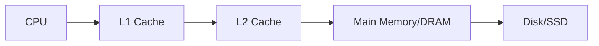

<!-- 
Generated by LectureQ (Enhanced Comprehensive Version)
Date: 2025-10-16 00:44:21
Model: qwen3:30b
Output Mode: Comprehensive
-->

I need to create comprehensive lecture notes for a student who missed class on Week 7, Lecture 7 about side-channel attacks and security vulnerabilities.

Let me analyze what I have:
- Slides (32 slides with content)
- Transcript of the lecture

The critical requirements are:
1. Write natural, flowing notes that synthesize ALL information from BOTH sources
2. Include EVERY concept, example, and explanation from slides AND transcript
3. Rephrase for clarity without copying verbatim
4. Make it educational and readable as if learning from scratch
5. Synthesize intelligently - don't just list points
6. Student should be able to learn everything from these notes alone
7. DO NOT SKIP any algorithms, examples, calculations, or key insights

I need to structure this properly with:
- H1 title including week and lecture info
- Overview section after title
- Hierarchical headers (# ## ###)
- Summary at the end
- Key Insights from transcript formatted as specified
- All technical content explained clearly
- Complete coverage of all concepts, examples, algorithms

Let me organize what needs to be covered:

**Race Conditions (from slides and transcript)**
- Definition: When concurrent threads access shared resources in a way that produces different results depending on timing
- TOCTOU vulnerability example with two processes running
- Dirty-COW vulnerability explanation
- Mitigations: Locks, Mutexes, Semaphores

**Side Channel Attacks Overview (from slides and transcript)**
- Definition: Not directly attacking target but using leaked information (timing, power consumption, etc.)
- Why timing is prevalent - computer architecture considerations
- The "Addicted to speed" concept from slide 9
- Memory hierarchy explanation with timescales (slide 10)
- Architectural picture showing memory access speeds (slide 11)

**Memory Caches and Speculative Execution (from slides and transcript)**
- How caches work (slide 12)
- Instruction speculation and pipelining (slides 13-14)
- Out-of-order execution
- Branch prediction

**Side Channel Attack Types (Meltdown, Spectre)**
- Flush+Reload attack (slides 18-21)
- Meltdown vulnerability (slides 22-24)
- Spectre v1 (Bounds Check Bypass) (slides 26-27)
- Spectre v2 (Branch Target Injection) (slides 28-29)

**Application-Level Side Channel Attacks**
- Unsafe comparison operators
- User enumeration timing attacks
- Mitigation strategies

**Code Review and Testing Techniques**
- Static vs Dynamic Analysis
- Manual Code Review
- Importance of testing in development lifecycle
- OWASP Top 10 (slide 50)
- Guest lecture announcement about static analysis vs AI for secure code review

Now I'll create the notes, making sure to:
- Synthesize slides and transcript naturally
- Rephrase technical content clearly
- Include all examples with explanations
- Add key insights from transcript as specified
- Create a logical flow that builds understanding progressively
- Ensure completeness by covering every point mentioned in both sources

Let me start creating the notes following the formatting requirements.
</think>

# Week 7: Lecture 7 - Side Channel Attacks and Secure Code Review

## Overview
This lecture covers **side channel attacks** (particularly Meltdown and Spectre), their underlying mechanisms, and how they exploit micro-architectural features of modern processors. The second part introduces **secure code review techniques**, including static analysis, dynamic testing, and mitigation strategies for vulnerabilities like timing side channels.

---

## Understanding Side Channel Attacks

### What Are Side Channel Attacks?
> Side channel attacks don't directly target the system's core functionality but instead exploit **indirect information leakage** from physical implementation details. Attackers observe characteristics like *timing*, *power consumption*, or *sound* to infer sensitive data without direct access.

*Instructor Emphasis*: "The most dangerous vulnerabilities often happen when everything appears correct at the architectural level, but micro-architectural features leak information."

*Student Question*: "How can timing really reveal secrets?"
*Instructor Response*: "Imagine checking a library bookshelf: if you hear which books are missing (fast access), you know what was borrowed. Similarly, fast memory access reveals what data was recently used."

---

### Why Timing Attacks Work: Computer Architecture Fundamentals

Modern processors prioritize **speed** through architectural features that create timing differences:

| Component | Access Time | Speed Relative to CPU |
|-----------|-------------|----------------------|
| Registers | ~1 cycle    | Fastest (closest to CPU) |
| L1 Cache  | ~4 cycles   | Very fast            |
| L2 Cache  | ~10 cycles  | Fast                 |
| Main Memory | ~100-300 cycles | Slow              |
| Disk      | ~10,000+ cycles | Very slow         |

*Key Insight*: "Memory latency hasn't improved much since the Pentium 4 (2004), so processors use **caches** and **speculative execution** to compensate."

#### Memory Hierarchy & Access Times


*Instructor Insight*: "When you access data, the CPU first checks cache (fast), then main memory (slower), then disk (very slow). The key is that **repeated accesses to the same location are faster** because it's cached."

---

## How Side Channel Attacks Exploit Processor Architecture

### 1. Memory Caches & Timing Differences
Modern processors use caches to store recently accessed data in fast memory.

*Example*: 
- First access: Slow (from main memory)
- Second access: Fast (from cache)

This timing difference is the foundation for **Flush+Reload** attacks.

#### Flush+Reload Attack Process
1. **Flush**: Clear all cached data from a shared array (`detectArray`)
2. **Wait**: Let victim application execute code that accesses sensitive data
3. **Reload**: Check access times to detect which cache lines were accessed

```c
char detectArray[256 * 64];
flush_cache(detectArray); // Clear all entries

try {
    char a = *kernel_address;   // Victim executes this (accesses kernel memory)
    detectArray[a * 64]++;      // Triggers cache access
} catch (segfault) {}           // Will fail but cache may be updated

// Check which cache lines are now in cache
for (int i = 0; i < 256; ++i) {
    if (is_in_cache(detectArray[i * 64])) 
        printf("Secret byte was %d\n", i);
}
```

*Instructor Insight*: "The attacker doesn't know which memory location holds the secret, but by checking all possibilities and seeing which access is fast, they infer what value was accessed."

---

### 2. Speculative Execution & Micro-Architectural Leaks

Processors use **speculative execution** to improve performance:
- Predict branch outcomes (e.g., "if" statements)
- Execute instructions before knowing if they're needed
- Discard results if prediction is wrong

*Example*: 
```c
a = constant_value;
b = slow_to_obtain();  // Could be a memory access
c = f(a);              // Can start before b finishes
if (uncached_value == 1) {
    compute_something(); // Speculatively executed if prediction is correct
}
```

*Key Insight*: "The CPU makes 'mistakes' by executing instructions speculatively, then discards them. But **the cache state changes** during speculation—this leak is what side channel attacks exploit."

---

## Meltdown Vulnerability

### How Meltdown Works
Meltdown exploits a flaw in Intel processors where:
1. User-space code can access kernel memory (normally protected)
2. The CPU doesn't check permissions *before* caching data
3. Attackers use **Flush+Reload** to extract sensitive data from kernel memory

#### Technical Details
- **Vulnerable CPUs**: Mostly Intel x86-64 (not AMD, which checks earlier at TLB access)
- **Attack Speed**: Up to 500 KB/s
- **Mitigation**: 
  - Map less of protected kernel space in user processes
  - Patches like KAISER/KPTI (Kernel Page Table Isolation)

*Instructor Insight*: "Meltdown is dangerous because it affects *bug-free OSes*. It's a micro-architectural flaw below the OS level."

---

## Spectre Vulnerability

Spectre exploits **speculative execution** to bypass security checks, with two main variants:

### Spectre v1: Bounds Check Bypass
*How it works*: 
1. Train CPU branch predictor using valid array accesses (0-15)
2. Force out-of-bounds access (`x = &secret - array1`)
3. Speculative execution executes code that leaks secret via cache

```c
unsigned int array1_size = 16;
unsigned char array1[16];
unsigned char array2[256 * 4096]; // Cache line-aligned
char secret = 'S';

void victim(size_t x) {
    if (x < array1_size) { 
        unsigned char value = array1[x];      // Safe access
        unsigned char temp = array2[value*4096]; // Leaks via cache
    }
}
```

*Attack sequence*: 
- Train CPU with `x=0..15`
- Call victim with malicious `x` (out of bounds)
- Speculative execution accesses secret value
- Flush+Reload reveals 'S' by checking which cache line is fast

### Spectre v2: Branch Target Injection
*How it works*: 
1. Poison branch target buffer to redirect speculative execution
2. Force CPU to jump to "gadget" function that leaks data
3. Use cache timing to extract secret value

```c
void (*func_ptr)() = safe_func; // Normal pointer

// Attacker poisons BTB to point here:
void gadget() {
    unsigned char secret = *secret_ptr;
    temp = array2[secret*4096]; // Leaks via cache
}

void victim() {
    func_ptr(); // Speculatively jumps to gadget()
}
```

*Instructor Insight*: "Spectre is harder to exploit than Meltdown but also **harder to mitigate** because it requires trade-offs between security and performance."

---

## Comparison: Meltdown vs Spectre

| Feature | Meltdown | Spectre |
|---------|----------|---------|
| **Target** | Kernel memory (protected) | Any memory (including sandboxed apps) |
| **Vulnerable CPUs** | Intel x86-64, some Apple chips | All CPU types (Intel, AMD, ARM) |
| **Exploitation Method** | Cache timing + out-of-order execution | Branch prediction + speculative execution |
| **Mitigation Difficulty** | Moderate (OS patches exist) | High (requires performance trade-offs) |

*Instructor Emphasis*: "Spectre is scarier because it can leak data from *other applications running in your browser*, like passwords or cookies."

---

## Application-Level Side Channel Attacks

### 1. Unsafe Comparison Timing
Many languages use **non-constant-time comparison** (e.g., `==`):

```python
# Vulnerable: Stops at first mismatch
def compare(a, b):
    for i in range(len(a)):
        if a[i] != b[i]:
            return False
    return True

# Secure alternative:
if constant_time_compare(a, b):  # Always takes same time
```

*Why it matters*: 
- If password `a` matches first character of correct password but not second → fast response (1 cycle)
- If password matches all characters except last → slow response (N cycles)

*Instructor Insight*: "Attackers can use this to guess passwords in *minutes* instead of years with brute force."

---

### 2. User Enumeration Timing
Attackers exploit timing differences between:
- Valid username + invalid password: **Longer time** (checks password)
- Invalid username + invalid password: **Shorter time**

```python
# Vulnerable code:
def authenticate(username, password):
    if not user_exists(username): 
        return False  # Short response
    if verify_password(password): 
        return True   # Long response
```

*Mitigation Strategies*:
1. **Never stop abruptly**: Always process all checks (e.g., check password even for invalid usernames)
2. **Add random delay**: Wait 200ms-3s before responding

```python
def authenticate(username, password):
    if not user_exists(username): 
        time.sleep(random.uniform(0.2, 3.0)) # Add randomness
    return verify_password(password) # Always takes same time
```

*Instructor Insight*: "This is why some sites respond with 'Invalid username or password'—it hides the timing difference."

---

## Secure Code Review Techniques

### Static vs Dynamic Analysis

| Technique | How It Works | Strengths | Limitations |
|-----------|--------------|-----------|-------------|
| **Static Analysis** | Analyzes code *without execution* (source code only) | Fast, scalable, finds pattern-based issues | False positives/negatives possible |
| **Dynamic Analysis** | Observes program behavior *at runtime* | Reveals real vulnerabilities | Resource-intensive, not exhaustive |

*Instructor Insight*: "Static analysis tools can detect >65% of defects before testing begins—saving teams 500% more time."

---

### Key Code Review Practices

#### Manual Code Review
- **Validation**: Are we building the *right system*? (Meets user needs)
- **Verification**: Are we building the *system right*? (Follows design/specs)
- **Challenges**: Time-consuming, requires expertise

#### Static Analysis Tools
- **Purpose**: Find vulnerabilities with well-defined patterns (input validation issues, unsafe functions)
- **Examples**:
  - Java: `MessageDigest.isEqual()`
  - Python: `hmac.compare_digest()`
  - C/C++: Self-implemented constant-time comparison

*Instructor Emphasis*: "The OWASP Top 10 is the *defacto security standard for developers*. You must know these threats."

---

## Real-World Impact & Statistics

| Finding | Statistic |
|---------|-----------|
| **Defect Removal Efficiency** | Best practices achieve >99% defect removal |
| **Cost Reduction** | Static analysis + peer review reduces costs by 50% |
| **Time Spent on Bugs** | Developers spend ~50% of time fixing bugs, not coding |
| **Testing Effectiveness** | Combined testing finds only ~85% of defects |

*Instructor Insight*: "The most expensive bug in history was a single missing semicolon in NASA's software—costing $125 million."

---

## Summary: Key Takeaways

### Side Channel Attacks
- **Core concept**: Exploit micro-architectural features (caches, speculative execution) to leak data.
- **Meltdown**: Leaks kernel memory via cache timing (Intel-specific).
- **Spectre**: Bypasses security checks using branch prediction (all CPUs affected).
- **Application-level**: Unsafe comparisons and user enumeration can be exploited.

### Secure Development
- **Prevention > Fixing**: Security by design reduces costs by 50%.
- **Static Analysis**: Crucial for early defect detection (>65% effectiveness).
- **Constant-Time Operations**: Always use secure comparison functions (e.g., `compare_digest()`).

---

## Study Questions

1. Explain why Meltdown affects Intel but not AMD processors.
2. How does Flush+Reload exploit cache timing differences?
3. Describe the two main Spectre variants and their attack mechanisms.
4. Why is constant-time comparison important for password verification?
5. What are three mitigation strategies for user enumeration attacks?
6. Compare static vs dynamic analysis in terms of speed, coverage, and limitations.
7. How does speculative execution contribute to side channel vulnerabilities?
8. Explain why Spectre v2 is harder to mitigate than Meltdown.
9. Describe the memory hierarchy and how it enables timing-based attacks.
10. What are two examples of unsafe comparison functions that leak timing information?

---

## Practical Exercise

**Scenario**: You're developing a login system with the following code:

```python
def verify_password(username, password):
    if username not in users:
        return False  # Fast response for invalid user
    correct_pw = users[username]
    return password == correct_pw  # Slow for valid user
```

**Task**: 
1. Explain why this is vulnerable to timing attacks.
2. Rewrite the code using constant-time comparison (use `hmac.compare_digest`).
3. Add a random delay of 0.5-2 seconds before returning results.

*Hint*: Always process all checks, then return result after fixed time.